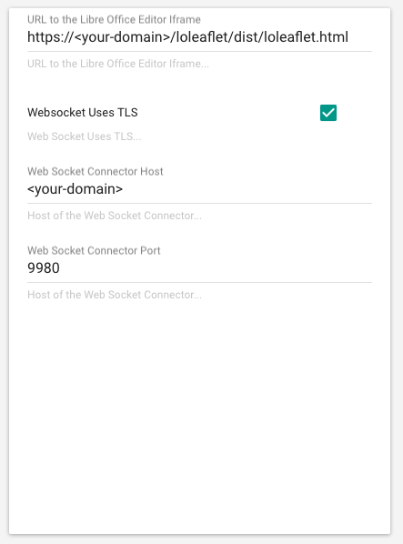
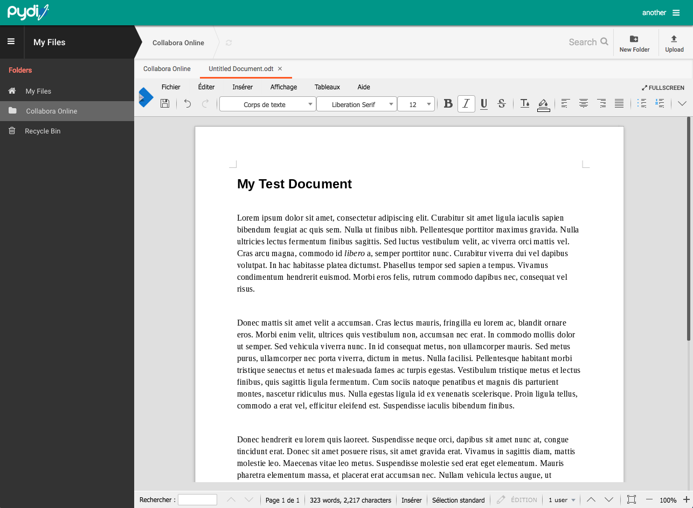

## Edit Documents Online with Collabora Online

Collabora Online is a powerful LibreOffice-based online office suite which supports all major document, spreadsheet and presentation file formats. It supports all major document formats:​ DOC, DOCX, PPT, PPTX, XLS, XLS, ODF, ODS, ODP.  
Shared editing: One person at a time edits a document, others see changes in real time. A different person can do changes at any time

This documentation describes how to deploy Collabora CODE application, which is a cutting-edge community-oriented Docker provided for free by Collabora Online. If you wish to switch to a supported version with more capacities, please contact us.

## Installing Collabora Online Development Environment via the Docker Image

### Prerequisite 

In this documentation, you have to replace <your-domain> with a suitable domain matching your certificates eg. office.yourdomain.com
You also have to replace <your-escaped-domain> with the same subdomain where dots are "escaped", eg. office\.yourdomain\.com

Here we will give you an example on one configuration if you want more detail about collabora you can go **[Here](https://www.collaboraoffice.com/code/)**.
### Start Docker Image
You can find a link to the docker for collabora **[here](https://hub.docker.com/r/collabora/code/)**

Install Docker on a server. 

    <!-- $ docker pull collabora/code -->
    $ docker run -t -d -p 127.0.0.1:9980:9980 -e \
         "domain=<your-escaped-domain>" --cap-add MKNOD collabora/code

This makes the docker image listen on localhost:9980.

Note: this docker image does not work on Ubuntu 14.04 LTS, because Ubuntu 14.04 LTS has missing kernel compile option CONFIG_AUFS_XATTR=y, which is leading to setcap not working on docker’s aufs storage. Upstream bug: https://bugs.launchpad.net/ubuntu/+source/linux/+bug/1557776

### Configuring the local Apache reverse proxy:

In order to be able to launch the Collabora frame directly inside Pydio that is served on yourdomain.com, we have to use a Proxy configuration to serve the container requests through a matching domain name.

**Install apache reverse proxy**

On a recent Ubuntu or Debian this should be possible using:

    apt-get install apache2
    a2enmod proxy
    a2enmod proxy_wstunnel
    a2enmod proxy_http
    a2enmod ssl

Afterwards, configure one VirtualHost properly to proxy the traffic. For enhanced reason we recommend to use a subdomain such as "code.example.com" instead of running on the same domain. An sample config can be found below:

    <VirtualHost *:443>
        ServerName <your-domain>:443
        
        # SSL configuration, you may want to take the easy route instead and use Lets Encrypt!
        SSLEngine on
        SSLCertificateFile /path/to/signed_certificate
        SSLCertificateChainFile /path/to/intermediate_certificate
        SSLCertificateKeyFile /path/to/private/key
        SSLProtocol             all -SSLv2 -SSLv3
        SSLCipherSuite
        ECDHE-ECDSA-CHACHA20-POLY1305:ECDHE-RSA-CHACHA20-POLY1305:ECDHE-ECDSA-AES128-GCM-SHA256:ECDHE-RSA-AES128-GCM-SHA256:ECDHE-ECDSA-AES256-GCM-SHA384:ECDHE-RSA-AES256-GCM-SHA384:DHE-RSA-AES128-GCM-SHA256:DHE-RSA-AES256-GCM-SHA384:ECDHE-ECDSA-AES128-SHA256:ECDHE-RSA-AES128-SHA256:ECDHE-ECDSA-AES128-SHA:ECDHE-RSA-AES256-SHA384:ECDHE-RSA-AES128-SHA:ECDHE-ECDSA-AES256-SHA384:ECDHE-ECDSA-AES256-SHA:ECDHE-RSA-AES256-SHA:DHE-RSA-AES128-SHA256:DHE-RSA-AES128-SHA:DHE-RSA-AES256-SHA256:DHE-RSA-AES256-SHA:ECDHE-ECDSA-DES-CBC3-SHA:ECDHE-RSA-DES-CBC3-SHA:EDH-RSA-DES-CBC3-SHA:AES128-GCM-SHA256:AES256-GCM-SHA384:AES128-SHA256:AES256-SHA256:AES128-SHA:AES256-SHA:DES-CBC3-SHA:!DSS
        SSLHonorCipherOrder     on
        
        # Encoded slashes need to be allowed
        AllowEncodedSlashes On
        
        # Container uses a unique non-signed certificate
        SSLProxyEngine On
        SSLProxyVerify None
        SSLProxyCheckPeerCN Off
        SSLProxyCheckPeerName Off
        
        # keep the host
        ProxyPreserveHost On
        
        # static html, js, images, etc. served from loolwsd
        # loleaflet is the client part of LibreOffice Online
        ProxyPass           /loleaflet https://127.0.0.1:9980/loleaflet retry=0
        ProxyPassReverse    /loleaflet https://127.0.0.1:9980/loleaflet
        
        # WOPI discovery URL
        ProxyPass           /hosting/discovery
        https://127.0.0.1:9980/hosting/discovery retry=0
        ProxyPassReverse    /hosting/discovery
        https://127.0.0.1:9980/hosting/discovery
        
        # Main websocket
        ProxyPassMatch “/lool/(.*)/ws$” wss://127.0.0.1:9980/lool/$1/ws
        
        # Admin Console websocket
        ProxyPass   /lool/adminws wss://127.0.0.1:9980/lool/adminws
        
        # Download as, Fullscreen presentation and Image upload operations
        ProxyPass           /lool https://127.0.0.1:9980/lool
        ProxyPassReverse    /lool https://127.0.0.1:9980/lool
    </VirtualHost>

After editing this virtual host, restart your apache using /etc/init.d/apache2 restart.

## Configuring Pydio Plugin to connect to CODE

In the Settings panel, go to All Plugins > Features Plugins > Editors and enable the Collabora Online plugin. 

Edit its parameters as follow: 

 - Url to the Libre Office Editor iFrame: `https://<your-domain>/loleaflet/dist/loleaflet.html`
 - WebSocket use TLS: `true`
 - Web Socket Connector Host: `<your-domain>`
 - Web Socket Connector Port: `9980` (see virtual host configuration above).
 
## Test and start editing docs ! 
 
Switch to a workspace and use the "New Folder" > "You can also create an empty Document" link to create e.g. an ODT Document.

Double click the new file to edit, you should now be able to edit it directly in Pydio!

