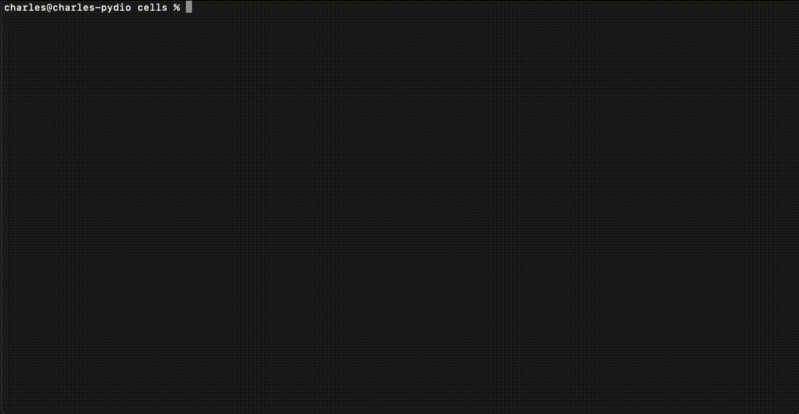

### Select your installation type

Get started quickly with Cells static binaries, or pick an image for your cloud environment. 
=== "[]()"
    _These instructions will get you started quickly with Cells binaries. Apply commands similary on either `cells` of `cells-enterprise` binary._

    <ol class="install-steps">
    <li><p><strong>Get your database access information</strong> (see <a href="./requirements">Requirements</a>). Login as non-root user.</p></li>
    <li><p><a href="/en/download" target="_blank"><strong>Download the binary</strong></a> for your server architecture. Make it executable:<br> <code>$ chmod +x ./cells</code></p></li>
    <li><p><strong>Configure Cells</strong> using web or command line installer (see below):<br> <code>$ ./cells configure</code></p></li>
    <li><p><strong>Start Cells</strong>. Web installer restarts automatically, otherwise use: <code>$ ./cells start</code></p></li>
    <li><p><strong>Open your web browser</strong> at <a href="https://localhost:8080" target="_blank">https://localhost:8080</a> <br> (or https://[server ip or domain]:8080).</p></li>
    </ol>

    <style type="text/css">
    ol.install-steps {
    padding-left: 0 !important;
    list-style: none;
    counter-reset: my-awesome-counter;
    padding: 0;
    margin:0;
    }
    ol.install-steps li {
    counter-increment: my-awesome-counter;
    border-left: 2px solid #08cc99;
    display:flex;
    align-items: baseline;
    background-color: #ecf8f6;
    padding: 16px 20px;
    margin: 20px 0 !important;
    }

    ol.install-steps li::before {
    content: counter(my-awesome-counter) ". ";
    color: #44d2ab;
    font-weight: bold;
    margin-right: 10px;
    font-size: 22px;
    }


    ol.install-steps li p {
    display: inline;
    margin: 0 !important;
    font-size: 18px !important;
    }

    ol.install-steps li code {
        font-size: 16px !important;
        display: block;
        margin: 0px 0 !important;
        padding: 6px !important;
        background-color: rgb(42 42 53 / 95%) !important;
        color: white !important;
        width: 270px;
        margin-top: 6px !important;
    }

    ol span.geshifilter {
        display: inherit;
    }

    </style>

    ## Installation modes

    ### Web Installer

    If your machine is local or web accessible, a temporary web server will start on TCP port [:8080], providing a wizard
    for configuring basic settings.

    

    After it completes, the server restarts automatically and you are good to go.

    ### Command line Installer

    If you would rather use a shell, you can perform the same steps using command-line (cli) prompts.

    


    ## Installation Troubleshooting

    ### Cannot access to web interface

    Make sure the Cells binding port is properly open for TCP connections in your firewall or equivalent (e.g. Security Group in Amazon AWS).
    Default port is 8080 (or another available http-alt port like 8008, 8081, ...).

    Check the logs to verify which port to open:

    ```
    2021-01-27T11:17:00.248+0100	INFO	Activating privacy features... done.
    2021-01-27T11:17:00.278+0100	INFO	https://0.0.0.0:8080
    ```

    ### SQL Errors

    _After start, you see a bunch of errors starting with: `ERROR   pydio.grpc.meta   Failed to init DB provider   {"error": "Error 1071: Specified key was too long; max key length is 767 bytes handling data_meta_0.1.sql"}`_.

    You might have an unsupported version of the mysql server: you should use MySQL server version 5.7 or higher or MariaDB version 10.3 or higher.

    ### GLIBC [Linux]

    _You see this error: `/lib/x86_64-linux-gnu/libc.so.6: version 'GLIBC_2.14' not found`_

    The version of libc6 is outdated. Run these commands to upgrade it.

    ```sh
    sudo apt-get update
    sudo apt-get install libc6
    ```

    ### SELinux [CentOS]

    _The main application page in your browser displays the following error: `Access denied.`_

    Ensure you have modified SELinux to be disabled or running in permissive mode. To temporary disable SELinux: `sudo setenforce 0`.

    You can also permanently disable SELinux in `/etc/selinux/config`.

=== "[]()"
    The [Pydio Cells image](https://hub.docker.com/r/pydio/cells/) is a container designed to be used in a Docker environment. It only contains what is strictly necessary to run your server.

    ## Run as stand-alone container

    Pydio Cells needs a MySQL/MariaDB Database [with a privileged user](https://pydio.com/en/docs/cells/v4/requirements).

    Launch a test instance with:

    ```sh
    docker run -d --network=host pydio/cells
    ```

    Enter your database credentials to finalise the configuration at [https://localhost:8080](https://localhost:8080) and you are good to go.

    If your server has a public IP address and no restriction on the chosen port (firewall...), your instance is also directly exposed at `https://<YOUR-SERVER-IP-ADDRESS>:8080`.

    Before you go live, you probably want to configure persistent data in a docker volume. Assuming you also have a registered domain name (FQDN) for your server, you could go with:

    ```sh
    FQDN=<Put Your FQDN here>
    docker run -d  -v /home/user/cells_dir:/var/cells -e CELLS_SITE_BIND=:443 -e CELLS_SITE_EXTERNAL=https://$FQDN --network=host pydio/cells
    ```

    Where:

    - `-d`: run in the background
    - `-v /home/user/cells_dir:/var/cells`: mount a local folder as Cells working directory
    - `-e CELLS_SITE_BIND=:443`: use standard reserved port for HTTPS (must be unused, typically by a webserver)
    - `-e CELLS_SITE_EXTERNAL=https://$FQDN`: (optional) explicitely declare your domain
    - `--network=host`: directly use the host network, to easily connect to the DB

    > WARNING: CELLS_SITE_BIND, CELLS_SITE_EXTERNAL may override the site configuration in pydio.json. If you have custom site configurations, don't forget to remove these Env from docker file.


    ## Run with Docker Compose

    Below is a vanilla configuration to run Pydio Cells with `docker compose`:

    ```yaml
    version: '3.7'
    services:

    cells:
        image: pydio/cells:latest
        restart: unless-stopped
        ports: ["8080:8080"]
        volumes:
        - cellsdir:/var/cells
        - data:/var/cells/data

    mysql:
        image: mysql:8
        restart: unless-stopped
        environment:
        MYSQL_ROOT_PASSWORD: P@ssw0rd
        MYSQL_DATABASE: cells
        MYSQL_USER: pydio
        MYSQL_PASSWORD: P@ssw0rd
        command: [mysqld, --character-set-server=utf8mb4, --collation-server=utf8mb4_unicode_ci]
        volumes:
        - mysqldir:/var/lib/mysql

    volumes:
        data: {}
        cellsdir: {}
        mysqldir: {}
    ```

    **Note**: with this configuration file, in the web installer, use:

    - Host Name: mysql
    - DB User: pydio
    - DB Password: P@ssw0rd

    and let the other parameters unchanged to configure the DB connection. 

    ## Go further

    ### Upgrade Cells

    Use `docker pull` command to get latest version of Cells then start a new container from updated image.

    > WARNING: You may upgrade cells from admin console. However the updater replaces the binary in the container. There is a risk of falling back to earlier version if the container is dropped.

    ### Commands

    The default commands when `running` the image are:

    - `cells configure` if no installation is found
    - `cells start` otherwise

    If you specify a command, it willd be executed instead, e.g:

    ```sh
    docker run pydio/cells cells version
    # or to log in a running container with id 5fe... 
    docker exec 5fe /bin/sh
    ```

    ### Data layout

    Below is a list of important files and data present in the volume:

    - `/var/cells`: main working dir
    - `/var/cells/pydio.json`: main configuration file
    - `/var/cells/data`: data
    - `/var/cells/logs`: logs
    - `/var/cells/certs`: certificate management
    - `/var/cells/services`: services information

    ### Environment variables

    As previously seen, when launching the image, the `start` (or `configure` on 1st launch) command is called: it means that all flags are settable with their associated ENV var, using upper case and CELLS_ prefix.

    Below is an extract of relevant ENV variables that you can pass to the container.

    | Name                | Value                   | Default      |
    |---------------------|-------------------------|--------------|
    | CELLS_SITE_BIND     | host:port               | 0.0.0.0:8080 |
    | CELLS_SITE_EXTERNAL | http(s)://url-to-access | (none)       |
    | CELLS_SITE_NO_TLS   | 1 = noTLS, 0 = TLS      | 0            |
    | CELLS_WORKING_DIR   | path in the container   | /var/cells   |
    | CELLS_LOG           | a valid log level       | info         |

    ### More examples

    We gather some [relevant sample configuration](https://github.com/pydio/cells/tree/main/tools/docker/compose) in our main code base. Find the example that suits you and fine tune your setup.

    ### Cells Sync

    The Cells Sync Desktop Application might require an additional port, for example if you run behind a reverse proxy that performs TLS termination. In such case:

    - First read this, [Setup Cells Server for Cells Sync](https://pydio.com/en/docs/kb/client-applications/setup-cells-server-cellssync)
    - Make sure to start a container with this env set `CELLS_GRPC_EXTERNAL`
    - Expose the port that you previously set with `CELLS_GRPC_EXTERNAL`

    #### Example

    Assuming that port **33060** is the port chosen for gRPC, the command should have those two additional parameters,

    - `-e CELLS_GRPC_EXTERNAL=33060` (sets the env variable)
    - `-p 33060:33060` (exposes the port)

    The entire command should look like this:

    ```sh
    docker run -d -e CELLS_SITE_EXTERNAL=192.168.0.172:8080 -e CELLS_SITE_BIND=192.168.0.172:8080 -e CELLS_GRPC_EXTERNAL=33060 -p 33060:33060 -p 8080:8080 pydio/cells
    ```


=== "[]()"
    The Cells Enterprise Appliance package follows the OVF standard.

    It is an up-to-date, ready to use out of the box, Rocky Linux 8 image preconfigured with MariaDB and Cells Enterprise distribution.  

    Download the [latest OVF image](https://download.pydio.com/latest/cells-enterprise/release/{latest}/ovf/Cells-Enterprise-OVF-{latest}.zip). An md5 file is also available on the same location for integrity verification.

    ## Minimal VM Requirements

    - RAM : 4G
    - CPU : 2 vCores
    - CPU support: VT-x/AMD-V
    - NICs: bridged adaptor

    ## Setup in Oracle VirtualBox

    We detail here the steps to launch the Pydio Cells appliance with Oracle VirtualBox. The process is very similar to other hypervisors.

    - Import the image into VirtualBox
    - Configure the virtual network interface:
    - Go to `Your Image >> Settings >> Network`, adapter 1 is already bound to a bridged adapter
    - Choose the correct name for the adapter you want to use
    - Click `OK`.
    - Start the virtual machine

    _Warning:_ even if the correct Name is already shown, click on it and validate, or you won't be able to start the VM (it is a known issue with the VirtualBox UI that is still there in 6.0.14).

    ## Configure

    We display the URL address of the installer when you start your VM. Check the console in the VirtualBox GUI.

    A self-signed certificate is used by default, you have to explicitly accept it in your browser.

    Follow the steps below:

    - Accept EULA
    - Enter your license key
    - Accept default DB configuration (except if you do not want to use the embedded DB)
    - Choose a password for the admin user
    - Launch installation. It can take up to a minute to reach the end.

    The installer service is disabled once the configuration terminates successfully.

    At this step, you can login with the credentials you have defined and check everything is up and running.

    ## Configuration Details

    ### Predefined user accounts

    If you need to log into the system, the `ssh` service is enabled on port `22` and following users have been created:

    | System users        | Password    | Comments   |
    | ------------------- | ----------- | ----------- |
    | root                | cells       | -        |
    | sysadmin            | cells       | Has sudo rights without password |
    | pydio               | cells       | Limited user that runs the app |

    To connect to the default *cells* database in MariaDB, you have these users:

    | MySQL users        | password    |
    | ------------------- | --------------- |
    | root                | cells       |
    | pydio@localhost     | cells       |

    ### File Layout

    - `/var/cells`: Pydio Cells working directory. It contains business and technical data.
    - `/opt/pydio`: binaries and additional libraries required to run Cells.

    ### Systemd service

    **cells** service is running under **pydio** user. The service is **enabled**: it will automatically restart upon reboot.

    Useful `systemd` commands, as `sysadmin` user:

    ```sh
    # Manually restart the service
    sudo systemctl restart cells
    # See Pydio Cells logs
    sudo journalctl -f -u cells -S -1h
    # start/stop the database (MariaDB)
    sudo systemctl start mariadb
    ```

    ### Firewalld service

    Firewalld service is active and opens three ports:

    - 80: **cells-enterprise**
    - 443: **cells-enterprise**
    - 22: **ssh**

=== "[]()"
    The Pydio Cells image for VMWare is based on Rocky Linux 9. It has been enriched with necessary third party software and pre-configured to provide an easy to run instance of the Cells server out of the box.  
    It is known to run in VSphere ecosystems and in standalone ESXi hosts.

    Download the [latest VMWare image](https://download.pydio.com/latest/cells-enterprise/release/{latest}/vmware/Cells-Enterprise-VMWare-{latest}.zip). An MD5 file is also available at the same location for integrity verification.

    ## Minimal VM Requirements

    - RAM : 4G
    - CPU : 2 vCores
    - CPU support: VT-x/AMD-V
    - NICs: bridged adaptor

    ## Setup a VM

    In this guide, we use the simple standalone ESXi web interface to launch a new virtual machine:

    - Log in your web interface
    - Go to the `Virtual Machines` section
    - Click on Create/Register VM

    A creation wizard pops up.

    - In `Select creation type`, choose `Deploy a virtual machine from an OVF or OVA file`
    - In second page, choose a name and upload **both** the `*.ovf` and the  `*-disk1.vmdk` files
    - Choose correct network and disk provisioning
    - Click on `Finish` and wait until creation is complete
    - Start the virtual machine

    ## Configure

    We display the URL address of the installer when you start your VM. Check the console in the VirtualBox GUI.

    A self-signed certificate is used by default, you have to explicitelly accept it in your browser.

    Follow the steps of the wizard to finalize your setup. All parameters are set by default except the main administrator password. When it's done, the installer saves everything, starts the `cells` service and exits. It can take up to a minute.

    At this step, you can log in the app with the credentials you have just defined and check everything is up and running.


    ## Configuration Details

    ### Predefined user accounts

    If you need to log into the system, the `ssh` service is enabled on port `22` and following users have been created:

    | System users        | Password    | Comments   |
    | ------------------- | ----------- | ----------- |
    | root                | cells       | -        |
    | sysadmin            | cells       | Has sudo rights without password |
    | pydio               | cells       | Limited user that runs the app |

    To connect to the default *cells* database in MariaDB, you have these users:

    | MySQL users        | password    |
    | ------------------- | --------------- |
    | root                | cells       |
    | pydio@localhost     | cells       |

    ### File Layout

    - `/var/cells`: Pydio Cells working directory. It contains business and technical data.
    - `/opt/pydio`: binaries and additional libraries required to run Cells.

    ### Systemd service

    **cells** service is running under **pydio** user. The service is **enabled**: it will automatically restart upon reboot.

    Useful `systemd` commands, as `sysadmin` user:

    ```sh
    # Manually restart the service
    sudo systemctl restart cells
    # See Pydio Cells logs
    sudo journalctl -f -u cells -S -1h
    # start/stop the database (MariaDB)
    sudo systemctl start mariadb
    ```

    ### Firewalld service

    We recommand to use the provided appliance in your private network, behind enterprise grade firewall and reverse proxy. Thus, the firewall service in Cells appliance is disabled and stopped by default.
=== "[]()"
    We expose below the specificities of the AMI custom setup. For further details, please refer to the other sections of this [administration guide](https://pydio.com/en/docs/administration-guides).

    ## Cells Ent AMI on AWS Marketplace

    You can find a ready-to-use Amazon Machine Image (AMI) for Cells Enterprise Distribution [on the Amazon Web Services Marketplace](https://aws.amazon.com/marketplace/pp/B08CNGR8ZP).

    This appliance is based on [Amazon Linux 2023 (AL2023) OS](https://aws.amazon.com/linux/amazon-linux-2023) and has been enriched with necessary third parties and configuration to provide an easy to run instance of the Cells server out of the box.

    ## Quick Start

    If you want to give a first quick glance at Cells with no hassle, just launch the AMI on a `t2-medium` EC2 instance, with no user data and no extra mounted volume.

    Define some security groups so that the instance:

    - Can reach the internet (to download updates)
    - Can be reached on port 443
    - Can be reached via SSH

    _Note: your instance must at least have **one network interface that is on a private network**, with an IP address that is in a well-known private range (e.g 10.0.0.0/8, 172.16.0.0/12, 192.168.0.0/16 for IPv4). It is the case by default on most regions_.

    You will have a ready to install instance at `https://<ec2-public-IP>` after a couple of minutes.

    You can quickly finalise the installation by:

    - Accepting EULA
    - Pasting your licence key
    - Use embedded local db that is already configured
    - Define an admin and leave advanced parameters untouched.

    ## Users

    The Pydio Cells AMI comes with 3 default users:

    - **ec2-user**: the default Amazon user that is to be used to connect using the key pair you define when launching a new instance. She has sudo rights without password for all commands.
    - **pydio**: the user that launches the Cells server. She has no sudo rights and no pre-defined password. You should use this user when you locally use the `cells` command line interface.
    - **root**: the root user. You normally do not have to log as this user.

    ## Services

    - **install-cells.service**: enabled when you instantiate a new Cells Enterprise AMI, this service launches the installation process. After successful configuration of your instance, it starts and enables the Cells service. It then disables itself before exiting.
    - **cells.service**: runs the cells server as a systemd daemon. The `install-cells.service` enables and starts this service when finalising the install.

    ## Tree structure

    They are 2 main paths that are used by Cells:

    - `/opt/pydio`:
    - `/opt/pydio/bin`: Pydio Cells binary
    - `/opt/pydio/conf`: Installation configuration files
    - `/var/cells`: The application working directory with: runtime configuration, logs, technical persistence and, by default, your data.  

    If you provide an additional EBS volume when you launch the AMI (see installation instructions), it is automatically mounted at this location before install.

    ## Database

    A MySQL DB is the only hard requirement to run a Pydio Cells instance.  
    As a convenience, the Pydio Cells AMI embbed an installed and configured MariaDB 10.5 server that is provided by the Amazon Linux repositories.

    There are 2 users `root` and `pydio`, all other configurations follow the `mysql_secure_installation` best practices.  
    There is one default `cells` DB, on which the `pydio` user has all privileges.

    You might use this database during your test phase. Before going live, it is recommanded to either:

    - Rather use an RDS instance
    - Change the passwords for both users

    _Hint: default mysql password for pydio user is `cells`, root user has no password_

    ## Network configuration

    By default, the application is installed using the "self-signed certificate" mode.

    It is recommended to run the Cells server behind a reverse proxy that exposes a valid TLS certificate when in production.

    If you do not provide a valid registered FQDN via "user data" upon launch, it is then configured using the Amazon automatically provided public IP address and the frontend is publicly available at `https://<your-instance-public-ip-address>`.    
=== "[]()"
     [Kubernetes](../../../run-cells-in-production/deploying-cells-in-a-distributed-environment/kubernetes-quick-install)


### Advanced step-by-step guides

These tutorials provide advanced step-by-step guides for bare installation on your OS/Cloud of choice, from RaspberryPi to Kubernetes Cluster!

<div class="install-logos">
<a class="logo" href="/en/docs/kb/deployment/install-cells-raspberry">
    <div class="logo-img"></div>
    <div class="logo-title">Raspberry Pi</div>
</a>
<a class="logo" href="/en/docs/kb/deployment/install-cells-centosrhel">
    <div class="logo-img"></div>
    <div class="logo-title">RHEL Distros</div>
</a>
<a class="logo" href="/en/docs/kb/deployment/install-cells-debianubuntu">
    <div class="logo-img"></div>
    <div class="logo-title">Debian/Ubuntu</div>
</a>
<a class="logo" href="/en/docs/kb/deployment/install-cells-macosx">
    <div class="logo-img"></div>
    <div class="logo-title">Mac OSX</div>
</a>
<a class="logo" href="/en/docs/kb/deployment/install-cells-windows">
    <div class="logo-img"></div>
    <div class="logo-title">Windows</div>
</a>
</div>


<style type="text/css">
.install-logos {
    display: flex;
    flex-wrap: wrap;
}

.install-logos .logo-img {
    height: 80px;
    display: flex;
    align-items: center;
    justify-content: center;
}

.install-logos a.logo {
    color: inherit;
    text-align: center;
    font-size: 12px;
    font-weight: bold;
    margin: 5px;
    border: 2px solid #97E6D1;
    border-radius: 4px;
    padding: 5px;
    background-color: #ecf8f6;
    width: 110px;
    cursor: pointer;
}

.install-logos img {
    border: none !important;
}

.install-logos .logo-title {
    padding-top: 5px;
}

</style>

