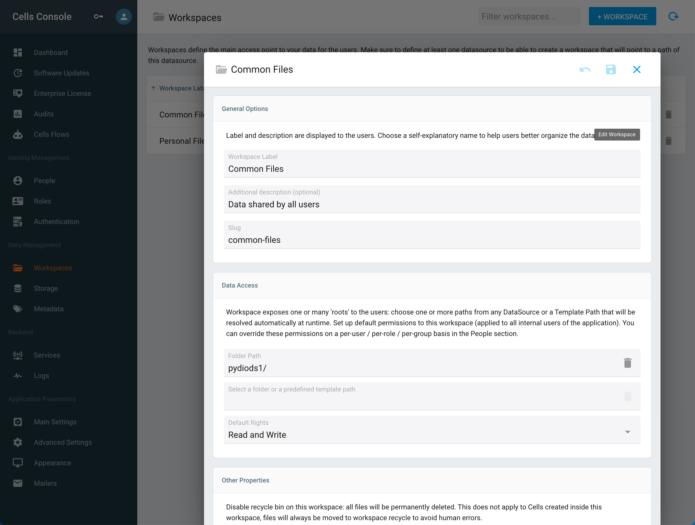
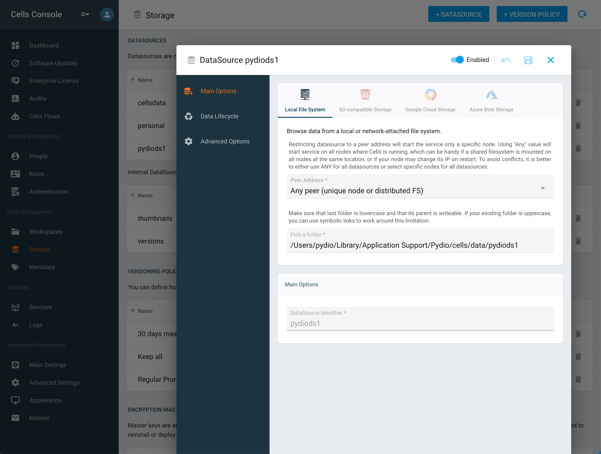
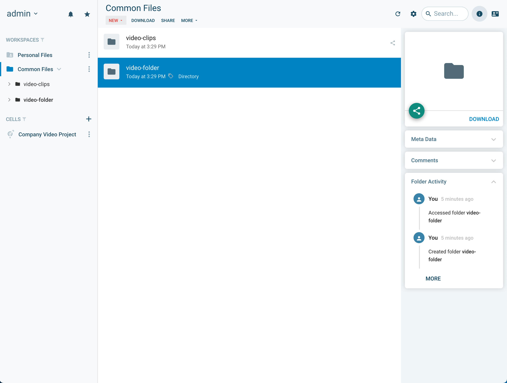

Now that your Cells is up-and-running, you are in control of your data! This section gives a short overview of user management and access control, along with the basics of the sharing features.

## Users, Workspaces, ACLs

Connect to Cells as an administrator and go to `Cells Console > People` menu.

Here, you can create users and organize them into groups. By default, your data is organized in two Workspaces: 
- **"Personal"** is a dedicated "home folder": each user will only see their own data inside this Personal workspace.
- **"Common Files"** is a shared folder where everyone can work on the same files.

Workspaces can be seen as top folders used as basic unit for managing **"who can access what"**. To have a better understanding, load your own admin user accesses: in the workspace tab, you see that you have Read/Write permissions on the two default workspaces.

If you remove the access to Common Files and go back to the home page, you see straight away that you only have the **"Personal"** workspace in the left-hand column.

You can manage these accesses at a fine-grained level (user per user), or a higher level (per group or per role). Actual accesses are computed for each user depending on their roles, groups and personal ACLs.

## Workspaces and Data Source

Now that you understand how to manage access to the data, you may wish to create your own workspace, e.g. mount an existing folder on your machine to browse inside Cells. If you go to `Cells Console > Workspaces` and edit the Common Files workspace, you can see that the Data Access section points to an internal path `pydiods1/`.

This is referring to a "Data Source" named _pydiods1_. Now go to `Cells Console > Storage`, where you will find this datasource and its real path on the file system.

If you wish to mount an existing folder, e.g. `/var/data/mydata`, create a new data source and pick the desired location.

After you save the datasource, corresponding services start in background, including an indexation of your already existing data. Go back to the `Cells Console > Workspaces` menu and create a "My Data" workspace pointing toward this new datasource root. Set default permissions for this workspace (Read and Write for instance), which is equivalent to assigning the Read/Write ACL to all users and save.

Go back to the home page. You can now see the workspace and browse the data it contains!

As you may now understand, you could also edit the "Common Files" workspace to point to this new datasource instead of the default one, or even add a second path to this workspace to aggregate data from various locations into one workspace. While datasources can be seen as mount points to actual folders on your file system, creating an internal tree of all data, workspaces are virtual views that expose data from _anywhere_ in that tree and are used to grant permissions.

A final note: as seen above, a datasource can expose a part of your local file system, but it can _also_ point toward other remote object storage, like AWS S3 for instance.

--------------
_See Also_

- [Datasources Overview](/cells-v4/admin-guide/connect-your-storage/datasources-overview/) to learn more about Datasources.