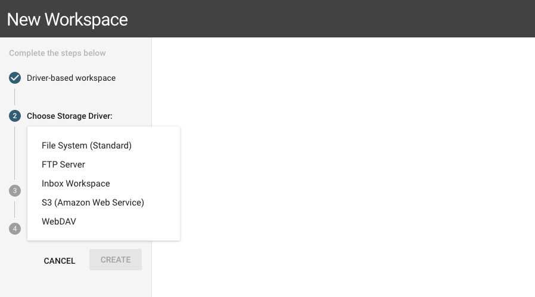
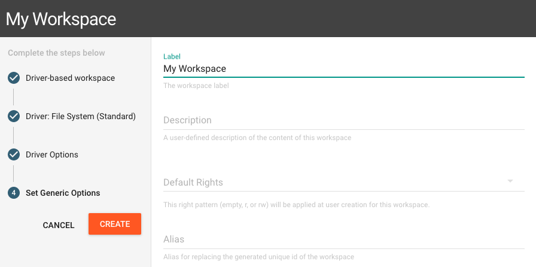
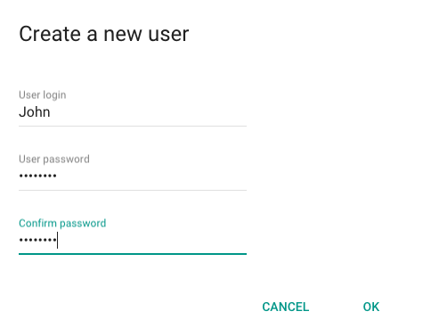
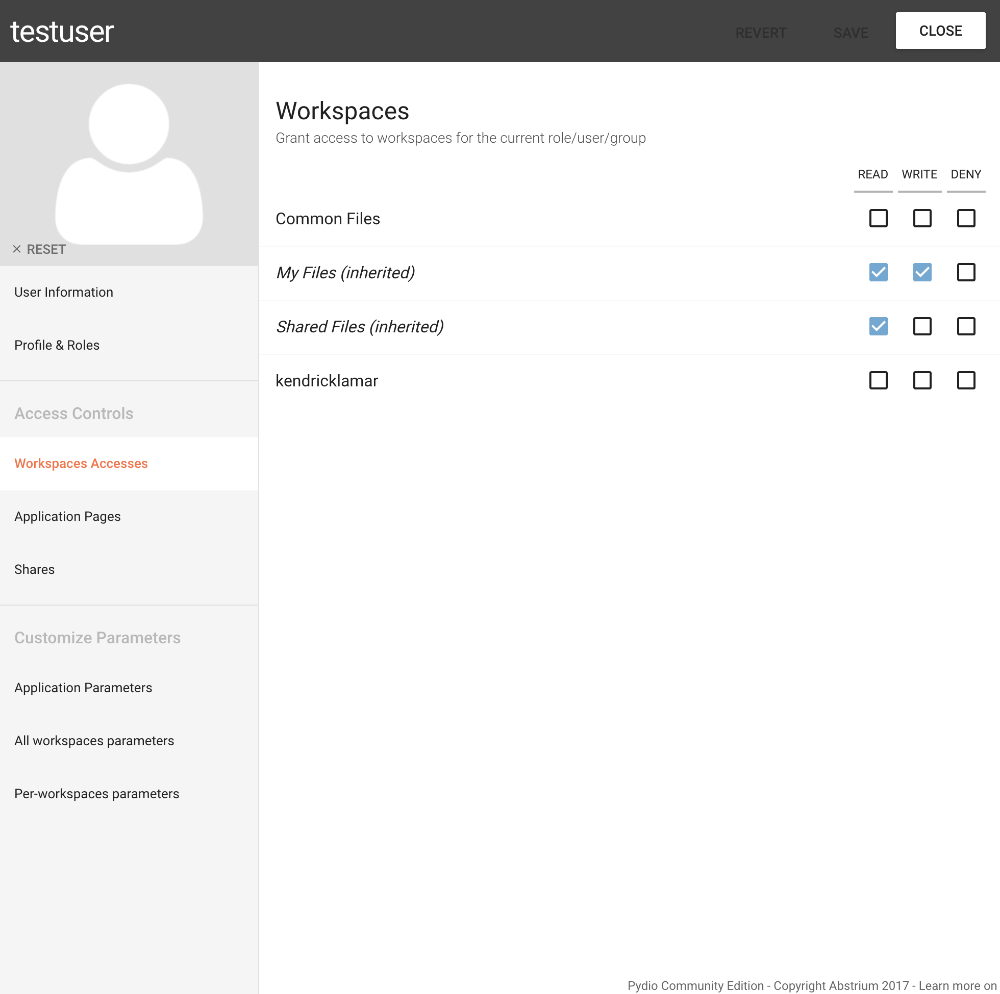

In this section, you will quickly learn how to create workspaces and assign rights.

What is a workspace?

With Pydio, in order to manage your data, you can create workspaces. 
- Technically speaking, each workspace is a separate
"datasource" for storing files and folders. Typically, they point to a specific folder of the server where pydio si installed.
- Conceptually speaking, you as an administrator will use workspaces to grant accesses to specific data selectively to any users of your platform.

### Create a workspace

Let's create a simple workspace that will store all files and folders in a directory on the Pydio server, let's say **/var/data/files**. This
directory can (and actually should) be anywhere on the filesystem, outside of Pydio install directory, as long as the web server software has a write permission on it.

Go to **Workspaces & Users > Workspaces** then click on the **+WORKSPACE** button:

1 - Select a template or driver:
- Choose "From driver"
- Select "File System (Standard)" driver

2 - Set storage location

- Use the "Path" field to point to the desired local directory /var/data/files. 

3 - Workspace options:

- Input the workspace name inside "Label" field
- Input the workspace description inside "Description" field

4 - Click on the CREATE button to save this workspace.

You have now created your first workspace with Pydio dashboard.

### Create a user and assign rights

To create a user, go to **Workspaces & Users > Users** then click on the **+USER** button:

Fill the primary information inside the popup.

Now you should see the detailed settings for the user.
These fields are optionals, but feel free to fill them.

Now go to "Workspace Accesses" tab and there you can allow your user to access your workspace the way you want:

