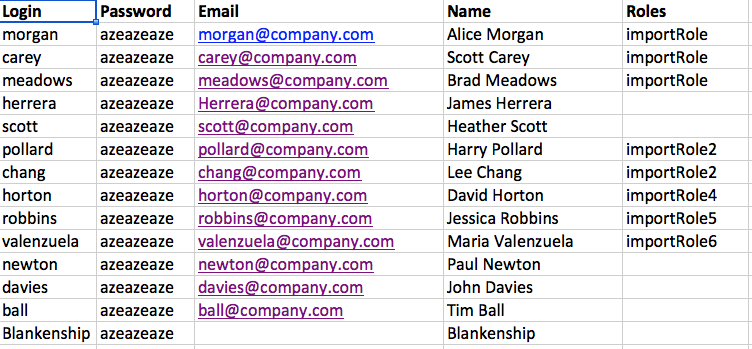
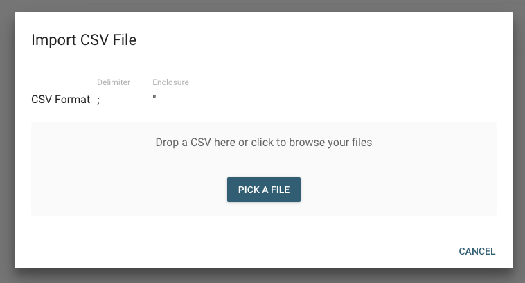
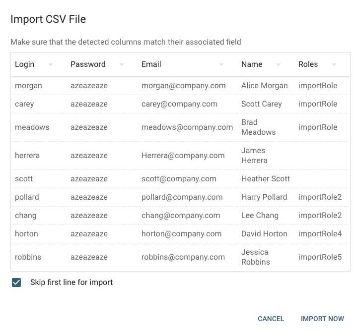

This is a specific Enterprise Distribution feature: starting with Pydio 8, you can import users massively using a Comma Separated file.

## Prepare the CSV  

Using a text editor or a spreadsheet editor, prepare the data that you will import with at least the following columns: 

 - **login** user identifier used to login
 - **password** user password

You can also add other columns containing the following data : 

 - **name** The display name showed to other users
 - **email** an email address
 - **role** a pydio role to be applied at import when creating the user. If it does not already exists in Pydio, it will be created.

You don't have to name these columns, the importer provides a step to map the columns to the expected data. That said, you can use a line as header, imported lets you 
ignore the first line. Below is a sample file prepared for import.

Make sure to set up the correct "delimiter" and "separator" when exporting to CSV. Default values are generally respectively "quotes" and "semi-column."

## Load file in Importer

In your Admin Dashboard > People section, use the third button in the header to open the CSV importer

Drop the CSV file you have prepared or open the picker to select it from your computer. It will be uploaded and the first lines will be displayed to setup the mapping.
There, you can see each columns, and choose the selector in each column header to tell what data it is containing. If you have extra data, you can select "Ignore" as well.

If you have a line of headers in your CSV, you can ignore it by checking the box at the bottom of the screen.

## Start Importing

Once you are ready, start importing and the task will run in the background.

You should see the various users creation in the bottom right notification bar.

## Refresh the list

The list is not automatically refreshed. Hit the refresh icon in the top right of the list to see the users and start assign rights to them!