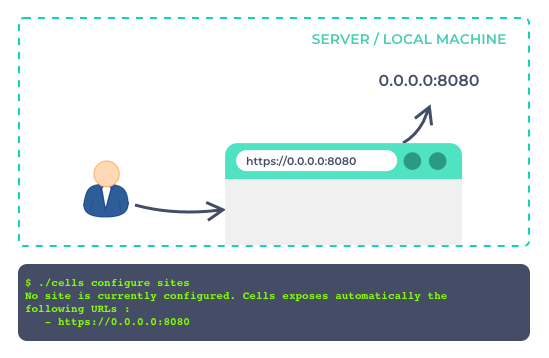
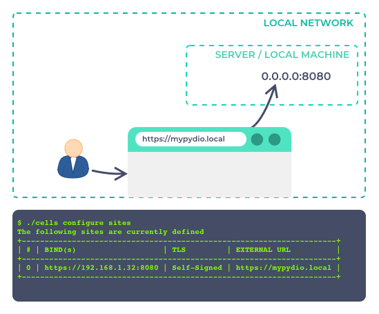

A site is a secure access route configuration in the [Cells Gateway](/cells-v4/admin-guide/quick-start/glossary).

The default configuration will get Cells up and running quickly with a direct access on a server or on a local machine. You can extend to wider network 
and/or secure that access with Sites.

## Command line interface

```
./cells configure sites
```

1. **Bind Address(s)**: one or more `<ip/hostname:port>` to bind Cells to local host's network interfaces addresses. URL can be used in case of a TLS setup with Let's Encrypt.

2. **TLS Settings**: [TLS configuration](https://docs.pydio.com/en/docs/cells/v4/configure-tls) for HTTPS support (TLS, Let's Encrypt, External URL)

3. **External URL**: Accept traffic coming to this url and redirect to one of the bind address.
    Typically if the app is behind a reverse-proxy or inside a container with ports mapping.

4. **Maintenance Mode [On|Off]**: expose a maintenance page on this endpoint with Cells still running and accessible via the other sites.

## Default Configuration

The Cells gateway starts by default on `0.0.0.0:8080`.

By using 0.0.0.0, the gateway will allow incoming traffic to any IPv4/domain of the machine network interfaces.

If the port 8080 is busy (already used by another process), it will try other options.

A self-signed certificate is automatically generated for supporting TLS connection out of the box.



## Add a Site

All examples below can be used separately or in conjunction with one another.

### Local network example

Let's imagine you want to make your Cells accessible for everybody in your local network via the mypydio.local address. You already have your local DNS
and port forwarding ready so that the incoming traffic redirects to the Cells server on port 8080. You've also generated a certificate, locally trusted.

We indicate all this to Cells using the command and the following parameters:

  - Bind Address: IP:8080
  - TLS: Your own key/cert pair
  - External URL: https://mypydio.local



### Public access example

Let's imagine you want to make your Cells accessible via the world wide web. You have a secure reverse proxy running that redirects all traffic to a URL to the
Cells server on port 8081. You can use the self-signed TLS parameter here as the only traffic we need to secure is between the reverse proxy and Cells.

We indicate all this to Cells using the command and the following parameters:

  - Bind Address: IP:8081
  - TLS: Self-Signed
  - External URL: https://mypydio.com


## [Ent] Advanced Usage

When using multiple sites, you can use the Sites URL to make Cells behave differently depending on the site accessed. See for example:

 - [Authentication Connectors](https://docs.pydio.com/en/docs/cells/v4/ent-using-sso-external-identity-provider): display different ways of authenticating on different URLs.  
 - [Security Policies](https://docs.pydio.com/cells-v4/admin-guide/secure-your-data/ent-dynamic-access-control/using-security-policies/): use the URL in the context of the security policies to restrict access to the www site to specific IPs.
