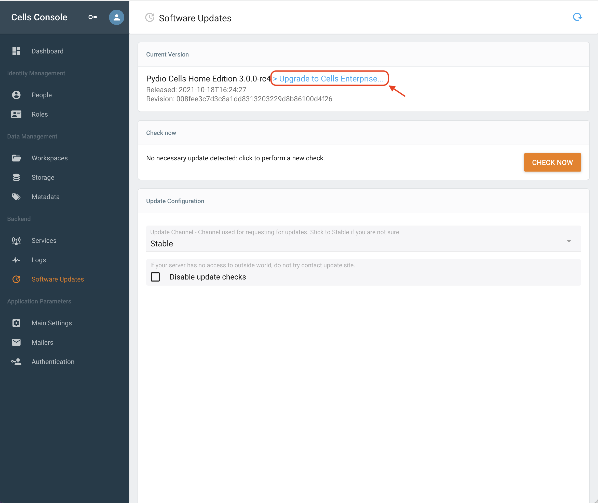

Cells binary is self-contained and can be easily updated / upgraded. Use the in-app tool, the command-line, or simply replace the existing binary by the [latest binary](/en/download). All necessary migrations will be performed on version-change detection. Downgrading is not possible though, as downward migrations are generally not implemented.

## In-App Tool

### Update Pydio Cells to the latest version


- Check new updates available with the **Check** button,
- Select the version and install. Once it's finished you will be invited to restart your Cells instance.
- On Linux if you are bound to privileged ports (80 or 443) **make sure** to set the capabilities with:

```sh
  setcap 'cap_net_bind_service=+ep' cells
```

### Upgrade Pydio Cells Home to Pydio Cells Enterprise



Click on **Upgrade to Cells Enterprise**:

- A menu appears, proceed by clicking on **start**.
- You must accept the terms of the license (check box at the bottom).
- You are now invited to provide your License Key.
- Press **install now**.
- If you are on Linux and using port `80` and/or `443`, make sure to give correct permission to your binary:

```sh
sudo setcap 'cap_net_bind_service=+ep' /opt/pydio/bin/cells
```

## Command Line

### Update Pydio Cells to the latest version

- Run the command `./cells update`
- Identify the latest version number available (for instance 4.0.1)
- Run: `./cells update --version=4.0.1`
- If you are on Linux and using port `80/443`, set the capabilities with: `setcap 'cap_net_bind_service=+ep' cells`,
- Restart Cells

### Upgrade from Home to Enterprise Distribution

- Stop the Cells service
- Download the latest `cells-enterprise` binary and replace the current one (if you are using `systemd` either rename the binary to `cells` or update your `cells.service` target)
- Add the key provided by our sales team in a `pydio-license` file owned by the user running Cells in your `CELLS_WORKING_DIR` directory
- Restart Cells.

## Notes

### Disabling automatic checks

In some situations, your server is not able/allowed to access the internet. You can turn off the automatic checks to avoid seeing errors in your admin dashboard. 

- Go to: `Admin Web Console > Software Updates` 
- Check the `disable update checks` box. 

### Security

To provide an additional security layer and to avoid MITM attack, all binaries downloaded from the official update server are signed with our private key: the server always check the validity of the package it has downloaded before applying the upgrade (by replacing the Pydio Cells binary).

### Do not forget setcap!

After Updating always make sure to set the capabilities if you are running on a Linux server.

```sh
setcap 'cap_net_bind_service=+ep' cells
```

This is not compulsory if you use our recommended `cells.service` systemd configuration that defines this parameter: `AmbientCapabilities=CAP_NET_BIND_SERVICE`. 
We yet strongly suggest to do it so that you won't get stuck in the future if you ever happen to try starting the apoplication by directly runing `cells start` with the `pydio` user. 

### Upgrading from Cells to Cells Enterprise

After upgrading to enterprise distribution, make sure that you have the license file, located in `CELLS_WORKING_DIR/pydio-license`.
