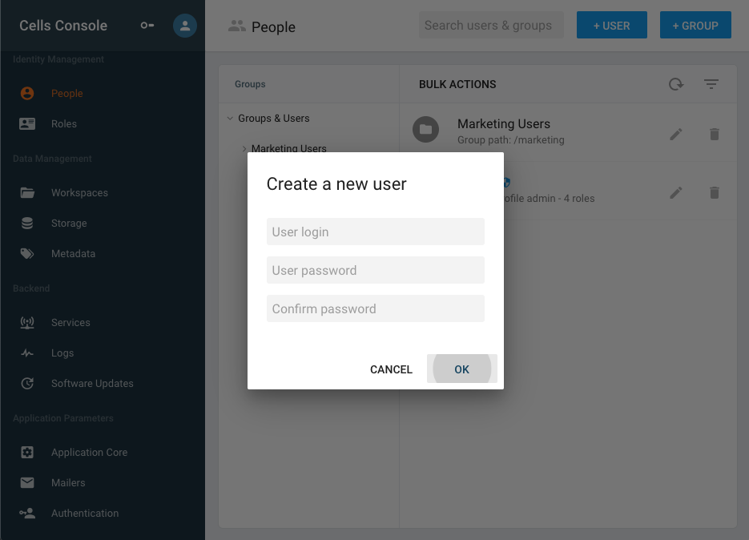
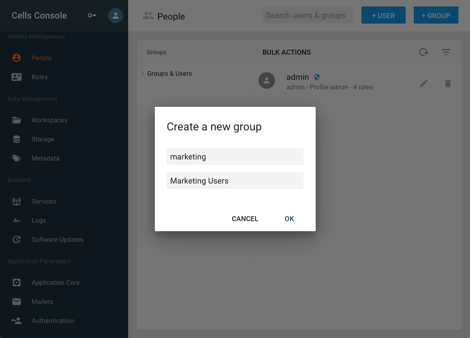

Pydio Cells provides advanced features for managing users. By implementing the authentication based on OAUTH2 standard, it can fully integrate in your Single-Sign-On (SSO) infrastructure and delegate authentication to your existing user directory. It can also bind to external identity providers like Github or Google, allowing your in-house collaborators to share files with external users.

Yet, Cells provides a complete embedded solution with an internal directory that should be sufficient for most cases and that we present in the following section.

Going to `Cells Console > People` section, you can easily create new users and organize them by groups. Groups allow you to organize users in folders like you would with files. In a similar way, one user can only belong to one group. 

## Users

To create a user go, click on the **+USER** button located in the top right corner. The following menu appears:

- **User Login**: this can **not** be changed afterwards.  
- **User Password**: put the password of the user, you have to type it twice to ensure its validity. Make sure to always use strong passwords. Note that the plugin that performs password strength check is fully customizable in Cells Ent.

When editing an existing user, you have access to following information:

- **User Profile**: this global category provides high-level set of permissions to the user. It can be used in conjunction with roles. Possible values are:
  - _standard_: the most common profile
  - _shared_: a restricted profile applied automatically to external users created by standard users
  - _admin_: a super user with access to the Cells Console and most of the internal resources
- **Name**: a human-friendly label for this user (editable by the user)
- **Email**: e-mail address to receive notifications and invitations (editable by the user)
- **Language**: default language for showing the interface (editable by the user)
- **Maximum Shared Users**: an optional limit for the number of shared users this user is allowed to create.

This screens also gives access to useful actions:

- **Change Password**: manually reset the user password
- **Lock out / Reactivate**: instantly disconnect the user from all clients, or reactivate its access if it has been automatically locked out after too many failed login attempts. This `unlock` operation can also be done using the command line.
- **Force Password Change**: if switched on, at the next connection, the user is presented with a password change dialog and cannot login until she updates her password.

The other tabs of the user editor are used to manage the users permissions (see the Access Controls chapter to learn more). Finally, the profile can be used to filter the users list, and _shared_ and _admin_ users are highlighted by a special icon in this list.

## Groups

Groups allow you to manage the rights, parameters and actions of many users at once. It is usually used to regroup users that have the same usage of Pydio Cells, access the same workspaces, etc.

To create a group, click on **+GROUP** located on the top right. The following menu appears:

- **Group Identifier**: the ID for this group in Cells DB (useful for api etc...).
- **Group Label**: a human friendly name.

*Hint*: If you need to move a user from one group to another, you can simple use drag and drop in the user tree.

## Additional operations

The search box at the top of the `People` screen lets you to quickly find users using their login or name. When you are in _Search Results_ mode, you can edit or delete a user, or move it to a group as required.

The BULK ACTIONS button allows you to select all users in page to delete them at once. When selecting the whole page, only users are selected, not groups.

--------------
_See Also_

- [Using SSO features to bind to external directories](https://docs.pydio.com/cells-v4/admin-guide/connect-your-users/single-sign-on-features/index/)
- [Managing permissions on Users, Groups and Roles](https://docs.pydio.com/cells-v4/developer-guide/cells-development/security-model/role-based-security-rules/)
