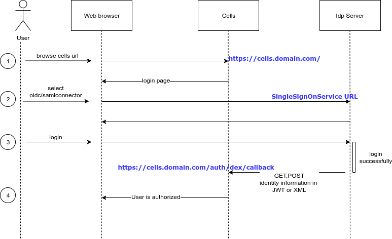

You can add external Identity Providers to Pydio Cells Enterprise. Users will choose between a list of external Identity Providers you have configured (eg: Login in with Google, Facebook, Github...) instead of the traditional login page. Users that log in from an external Identity Provider are automatically created in a separate group in Cells internal user repository.

## Involved Parties

When configuring Cells with external providers, please keep in mind that you are working in an environment where several entities must know each other and exchange security information via public network. You must know the role of each entity and the protocol required to exchange information in a specific order. Although OIDC and SAML are different frameworks, they have following parts in common:

- **Users**: the owner of the Cells data (_resource_), whose identification information is owned by the external Identity Provider. Before accessing their resources in Cells, users must identify with the Identity Provider and authorize Cells to access the resource on their behalf.
- **User Agent**: the client application/device used by users to connect to Cells. It can be a web browser, sync client application or mobile application.
- **Cells**: the _Resource Server_ in OIDC, or _Relaying Party_ in SAML
- **Identity Provider**: Depending on the framework, this server provides several services such as, authentication, identification, consent apps... You can use commercial servers such as Google, Azure, or on-premise servers that understand one of the multiple protocols available.
- **Connectors**: inside Cells, they are pre-configured adapters that "talk" with external Identity Providers using the correct protocol.

Both OIDC and SAML are relying on PKI to encrypt and certify exchanged data. If you are working inside a test environment without well-known-authority signed certificates, you may also prepare a local Certificate **Authority Server**.

## Data exchange workflow

1. User opens Cells in a web browser
1. Cells renders login page to the user. If there are more than one connector, users have to pick a connector to login. Pydio Cells ships an internal Connector providing a simple login dialog for Cells internal users directory.
1. If the connector is external, user is redirected to the login page of the corresponding Identity Server. User may use their credential (username/password), 2FA, etc. to authenticate to this server. If authentication succeeds, the Identity Server sends user identity information (such as user ID, email, groups, ...) in JWT or XML format to Cells and redirects the page back to Cells. This JWT/XML message will be inspected by Cells to allow or deny access.
1. If all this workflow succeeds, the user can access to their data (or resources) inside Cells.

## Cells Connectors

Connectors can be added in Cells via the `Cells Console >> Authentication` menu. Parameters differ between each connector, but they can be summarized into four groups:

- **SSO URL** : URL of the Identity Server
- **Client ID/Secret** : Cells instance identification, must be previously registered inside the Identity Server
- **Redirect URL** : an endpoint which Cells open to Identity Server for sending back information.
- **Auxiliary infos** : Certificate Authority file, mapping from IdP attributes to Cells user attributes, etc.

------
_See also_:

- [OpenID Connect](https://openid.net/connect/)
- [OAuth 2.0 Authorization Framework](https://tools.ietf.org/html/rfc6749)
- [Security Assertion Markup Language (SAML)](http://docs.oasis-open.org/security/saml/Post2.0/sstc-saml-tech-overview-2.0-cd-02.html)
- [Google authentication with Cells](https://pydio.com/en/docs/kb/identity-management/using-google-identity-provider) (OIDC)
- [Github authentication with Cells](https://pydio.com/en/docs/kb/identity-management/using-github-identity-provider) (OIDC)
- [Azure ADFS](https://pydio.com/en/docs/kb/identity-management/using-azure-adfs-identity-provider)
- [ADFS on-premise server](https://pydio.com/en/docs/kb/identity-management/using-premise-adfs-server-identity-provider)
- [SimpleSAML](https://pydio.com/en/docs/kb/identity-management/using-simplesaml-php-server-identity-provider) PHP server (SAML)
