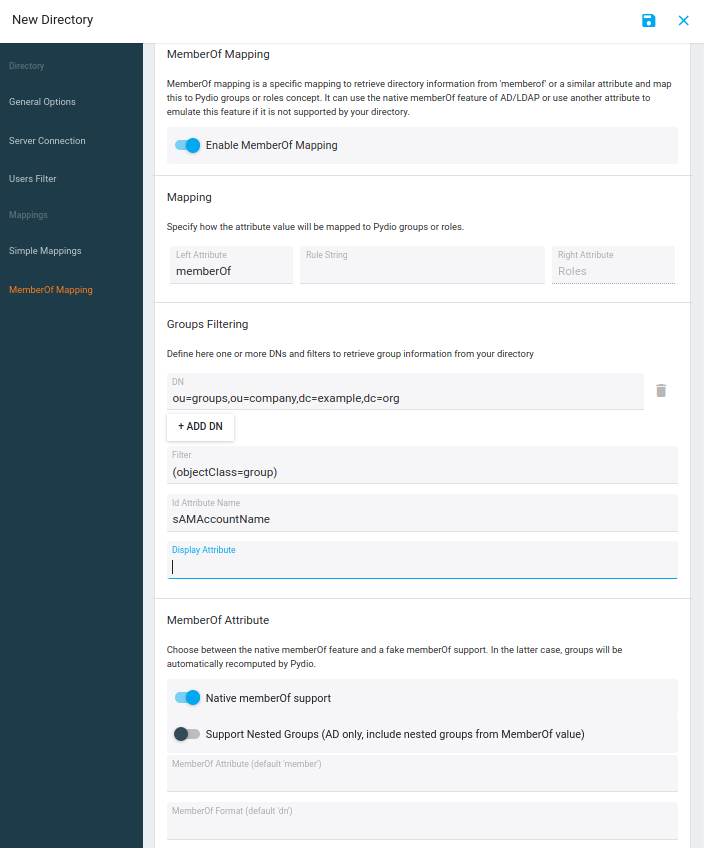

Dynamic mapping of LDAP groups to Pydio roles is a powerful feature allowing administrors to keep users management on the LDAP-side, while Cells will automatically map these groups to roles. Setting Cells access lists on the roles is done once, and the synchronization will update users and their permissions as it runs.

If your LDAP server supports the `memberof-overlay` in LDAP filters, each user object in LDAP response may have a "memberOf" attribute. Generally, this list of groups may contain system groups that we don't want to import and we are looking for only a small set of groups. Cells provides a configuration interface with simple but yet flexible parameters to help you refine the groups imported inside Cells.

* Microsoft Activie Directory supports natively `mamberof-overlay`
* If your LDAP does not support `memberof-overlay`, we provide a magic parameter to force your ldap to list off the `memberof` value that, in turn, provides the input for the mapping.
  
## MemberOf mapping

This is a specific case of mapping, in order for a user to be assigned one or more roles in Pydio Cells, depending on the `memberOf` attribute defined in your external directory. `memberOf` is a multiple value attribute of user object which itself contains a list of groups where this user is a member. You should define a rule.

- **Left Attribute:** `memberOf`
- **Rule String:**
- **Right Attribute:** `Roles`

The values of `memberOf` attribute can contain any group of the LDAP directory: you might want to narrow down the list of the groups that are to be mapped in Cells by using group filtering.

_The above screenshot shows an example of `memberOf` mapping, where:_

1) toggles this feature ON and OFF

2) Mapping: defines the name of the attribute that is to be used *in your LDAP server*. This is useful to emulate the `memberOf` feature if it is not supported by your implementation.

3) DN: is the DN of one or more organization unit in the LDAP directory in which the connector searches for groups. If memberOf values have some groups in other locations, they will be ignored.

4) Group Filter: Like **User Filter**
  Example: `(objectClass=group)` or `(objectClass=groupOfNames)`

5) ID Attribute: Pydio will take the value of this attribute of group object to use as **Role ID** in Cells.

Some LDAP directories do not support `memberOf` attribute by default.  
If you turn off the `Native MemberOf support` toggle, Cells tries to calculate this attribute from the `Fake memberof Attribute` value and its format.

- Fake `memberOf` Attribute: name of the attribute of group object which holds the member identity. In OpendLDAP, this value is usually `member` or `memberuid`.
- Depending on the value of `Fake memberOf Attribute` and the schema of your LDAP, the corresponding format is usually `dn` or `uid`.

Values of these two options are usually:

- **Fake memberOf Attribute:** `member`
- **Fake memberOf Attribute Format:** `dn`

or

- **Fake memberOf Attribute:** `memberuid`
- **Fake memberOf Attribute Format:** `uid`

## Fine-tuning

As explained in the introduction, and due to the Master/Slave model of the integration, we strongly advise you to perform following fine-tuning on your instance.

### Remove My Account button

The easiest way to prevent LDAP-defined users to change information that are defined in your external directory(ies), is to define a system-wide rule that will disable the `My Account` button for the relevant users. This is achieved easily:

- As an admin user, go to: `Cells Console >> Identity management >> People`,
- Open for edit the parent group of your LDAP users,
- Open the `Application Parameters` page,
- In the upper-right corner, choose the `All Workspaces` option from the `Add for...` drop down list,
- Search for the `My Account` action of the `action.user` category by simply typing `my account` in the quick search field, and select it,
- Ensure the MyAccount toggle is turned off.

You are then set: the `My Account` button is then hidden for all corresponding users.  
Depending on your specific configuration, you might want to do this for various groups or define a specific role that can be applied to relevant groups and users.