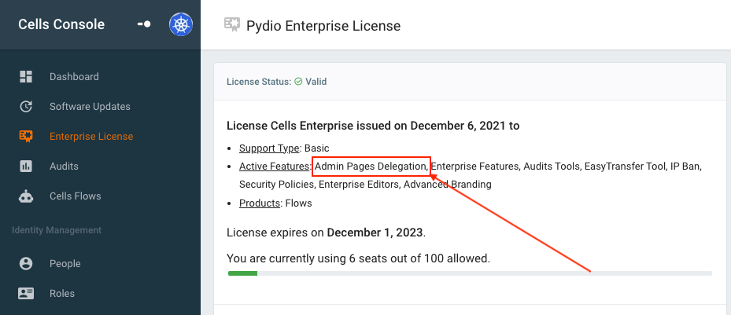
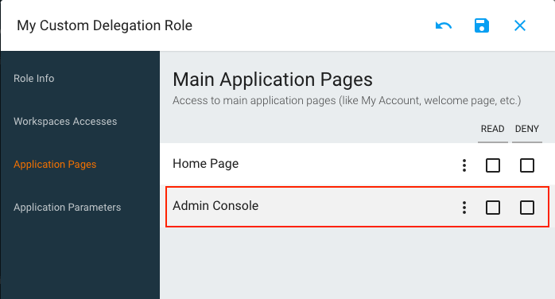
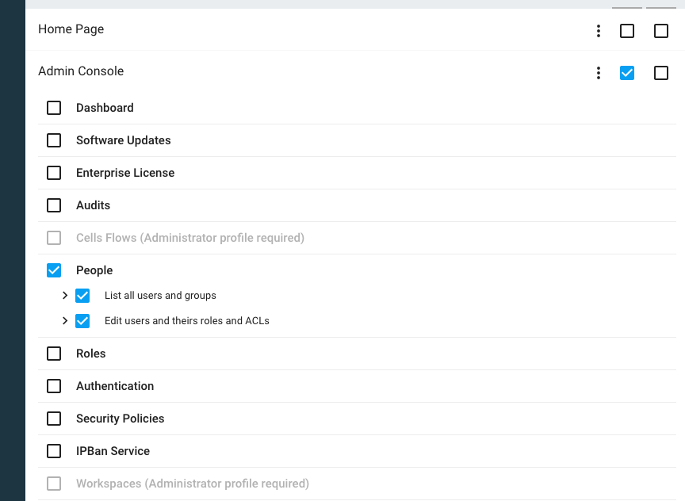

Sometimes it is necessary to grant some non-administrative users some administrative (but restricted) permissions. 

## Usecases

Typically, you may wish to provide your Ops team a monitoring entry into the system (logs, updates required status, services healths, etc...), without giving them the full fledge "super-user" role that would allow users and data modification.

Similarly, if you are using the [Group Tenancy](https://docs.pydio.com/cells-v4/admin-guide/connect-your-users/ent-group-tenancy/) feature, you can decide that a "Group Administrator" has the right to manage users inside her group, while not being allowed to see all the other pages of the Cells Admin Console. 

## Feature Activation

First, you must make sure that your Cells Connect / Cells Enterprise License is enabled for this feature. You can see this by looking at the Enterprise License panel, where the active license features are listed.

If you cannot see this, please [Contact Sales](https://pydio.com/en/contact).

If this feature is active, you can edit any user or role and go to the "Application Pages" menu: here you can see that the "Admin Console" access can be toggled, as would be any workspaces. 

## Delegating Permissions

Using the Application Pages > Admin Console READ access, you are presented with the exact same list of pages that you see in the Admin Console left-hand menu. Click on a page to give a consultation access to it. If you wish to give a write access as well, use the additional checkboxes to enable this. 

## Additional Notes

### A - Workspaces Management: use Cells instead!

Some specific pages are excluded from this delegation list, as they always require a super-admin permission.

The "Workspaces" page allows users to create Workspaces by defining their roots in the data tree, which includes all data sources. As such, giving access to this page always grants access to all the data. If you want to give limited access to workspaces, you should typically use the Cells feature, which allows non-admin users to create Cells within Workspaces that restrict the data they can view.

### B - Cells Flows: too much responsibility

With power comes responsibility... Using Cells Flows should always be restricted to super-admins, as it allows accessing all the data of the application. You can use Forms, Webhooks and Buttons to provide end-users interactions with Flows that you first define.

### C - Pages Accesses vs. API 

When you toggle the read/write operations for each page, these rights actually **update the underlying Rest API** that are used by the page. That way, you can be sure that you are opening this restricted permission only on a given API (e.g. the /a/user API when assigning accesses to People page), and on the other hand, that does mean that if you assign this permission, the corresponding API will be accessible for this user from an API client as well.