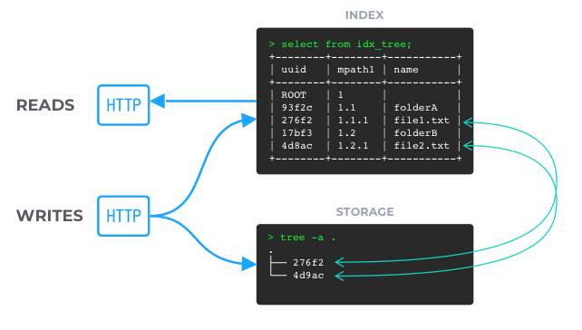

One requirement of many Pydio/PydioCells users was always to "keep the tree structure" of files and folders visible inside the storage (and eventually modify these directly without going through Pydio). To achieve this, Cells was conceived so that datasources rely on a unidirectionnal synchronization between the storage and the internal index. That way, the index is always reflecting the state of the storage, and if one wants to modify the storage content directly, a re-indexation is required.

But when files number is getting high, this can bring a bunch of issues, and sometimes a "resync" of the datasource is required to fix index issues.

Starting with Cells v3, a new datasource format was introduced, that keeps the tree structure only in Cells internal indexes, and stores files as a **flat structure** inside the storage. This is more inline with "object storage" design, and brings huge performance gains as no more "sync" is required to maintain these indexes. This is now the preferred format, unless a direct access to the files inside the storage is necessary.

This "format" is decoupled from the storage technology : any datasource (Local FS, S3 or S3 compatible, etc...) supports both formats.

## Structured Storage: best for accessing the files directly

### Objects-to-Index Synchronization

In structured format, the files and folders you see in Cells are exactly the same as the storage contents. Any modification, even going through the Cells interface is always applied on the storage, and then reported to the index throught the real-time synchronization. 


In this configuration, modifying the storage content directly and triggering a manual re-synchronization makes sure that the index is always up-to-date.

### Drawbacks

As Cells is speaking "object" with the storage, the drawback of this configuration is that huge moves (like a folder rename) require first moving all the objects inside the folder to their new name, listening to these move events, factorizing them and finally renaming the folder inside the index. Furthermore, the "move" operation does not really exist in object storages, but always require a copy/delete sequence!

Another drawback is the presence of ".pydio" hidden files inserted in each folder to maintain their UUID. 

### Backup / Restore

For structured storage, backup/restore is just a matter of copying the data to/from an other location and launching a resync manually.

## Flat Storage: best for performances

### Embracing the "objects storage" world

In flat storage, files are stored as basic data blobs named with their internal UUIDs. Folders are not physically present inside the storage. The index service maintains the whole tree of folders and files and will just query the storage when an actual data modification (upload/download) is necessary.
As a result, tree modifications like "moves" are performed directly inside the index, at best speed. 



This is exactly what object storage technologies are designed for : serving objects by keys, allowing infinite horizontal scaling possibility.

### Backup / Restore

For admins, it can be a bit scary to have a look at their storage and see just a bunch of UUID-named files. What if Cells is down, how will I get my folders/files back? A command line tool is provided to backup a flat datasource index directly inside a dedicated DB file on the storage. This DB file can later on be read by Cells to initialize a new datasource with the saved index data.

To backup the index of "ds1" inside a "snapshot.db" file, run:
```
cells admin datasource snapshot --datasource=ds1 --operation=dump --basename=snapshot.db 
```
Then you can restore this index with the opposite command:
```
cells admin datasource snapshot --datasource=ds1 --operation=load --basename=snapshot.db 
```
Beware that the "load" operation will override the current index data! You can also create a new datasource and specify "snapshot.db" in the Advanced options.

_[Note]_ Performing regular backup of your SQL Database is enough to make sure that you are able to recover your files hierarchy. This optional on-file snapshot of the index table is a second layer of security, in case you loose your DB!

### Generating snapshots with Scheduler/CellsFlows

As an addition to the command-line, the "dump" operation can be manually triggered from the scheduler. For Enterprise Distribution, an additional job is programmed 
to run every night and dump snapshots for every Flat datasources. By default, these snapshots are kept for 10 days.

## Switching Datasource Format

A command-line tool is provided to eventually migrate a datasource from flat to structured and opposite. 

```
cells admin datasource migrate
```

This tool is a command-line, as the server must run in a particular state to allow this migration. Basically, all `pydio.grpc.data.sync.*` services associated with each datasource must be **turned off** during a migration operation. When using the command line, it will check against the service registry that the targeted sync service is not running.

It is better to not migrate data "in-place". For this reason, if a datasource "ds1" is stored in the bucket "bucket1" on the storage, you first have to create a new bucket "bucket2" where all data will be moved. Then, according to the new target format, the tool will move all files with correct renaming and eventually add or remove `.pydio` entries from the index. 

After a successfull operation, the tool will upgrade the configuration file to point the datasource to the new bucket. Files and folders entries in the index are always left untouched. After a restart, the operation should be transparent.

Please note that this tool can be handy in the case of full uninstallation of Pydio Cells. Use it to transform a flat storage to a structured one **before** uninstalling Cells!

## Special Case: "Internal" Storage

A third format, derived from Flat, is available to create specific datasources used for internal data, namely thumbnails and files versions. These datasources are using the same format as Flat, but have the specificity of not sending events to various parts of the application. 
