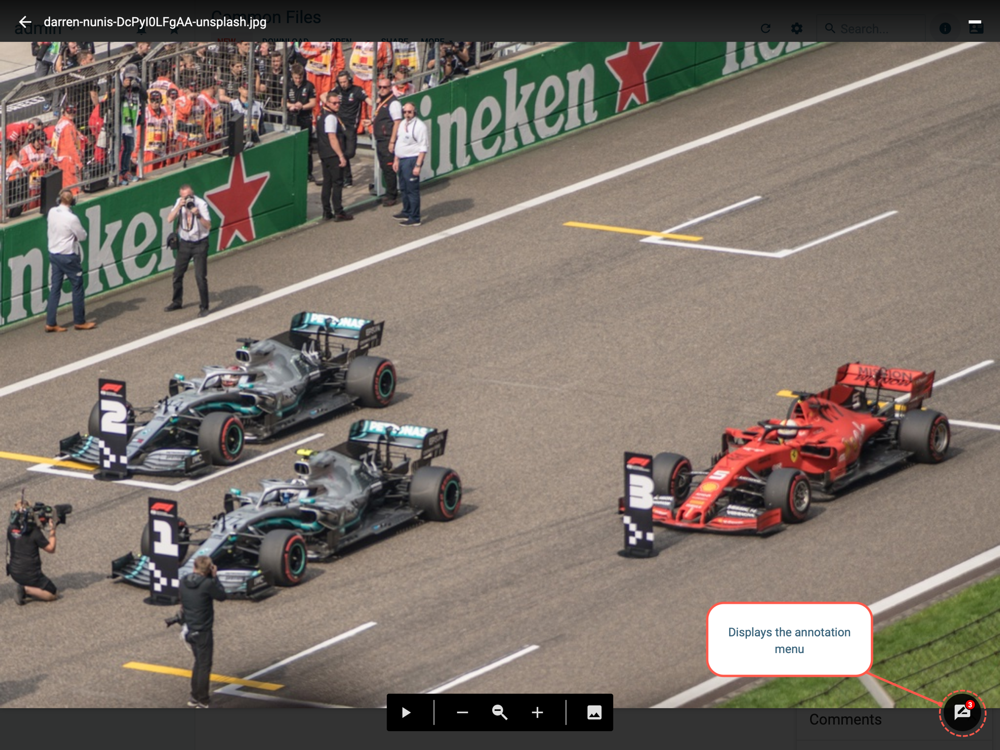
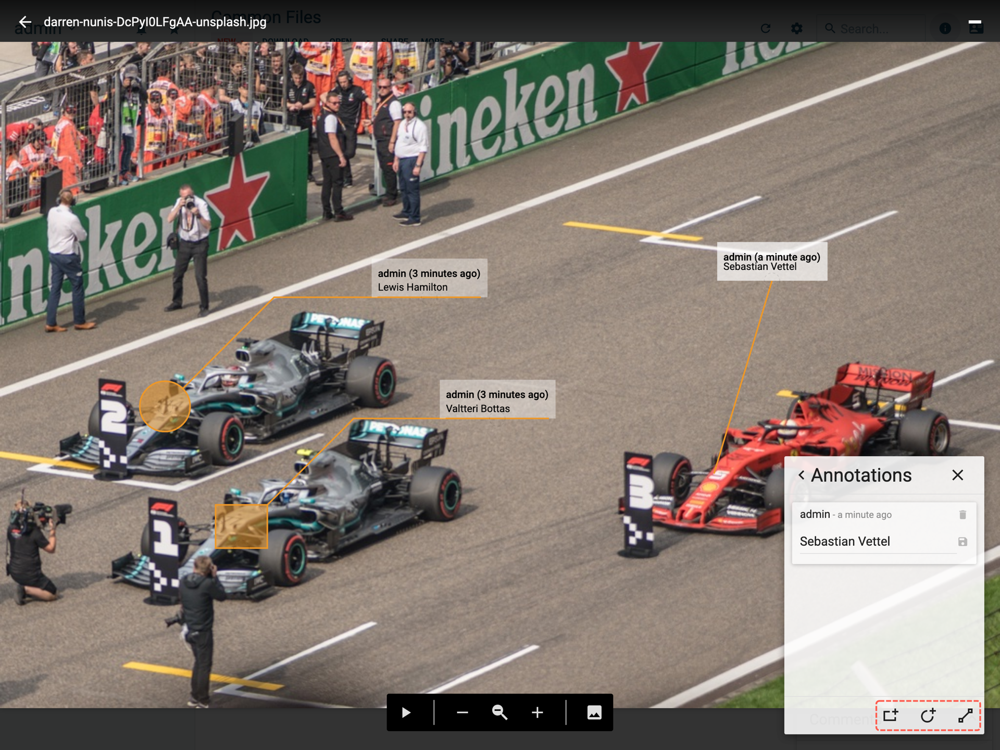
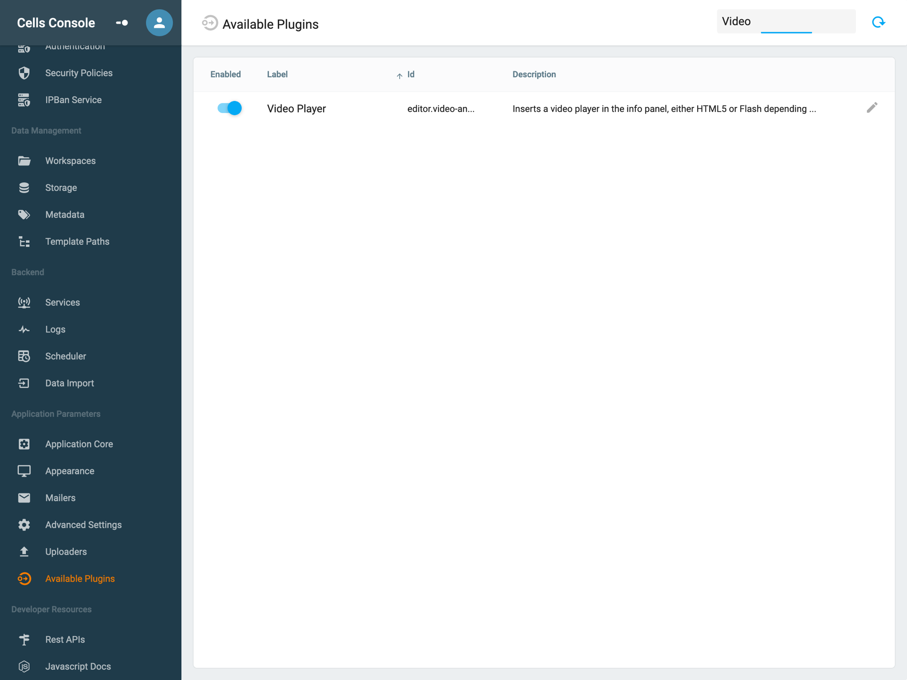
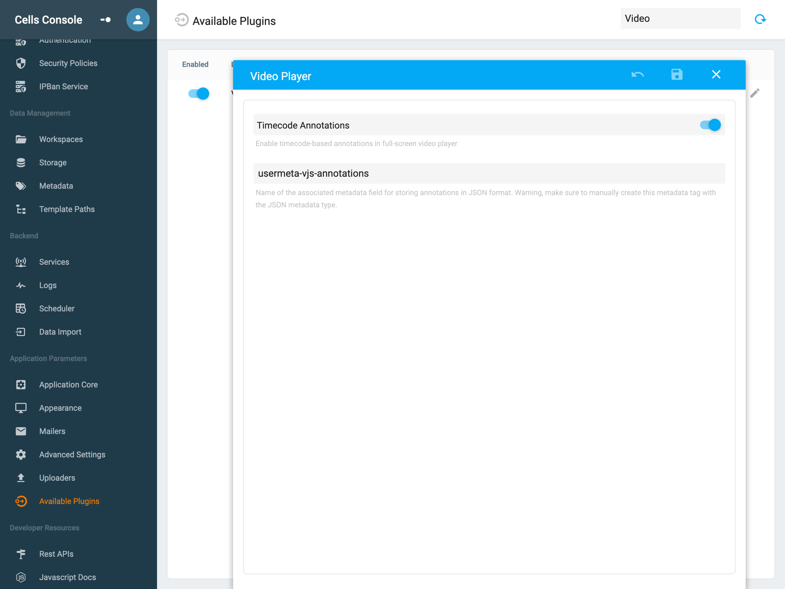
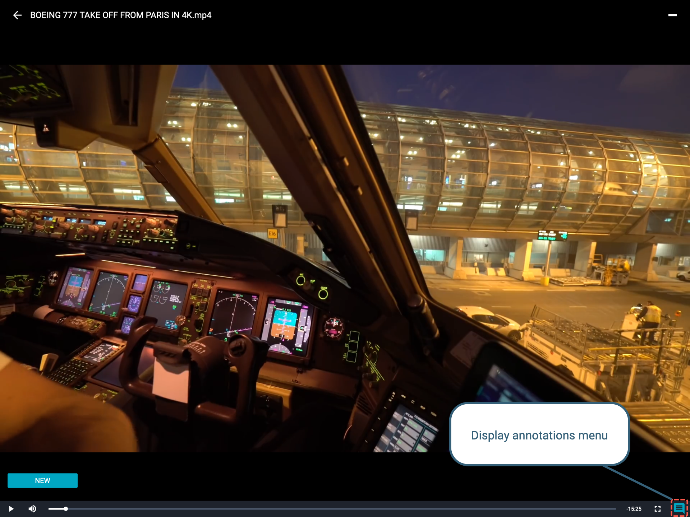

Image and video annotations are important features that enhance the collaborative aspect of the file sharing platform.  They provides ability to comment out any specific area of an image or a specific timecode inside a video.

## Enabling annotations

By default on the latest release (2.1.0) of Cells, image annotations are enabled but video annotations require manual enabling.

### Image annotations

To use image annotations, open an image with the Cells interface (main application or public link) and hit the annotation menu, a button located on the bottom right.

This will open up a menu, you can notice 3 different shapes selectors (**circled by red dotted line on the screenshot below**).

You can select any shape (in the screenshot above you can see the 3 different kind), then a cursor will be enabled, click on anything on the image and it will draw the annotation then you can add text to it.

### Video annotations

You need to first enable the annotations, to do so ([enable advanced parameters](https://docs.pydio.com/cells-v4/admin-guide/advanced/advanced-configurations/)) and browse to **Application Parameters >> Available Plugins**.

Search for **video**:

Hit the edit button on the **Video Player** plugin.

then enable **Timecode Annotations** and hit **save**.

Now you can go back and play any video and see the following indications.

Hit the display annotation button and then **new**, you can now select any part of the timeline and put a text to indicate what it is.

Once you have added an annotation this will be the end result:

