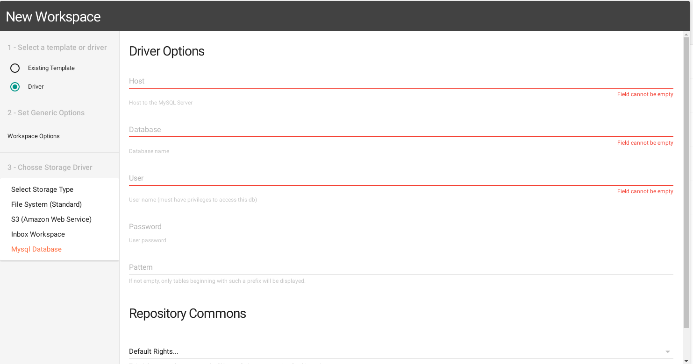
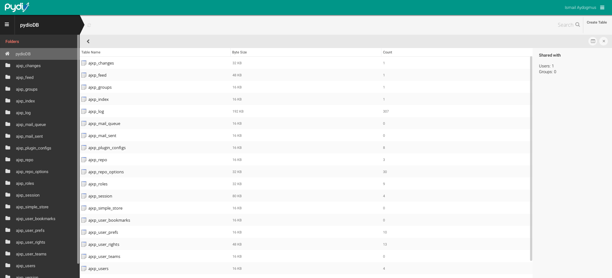
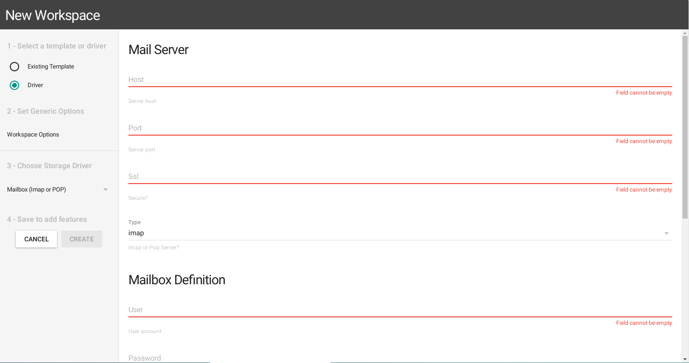
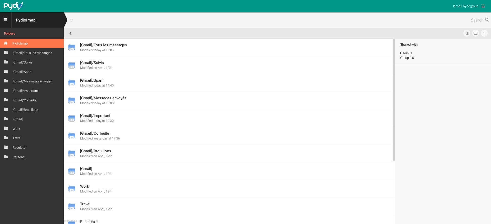

Some other drivers nicely demonstrate how Pydio can be used as a generic data-browsing framework.

### Access.mysql (DEPRECATED)

Disclaimer : If you installed Pydio by the linux repository ( apt / yum ), you must install the `pydio-plugin-access.mysql` or `pydio-all` package.

You can enable the plugin go to **All Plugins > Available Plugins > Workspaces Drivers > MySQL Database**

First you need to create a workspace with "Mysql Database" storage driver :

Then you need to add the Host, the database name, the user and the password. After that, as you can see This one will turn your Pydio client into a phpMyAdmin-like interface: you can browse tables and records, and modify the database structure: create/delete tables, create/delete columns from tables:

### Access.imap

Disclaimer : If you installed Pydio by the linux repository ( apt / yum ), you must install the `pydio-plugin-access.imap` or `pydio-all` package.

Disclaimer : Don't forget to install the "Mail_mimeDecode" package from pear.

You can enable the plugin go to **All Plugins > Available Plugins > Workspaces Drivers > Mailbox(Imap or POP)** and then Crete a workspace with "Mailbox" storage driver:

Associated with the Email Viewer (editor.eml), a workspace created with the driver transforms Pydio into a mailbox. View all your mailboxes and the emails, with support for text and HTML, as well as attachment. Only reading is supported, there is no ability to actually Send an email.

This can be handy to transfer a huge attachment directly from an email to another Pydio workspace, without having to download it to your desktop and re-upload it afterward.

A good usecase would probably to create a workspace template and let user add their own email-workspace, providing their own credentials for connexion. 

