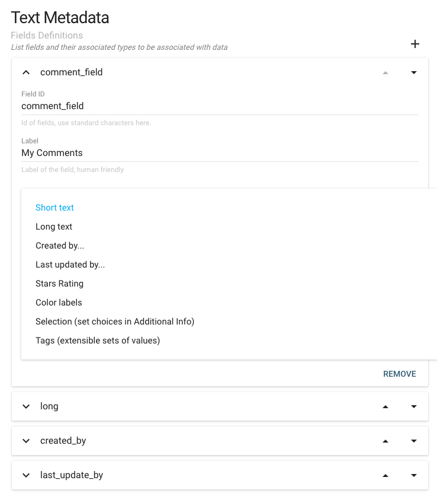
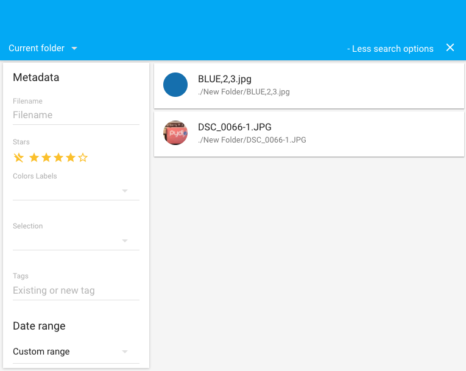
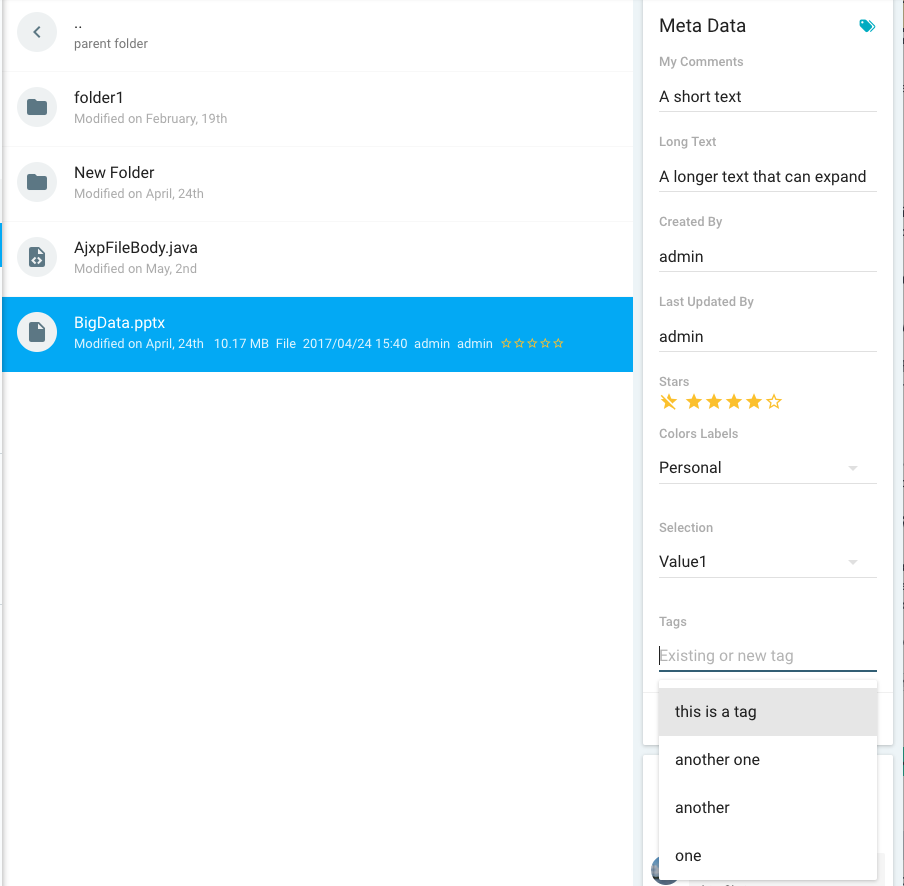
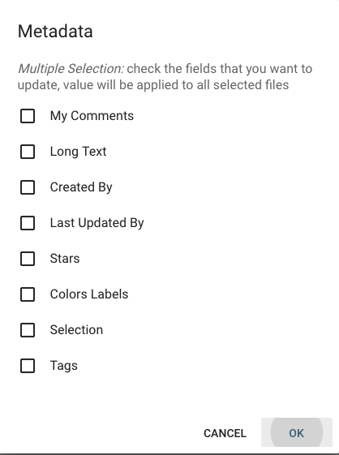

A common need for a system like Pydio is to let the users enter their own comments or remarks about the files they use. Pydio lets you simply define as much metadata fields as you want, with various field types available, through this plugin **meta.user**.

**This plugin requires a "metastore"** plugin to be active to do the actual storing implementation. If you are not sure of what this mean, just read the previous section. Metastore will handle the actual storing of the metadata, where as the plugin will handle how it is displayed and other users interface.

Metadata is attached to a file, which means it is moved/copied/deleted between folders when such operations are applied on the files. The plugin provides a little editor for adding/modifying these properties as simple text lines, display them in both the file list and in the infoPanel, and the added metadata is also searchable.

## Add Metadata to a workspace

To add some metadata fields, simply follow the steps:

+ In the "Additional Features" of a workspace configuration panel, make sure a MetaStore is defined, and add a "Text Metadata" plugin to the stack.
+ You can see a replicable set of fields:
    - Meta Field: a technical name for the field. Please use only alphanumerical characters. See below for specific keywords.
    - Meta Label: will be displayed to the user
    - Field Type: possible types of fields (see below)
    - Column visibility: can be "visible" or "hidden" (without quotes). This defines whether in List mode, the associated will be visible by default or not.
    - Additional Info: used for "Selection" type (see below)

### Metadata Types

The various possible types are described below:

+ **Short Text:** A simple text
+ **Long Text:** A longer text
+ **Created By:** Value will be automatically provisionned with the name of the user who uploaded/created the file
+ **Updated By:** Value will be automatically provisionned with the name of the user who last updated the file
+ **Stars Rating:** the field automatically turns into a 5-stars rating system for the files. View and edit the rating directly in the InfoPanel, in the FilesList (in list mode only for the moment), and in the "File Meta Data" form.
+ **Color Label:** the field turns into a labeling system that will apply a given css class to either the table row when in list mode, or the thumbnail cell when in thumb mode. The css classes are defined in plugins/meta.serial/css and by default they define 5 levels of priority with associated background colors. Use png transparent images as background colors, that way the user can still notice when a row is selected or not.
+ **Selection:** A select box with a set of value that you can define using the "Additional Info" field, using the following syntax: `key1|Label 1,key2|Label 2,key3|Label 3`.

### Indexing metadata for search engine

If you want the metadata to be indexed and searchable, you will have to edit the indexer (generally Lucene Indexer) feature and add a comma-separated list of fields names in the "Index Meta Fields" field.

Once configured, the search engine provides an advanced faceted search with the metadata:

## Rendering 

Below, you can see how the various meta field types will render in the information panel when selecting a given file: 

Additionally, you can mass-edit a selection of files or folders. In that case, the edition dialog will let you choose which metadata field you want to update. The changed value will be applied to all selected files.

