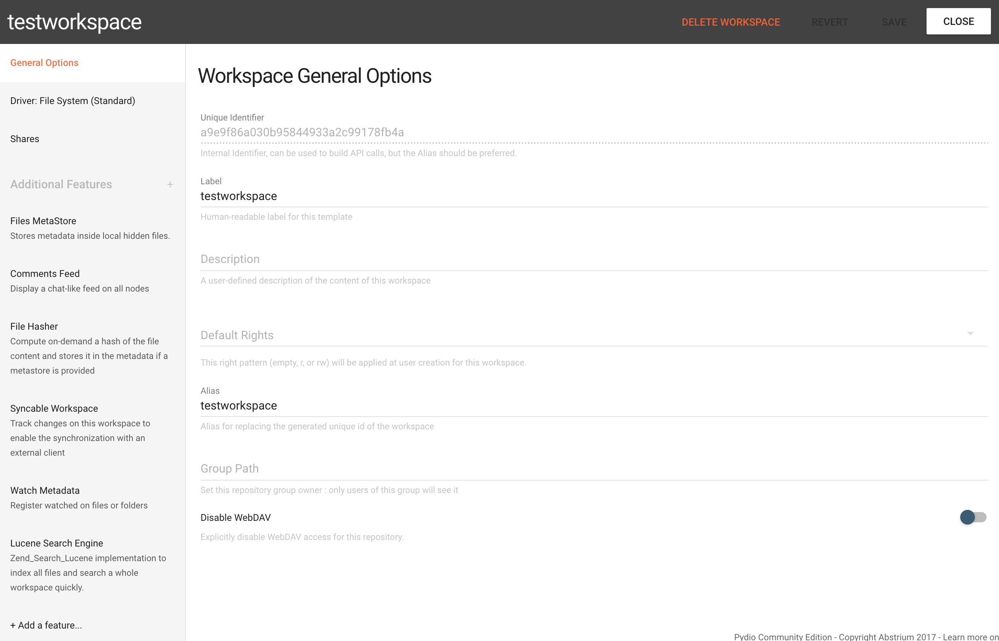
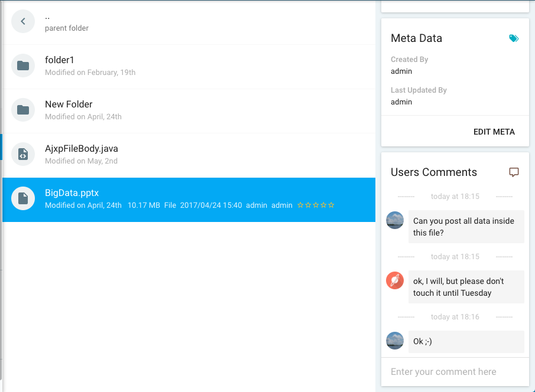

Add the Comment Feed feature to let users add their comment on any files or folders in a workspace.
This content appeared as a conversation feed, and is refreshed real-time, thus acting almost as a live-chat.

First you need to enable the feature on your workspaces to do that go to **Workspaces & Users > Workspaces > Choose a workspace and edit it** and in the **Additional Features** add **Comment Feed**.

The comment field will look like that.
