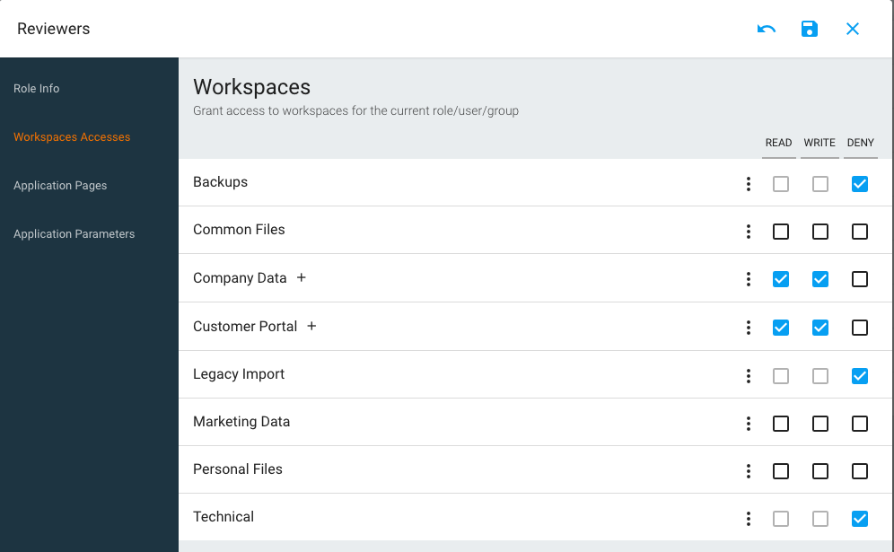
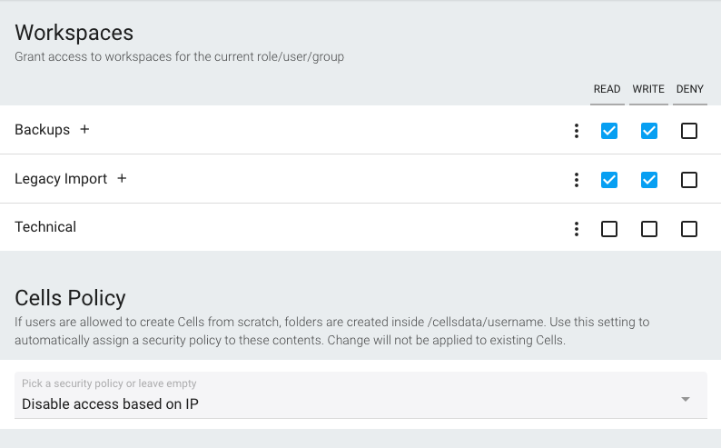

## Role as a central concept

The role abstraction is used by the system when defining authorizations and policies. Basically, a role is a simple container for an **Access Control List** (ACL). 
An ACL is a set of permissions that either grants access to any Node of the tree, or stores specific configurations attached to the corresponding roles (like Actions and Parameters custom values).

Nodes permissions are creating e.g. when assigning Read/Write to a Workspace or a Cell or a specific folder. They can be set manually (Read, Write), or computed dynamically at runtime by a Security Policy (see [Security Policies section](./ed-security-policies)).

### Admin-defined Roles

An administrator can create an arbitrary role and assign it to any users. A specific "Apply To" field also allows to automatically assign it to users with a specific profile.

The basic information attached a role can be edited: 

### Groups

Groups are a convenient way to organize users hierarchically. A group is defined by its path, for instance `/management/directors` and can be nested under another group. 

When installing the application, a single default group is present: the `ROOT_GROUP` group has the specific `/` path. As such, the `ROOT_GROUP` group is the ancestor of all users and groups.

**Each group is attached with a _canonical_ role** that takes the group Uuid as Uuid.

### Users

A user represent a single person or entity. The user provides the authentication within the system. 

A user can only be part of one group and is characterized by her login and the path of her group: typically:  `/management/director/jane`

The main properties of a user are her `username` (the login she uses to connect to the system) and a technical Unique ID (that is a `String UUID`). A user can also be enriched with metadata, like various information (name, photo...), and the user Login is used in the activities and audit logs.

**Each user is attached with a _canonical_ role** that takes the user Uuid as Uuid.

Additionally, an ordered list of Roles can be attached to any users.

## Access Control Lists

Access Control Lists allows the Administrator to actually apply the strategies described above. In the various users/roles/groups editors, one can grant permissions on Workspaces or on workspaces sub-folders for the corresponding "canonical" role.

### Merge Rules

When multiple ACLs (either static or dynamic) are applied on a single `Node`, either because they are attached directly to this `Node` or to one of its ancestor, they are merged following the rules :

- **_Deny by Default:_** if no acl is found, access is never granted
- **_Access Flags:_** if a Flag value is found, it opens the associated right.
- **_Explicit Denial Wins:_** if any "Deny" is found somewhere in the tree, it always wins over other values.

For instance for `READ` access this translates to:

- By default, a `Node` is never visible
- A "Read" flag attached to this `Node` (or one of its ancestor) gives Read access to this `Node`
- If a "Deny" flag is attached to the `Node` or one of its ancestor, it takes precedence and always prevent accessing this node.

### Setting Workspace Accesses

The basic operation to assign right goes through the "Read" / "Write" / "Deny" checkboxes. The first two will grant corresponding privilege to the currently edited object. The "Deny" operation is used to override a right that would have been applied by a role higher in the chain.

When editing ACLs, we recommend sticking to the Workspace level of granularity, to make your security model more maintainable. In some cases, you may require to directly assign rights at a folder level. For that you can use the "+" button next to the workspace name to list the workspace children and assign rights accordingly.

### [Ent] Dynamic ACLs with Policies

Policies are a powerful feature of Pydio Cells used to dynamically assign ACLs depending on the context (logged in user, day and time of the week, client IP address...) and a set of rules that can be scripted and combined together. 

See the [Security Policies](./ed-dynamic-access-control) section to learn more.

### [Ent] Policies inheritance and Cells

When using Security Policies to dynamically provide or deny access to a Workspace, if a user creates a Cell to share data from this workspace with another user, this Cell will automatically inherit from the original policy. 

For Cells created "from scratch" (not referring to an existing folder), an empty folder is automatically created, and by default it does not inherit from any parent workspace. If you want to apply a default policy for that case, you can use the "Cells Policy" field and preset a specific policy.

## Putting Things Together

As you probably understood by now, when a user is logged in, this user may have a certain number of Roles applying to her. From there, all Access Lists will be summed at runtime into a unique effective role.

### Computing Effective Role

All user's roles are used compute her actual role:

- If the user is part of nested groups /management/directors, she will inherit each Group Role starting from root:
  - _RootRole_ defined for "/"
  - _ManagementRole_ defined for "/management"
  - _DirectorsRole_ defined for "/directors"
- If the user has some arbitrary roles applied, e.g. "Subscriber" applied by admin and "Team of John" because she's part of a user team:
  - _SubscriberRole_
  - _TeamOfJohnRole_
- Finally the user always has her own canonical role
  - _CanonicalUserRole_

The "Manage Roles" component in the user editor provides you an accessible visualisation of all roles applied: 

The rules that will apply when trying to detect if the user has a right to access a node or should see a given action for example will be computed by **merging the various roles values in this order**: from top (always _RootRole_ first) to bottom (always _CanonicalUserRole_ last).

### Example

This model provides great flexibility to assign permissions on the Administrator side. Typical schemes can look like:

- Assign Read/Write on workspace Personal Files to Root Group (all users)
- Assign Read/Write access on workspace Accountants to group Accountants, same on workspace Engineers to group Engineers, etc...
- Assign Read access on workspace "Marketing Files" to Root Group, but Write access on this workspace to role "Marketing Editors". Then assign role "Marketing Editors" to a subset of users in various groups
- Deny Access on Personal Files to role "External Users", and make this role automatically applied to any user created by users (shared users),
- etc.

