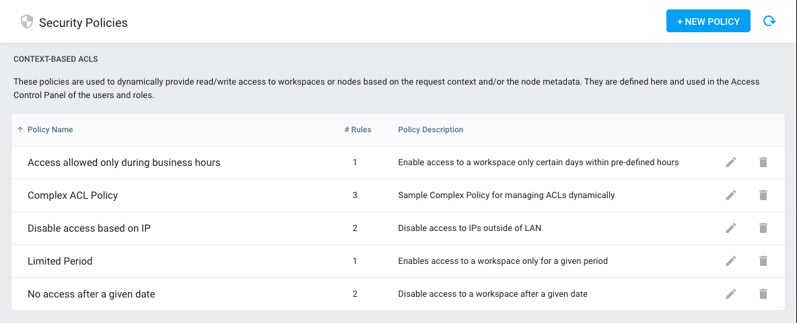
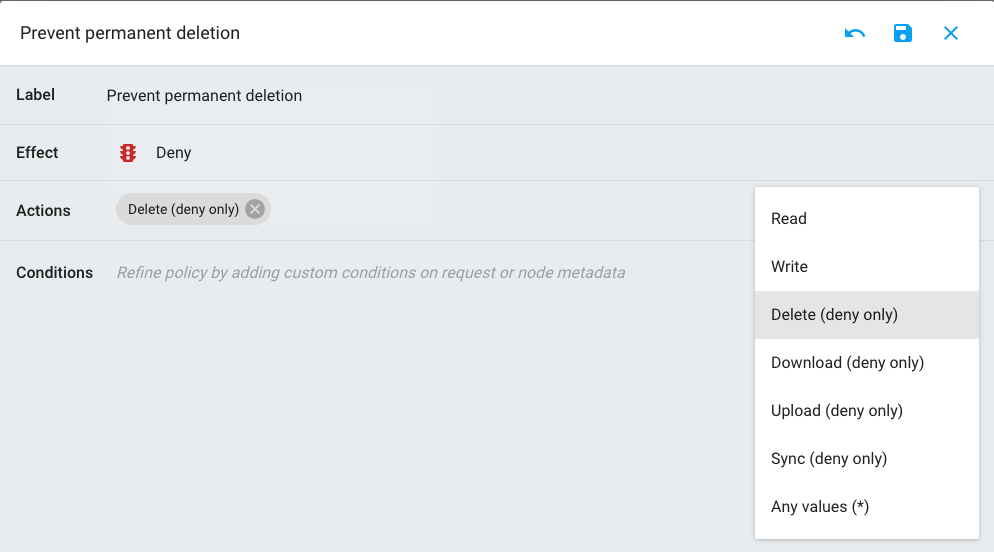

## Introduction

Security Policies provide an alternative approach to RBAC for managing permission grants. With security policies, you get fine-grained access control with the ability to answer questions in evolving environments. 

A security policy consist in a stack of rules that are evaluated at runtime, taking into account contextual information such as the HTTP Request metadata (hostname, client IP, HTTP method, etc) or the file or folder metadata (type, name, extension, user-defined tags, etc).

You can lean more about IAM Rules in [IAM Policies - AWS Identity and Access Management](https://docs.aws.amazon.com/IAM/latest/UserGuide/access_policies.html).

### Policy Rules

When evaluated, each rule of a security policy answers the following question: `WHO is ABLE to perform WHAT on SOMETHING in a given CONTEXT` :

|Question| Detail|
|---|---|
|Who | An arbitrary unique subject name, for example "ken" or "printer-service.mydomain.com".|
|Able| The effect which can be either "allow" or "deny".|
|What| An arbitrary action name, for example "delete", "create" or "scoped:action:something"|
|Something| An arbitrary unique resource name, for example "something", "resources.articles.1234" or some uniform resource name like "urn:isbn:3827370191"|
|Context| The current context containing information about the environment such as the IP Address, request date, the resource owner name, the department ken is working in or any other information you want to pass along. (optional)|

A policy is composed of one or many rules: 

### Deny by default vs. explicit deny

Composed of many rules, a security policy is always "Deny by Default". Given the Context, each rule will compute its "ABLE" value to "allow" or "deny". 

 - If no rules provide an "allow" value, policy is evaluated as denied. 
 - On the other hand, any rule evaluating as "deny" will supersede other rules and instantly set the policy to "deny".

## Cells Security Policies 

In Pydio Cells, _Resources_ can be of three types : a REST API endpoint, an OpenId Connect operation or a file or a folder (and by extension a workspace). 

### REST Resources	

These policies are protecting the REST APIs on a per-uri/per-method basis. They grant basic access to some specific APIs for public discovery or logged users. You should generally not touch these unless you know exactly what you do.	

### OpenId Connect Resources	

OpenId Connect Service is used for authentication of the user, before any access to the APIs. As such, you can totally disable the login operation for a set of users based on the requests context, e.g. disable logging from a given set of IP or at a given time.	

### Context-Based ACLs

These policies are used to dynamically provide read/write access to workspaces or files and folders. They are meant to be used in the Roles/Users workspace access panel in replacement to manual "Read/Write" assignements. 

The rest of this documentation is focused on Context-Based ACLs, as they are a powerful way to provide dynamic access to workspaces or to filter any files that users are allowed to see or modify inside a workspace.

## Using context-based ACLS for workspaces accesses	

Pydio Cells comes out-of-box with a carefully chosen set of pre-defined policies. In order to fully understand the concept, we strongly encourage you to check these pre-defined policies and their underlying rules.	

### How Security Policies apply to ALCs

If we refer to the `WHO is ABLE to perform WHAT on SOMETHING in a given CONTEXT` that each rule evaluates, in the context of ACLs, it usually refers to the following :

 - **_WHO_**: a list of identities defined by their username, profile or role
 - **_SOMETHING_**: a path to a specific workspace or node that user tries to access
 - **_CONTEXT_**: request or file/folder metadata.
 - **_WHAT_**: Read, Write or any other Action (see below)

Once defined, these policies are available in the "Workspaces Accesses" panel (for each role, user or group) to replace the manual "Read/Write" assignments. Assigning a policy to a given workspace means that it will be evaluated for all requests (_CONTEXT_) performed by a user with this role (_WHO_) on all nodes that are inside this workspace (_SOMETHING_). 

### ACLs Policies Actions

**Read / Write Actions**

The most common applicable actions for defining an ACL Policy Rule are "Read" and "Write". A basic policy that has one rule that sets "Allow" effect on "Read" and "Write" actions and no conditions is purely equivalent to a Read/Write manual permission assignment.

You can also combine Read and Write with "Allow" or "Deny" effects to specifically invert their application.

**Special "Deny-only" Actions**

The "Delete", "Download", "Upload" and "Sync" actions behave in a special way: they cannot be applied with "Allow" effect, because they always require an existing Read or Write permission to be set. These actions can only have a Deny effect and can be very useful to refine a generic permissions with more advanced ones. 

 - Deny Delete: forbid the definitive deletion of resources
 - Deny Download: forbid the actual content download of file data
 - Deny Upload: forbid the actual upload of file data
 - Deny Sync: forbid a sync client to connect to a resource

For example, one can expand the basic "Read/Write" permissions by allowing for example a user to "Read" files (= see the file in the list) without being able to "Download" (read their contents) them, or on the other side to "Write" (move them around) without being able to "Upload" (modify their contents) or permanently "Delete" them. 

### Using Conditions

The interesting part comes with adding "Conditions" to rules that may evaluate differently depending on the context. 

Pre-defined policies provide some Conditions examples:

|Policy| Rules|
|---|---|
|Access during business hours| `Allow` - `Read, Write` - if `Time is between Monday-Friday/09:00/18:30` |
|Deny access if outside local networkd|`Allow` - `Read, Write` `Deny` - `Read, Write` - if `Client IP is not localhost` |
|Hide all files with txt extension|`Allow` - `Read, Write` `Deny` - `Read` - if `File Extension matches txt`|

Policies 2 and 3 remind us that **effect is always "Deny By Default"**: if we do not set at least one rule that can be evaluated to `Allow`, accesses will never be opened to the workspace!

See [Next Chapter](./rules-conditions) to learn more about Conditions. 

### Create / Edit Policies

To create a new policy template click on the "**+NEW POLICY**" at the top-right panel of the `Cells Console > Security Policies` dashobard.  	

| Field | Description |
|---|---|
|Name|This is the name that will be displayed in the various lists, typically when a user picks up a policy to be applied on a workspace.|	
|Description|Text that explains what the policy is about|	
|Policy type|One of the 3 types of policy supported by Pydio Cells.|	

You then have to create rules for this policy template by clicking on the `ADD NEW RULE` button.  	
Here you must define:	

|Field | Description|
|---|---|
|Label| A self explanatory display name.|	
|Effect| Wether this rule will `allow` or `deny` the action when the condition on context is true.|	
|Actions| Wether this rule is applied on `write`, `read` or both actions|  	
|Condition| One or more Conditions that can will be evaluated at runtime|	

Conditions can be applied on two sets of metadata : request metadata and files metadata. They are described in the next chapter.