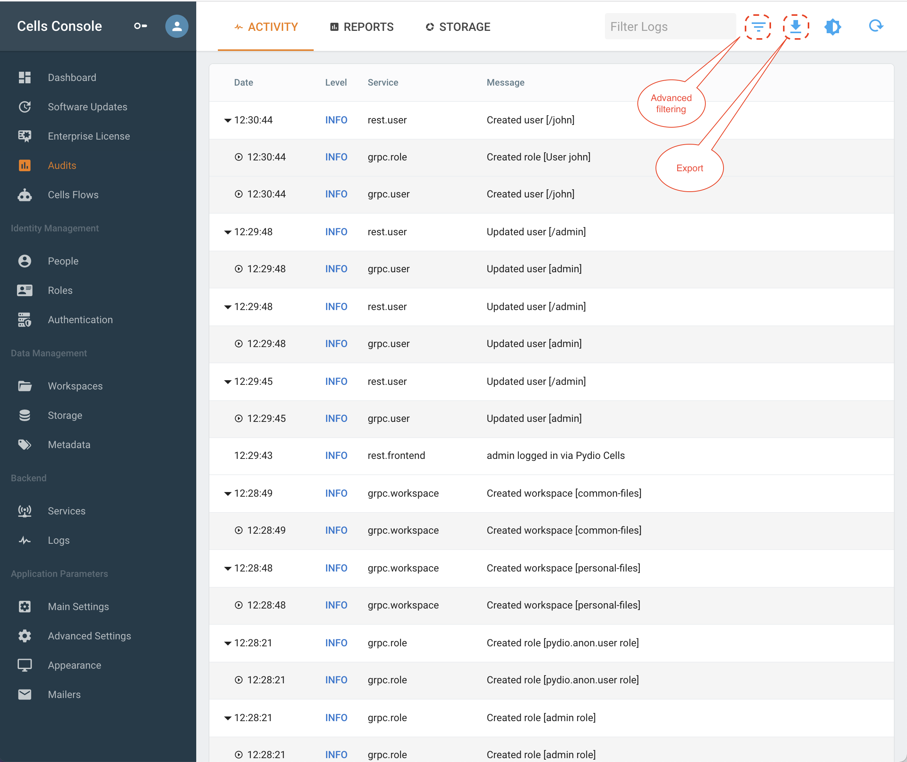

In the **Enterprise Edition**, an audit log gathers all non-technical events to help focus on business logic when analyzing logs for compliance or when tracing events after a security breach.
Logs are grouped using a unique Request-Id as they may be produced by a unique action going through various micro-services.

When using Supervisorctl (or systemd) service, audit logs are also available in the `~/.config/pydio/cells/logs/audit.log` file (rotated every day).

This is the main menu of the audit logs that can be found in **Cells Console >> Audits >> Activity**, you will be presented with the following page:

## Exporting logs

For an easier analysis, audit logs can be exported in XLSX or CSV format.  
To do so, you can use the button in the top-right of the audit logs screen. Please note that you must first filter the logs (either by searching or by restricting to a given period) to avoid exporting the whole base of logs at once.

## Filtering

The audit log also allows you to filter the logs and their content, you can combine filters to trim even more the result.

To display the **advanced filtering** you need to click on the inverted triangle and click on the filter, here is a quick description of the options and their purpose:

- **Filter logs**: This is the main search bar, you can write any word related to Cells.
- **Pick a day**: Choose which day the logs happened.
- **Level**: This is the level of logs for Cells, you have INFO, ERROR or DEBUG, by default INFO and ERROR are displayed and if you only want to one of them displayed, select it in the filter.
- **Service**: Allows you to display logs for any specific service, as Cells is ran with multiple micro services.
- **User Login**: This is the user login that triggered the log, therefore applying this filter will only display actions for the provided user.
- **IP**: It allows you to display only logs that happened from a specific connection IP.