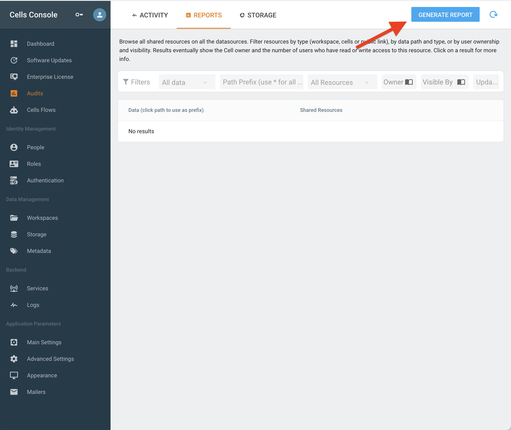
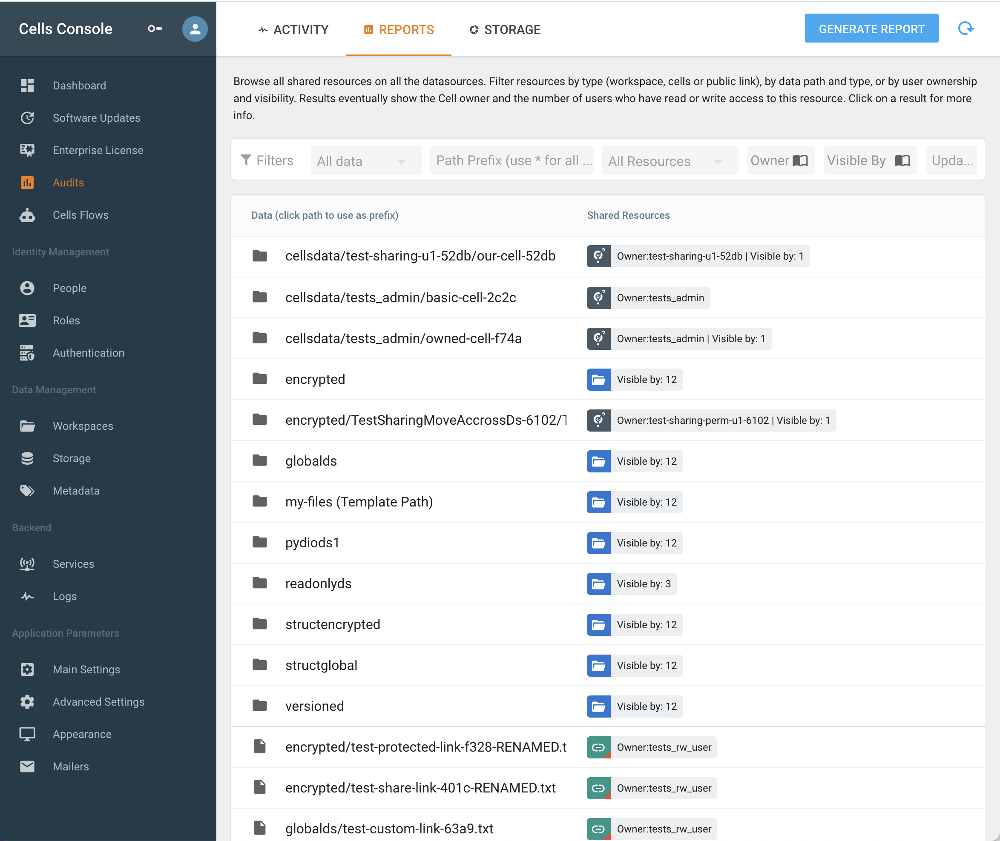
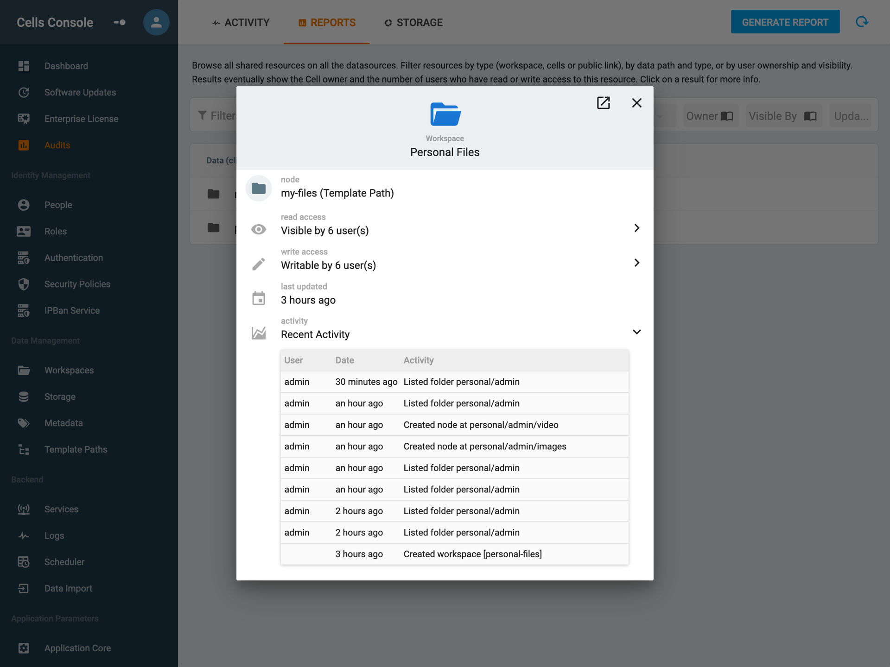
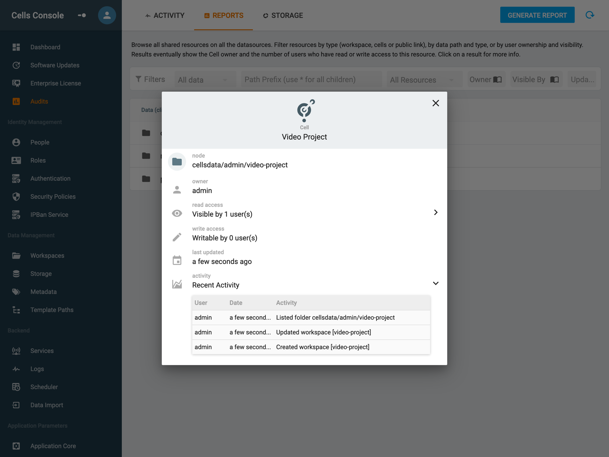
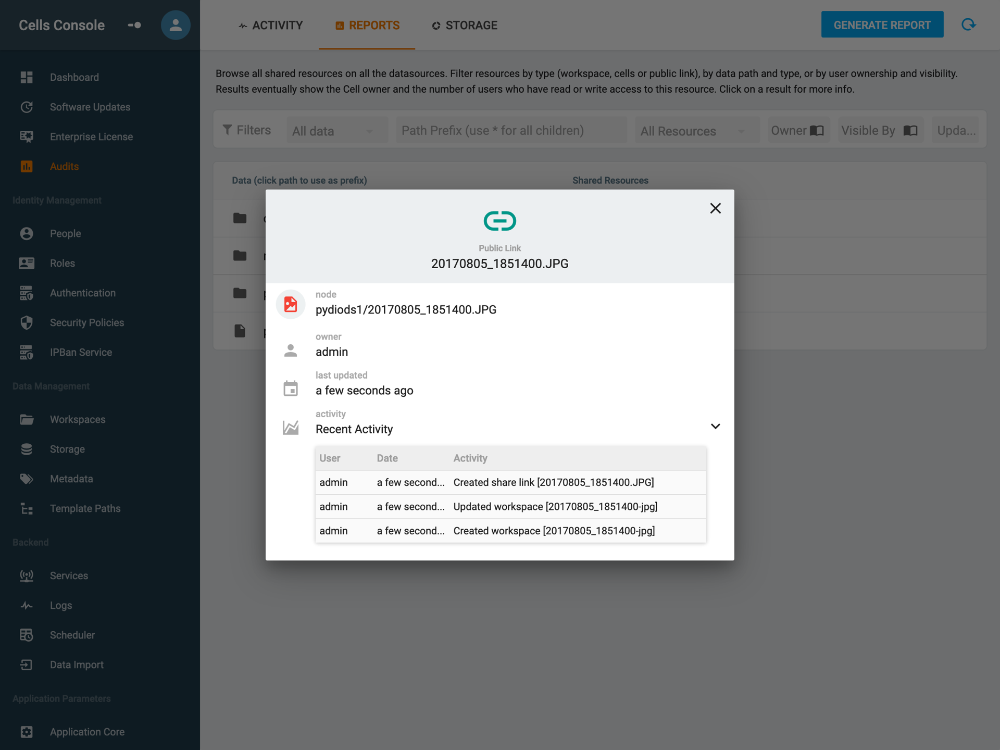

Pydio Cells provides a way to keep track of every shared resources, therefore giving you more visibility and control about who accesses what at any time.

## Audits

With audits you will have all the sharing activity on your cells.
For instance, if you deleted a user and you want to retrieve all the shared resources that he had, it's easy you can search for his resources, edit them and change the owner.

First generate a report using the top-right button. A progress bar will appear allowing you to keep track of the progression.

Once the logs are generated, filter them and retrieve the information that you are looking for, you can filter them.

1. **Data Type**: Files or Folders only

2. **Path Prefix**: is the path to the resource; the path prefix can contain a wildcard at the end, the path must be of this form:
   - for a simple case inside a public workspace `<datasource>/<resource>`
   - for a the personal files cases `<datasource>/<username>/<resource>`
   - you can use a wildcard at the end as said for instance `<datasource>/*` or `<datasource>/<folder>/*` and so on.

3. **Resource Type**: Workspace, Cells or Public links.

4. **Owner**: by whom the resource is owned.

5. **Visible By**: users that are able to see the resource.

6. **Date**: when the resource was updated.

### Workspaces

You can retrieve the workspace activity by clicking this button:

it will display the following menu:

| Field        | Description                                                  |
| ------------ | ------------------------------------------------------------ |
| Node         | Node name (datasource in this case).                         |
| Read access  | Number of users who have read access on the workspace.       |
| Write access | Number of users who have write access on the workspace.      |
| Last update  | Last time the node had an action performed on it.            |
| Activity     | History of each and single action that happened on the node. |

### Cells

You can retrieve the cells activity the same way you did for the workspaces (by clicking the graph button that will appear when your mouse is on the cells)

| Field        | Description                                            |
| ------------ | ------------------------------------------------------ |
| Node         | Node name (the path to the cell in this case).         |
| Owner        | User who created the cell.                             |
| Last updated | Last time an action happened.                          |
| Activity     | History of the all actions performed inside this path. |

You can also edit the cell change it's content and parameters (the same interface as when you create a cell).

### Public link

When looking at Public Links, a red flag indicates that a link has no protection set (no password, no expiration date). This can be handy to quickly review "fully public" links and alert their owner to check if this is a normal situation.

You can retrieve all the activity that happened around a public link the same way.
(By clicking the graph button on the right of the green icon and name of the owner)
it will display a recap of who accessed the public link and such.

| Field        | Description                                                                                                                                                      |
| ------------ | ---------------------------------------------------------------------------------------------------------------------------------------------------------------- |
| Node         | Path to the shared resource in this case.                                                                                                                        |
| Owner        | Who created the shared link.                                                                                                                                     |
| Last updated | Last time an activity happened.                                                                                                                                  |
| Activity     | History of actions. In this case you can see the accesses to the link the cf498178.... is the id of the temporary user created when someone access the resource. |
