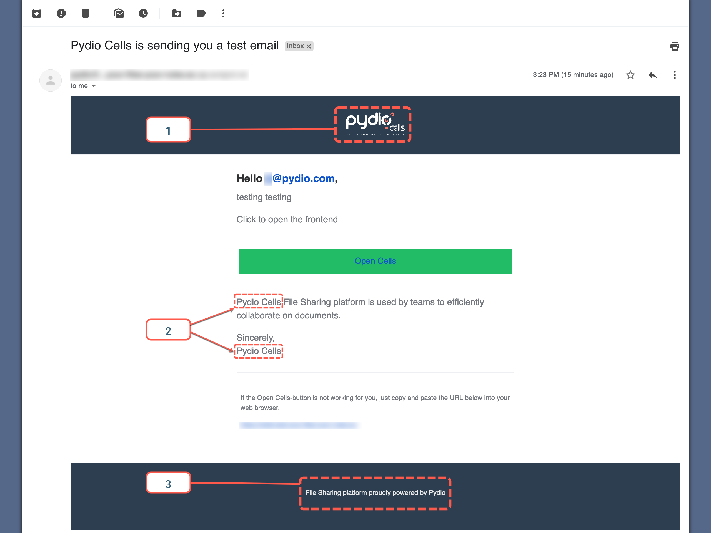

In this chapter, we have a look at the mailing system integrated to Pydio Cells and guide you through template customization.

## [Enterprise Edition] Custom templates for mailer

With the Enterprise Edition there are 3 additional options that will allow you to change the mailer template:

* Change the Logo
* Change the Application Name
* Change the Footer (Usually copyrights)

_Refer to the numbers on the screenshot for the list below_

1. To modify the Logo you must go to **Advanced Settings > UI Customization** and modify **Emails Template Logo** with an url pointing to an image directly, for instance `http://domain/image.png`.

2. To modify the application name go to **Application Core > Main Options** and change the **Application Title** setting.

3. To modify the footer (bottom text) go to **Advanced Settings > UI Customization** and modify **Emails Template Footer**.

_By the Way the test mail will not display the message_