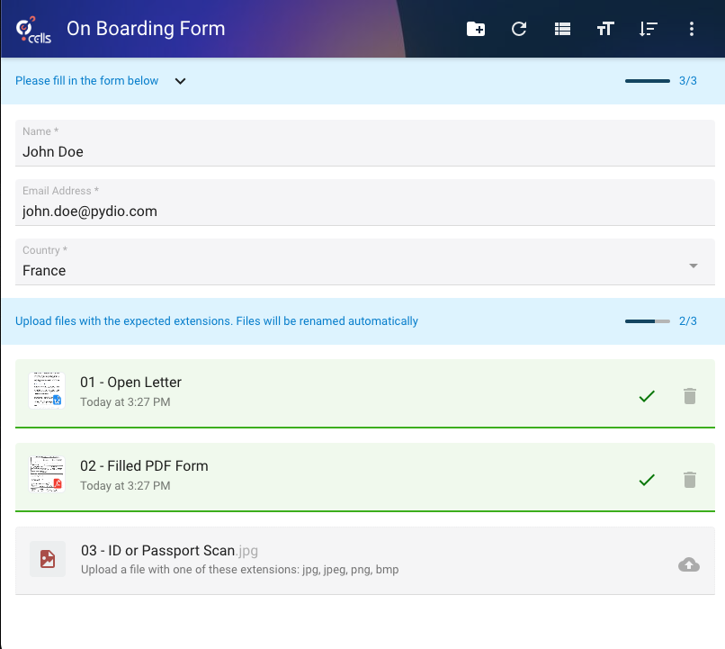
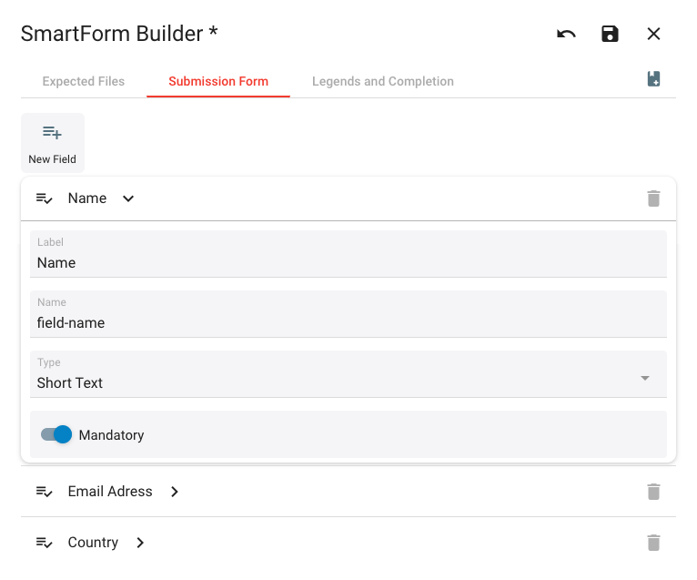
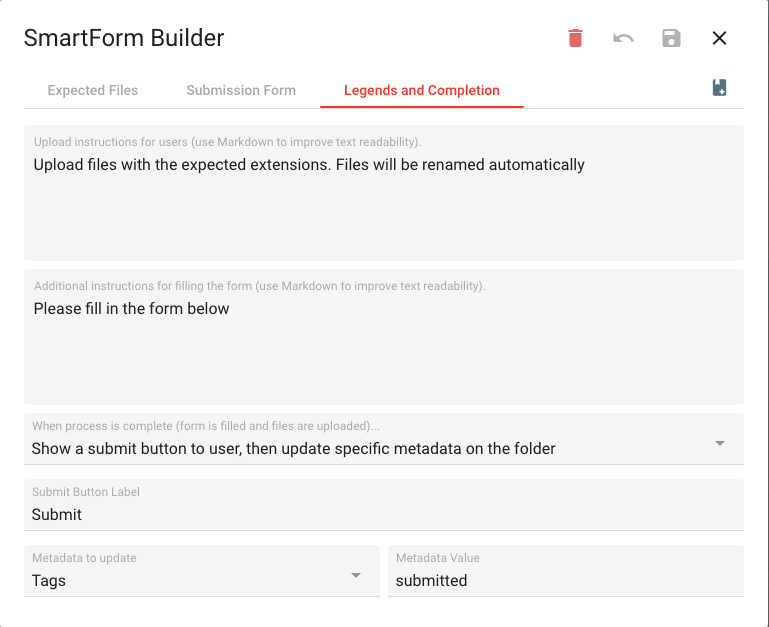

In the course of a given project, sometimes you need to gather information from team members, partners and even clients. Cells SmartForm is a flexible, easy-to-use form builder with added intelligence.

As with any form builder, you can quickly build forms with checkboxes, multiple selections, long and short text fields – all the things you would expect from a form builder.

You can build any form you need from questionnaires to consent forms to project checklists. Smart Form stores all your form submissions within a single JSON file that can be used to power Cells Flows automations.

Smart Form also allows you to collect documents from users as part of their form submissions, as well as provides you access to the submission metadata for full tracking and tracing.

## Creating a SmartForm

### One SmartForm = One Folder

SmartForm is mostly a graphical interface to a form definition stored inside a folder's metadata. As such, each form instance is attached to a folder you create, and that will receive both the documents and the content of the form fields stored as a JSON file.

To start using SmartForm, you must first enable the plugin in the Cells Console > All Available Plugins list. Then inside a - preferably empty - folder, use the SmartForm... action to open the editor.

### Collecting Specific Documents

A key feature of Cells SmartForm is the ability to create an expected list of documents specifying each doc's name, format and maximum size. Any file can be dropped by users on the displayed list items and if their format matches, the file is automatically renamed to the expected name and this item is considered as completed. 

### Simple Form Fields

Along with specific documents, it is often necessary to collect some specific structured data from users. The form build allows you to create many fields with various supported types. This can also be used independently of the documents feature.

## Processing SmartForm output

### Submission behavior

On a user perspective, you can configure what happens once all forms fields are filled and all expected documents are uploaded: either automatically trigger a submission or show a button to let users submit the form by theirselves. 

Submission here is simply attaching a metadata you define to the folder where the SmartForm is running. That gives you all flexibility to observe this metadata change with Cells Flows and act on the folder in consequence.

### Reading form "values" and upload documents 

The form values are saved in real-time in a hidden `form.values` file inside the current folder. This files contains a JSON map with all field => values. Using the "Read Content" action in Cells Flows, it is simple to load this data and trigger actions depending on the detected values : send values by emails, reformat them, etc... 

Similarly, upload documents are just normal documents stored inside the SmartForm folder. As such, once the form is submitted, it is easy to apply any Flow to these docs.

## SmartForm Templates

The SmartForm Editor provides a sleek "Templates" features for easily re-using prepared SmartForms. This also provides useful tools for automatisation: Cells Flows can find a SmartForm template by its UUID and automatically apply it to any newly created folder.

