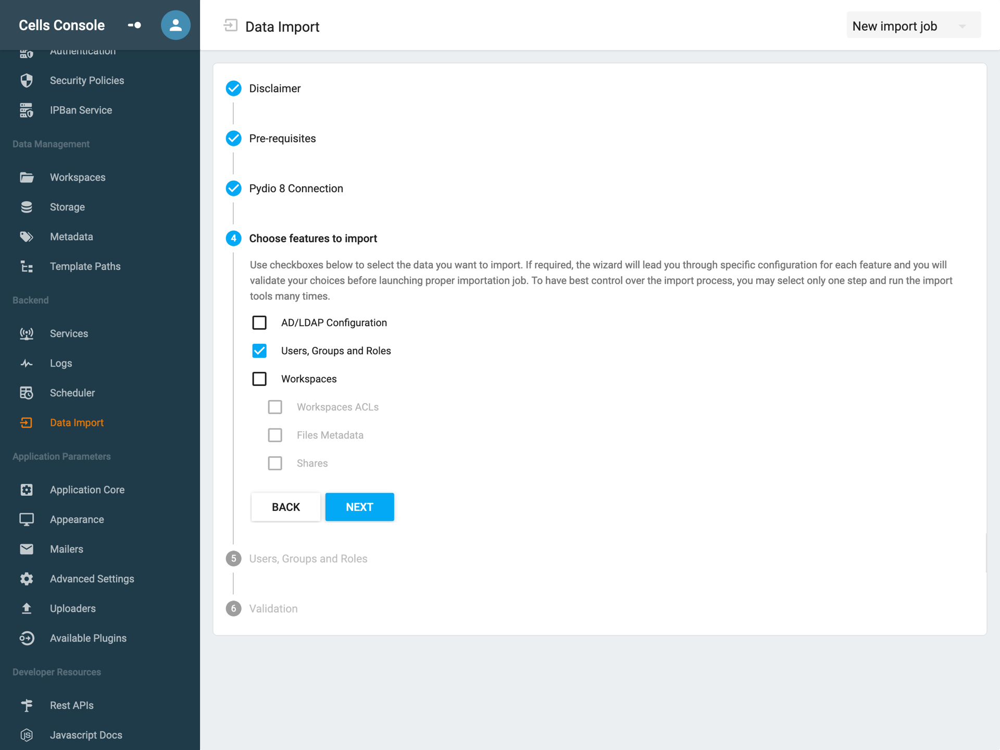
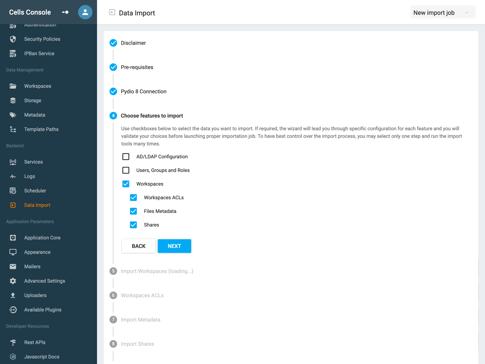
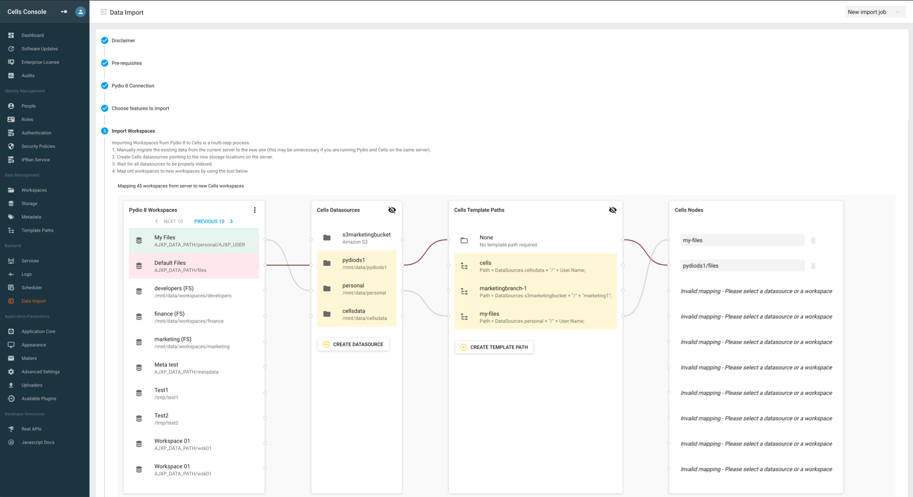

This how-to describes the migration from Pydio 8 to Pydio Cells Enterprise Distribution step by step.

## Preparation

### Forewords

- The process is quite tested and robust, yet you **should perform a full backup of your system before starting**.
- The migration can only be achieved from Pydio 8 to Pydio Cells, thus if you are running an older version, you must first migrate up to Pydio 8.2.5 (the latest version at time of writing)
- We advise that you install Pydio Cells on another new machine to ease the process and be able to abort the migration and be able to be back online with the Pydio 8 server in no time. In such case, perform a copy (via rsync) of the business data from your old server to your new server before starting. (In Cells, when you add an existed folder as a new datasource to Cells, it will write some additional information in .minio.sys or .pydio file. That means that you are at risk of a modification on data of production. It is thus highly recommended to install Cells on a separated machine during migration).

### Clean before start

- The migration is quite long and resource consuming, so it is a good idea to perform a clean up of the files before starting and thus reduce the amount of data that are to be migrated.

You should also perform following cleanups so that the migration runs smoothly:

**Compulsory**:

- In the admin console, under each `Workspaces >> <chose a workspace> >> Shares` click on "Remove broken links": broken links break the migration of the shares
- If possible, remove all public links that have been created by users that *are not in the referential anymore*.

**Incompatibilities**:

There are some plugins/functionalities in Pydio 8 Community that are not available in Cells Home distribution. Please take a look in this list to make sure before proceding.

| Functionalities/Plugins    | Pydio Community | Cells Home | Notes                                       |
| -------------------------- | --------------- | ---------- | ------------------------------------------- |
| LDAP auth plugin           | yes             | no         | available in Cells Enterprise only          |
| Custom DB auth plugin      | yes             | no         |                                             |
| SMB auth plugin            | yes             | no         |                                             |
| FTP auth plugin            | yes             | no         |                                             |
| RADIUS auth plugin         | yes             | no         |                                             |
| Remote auth plugin         | yes             | no         |                                             |
| OTP auth-frontend          | yes             | no         |                                             |
| CAS auth-frontend          | yes             | no         | use SAML instead                            |
| Dual-form auth-frontend    | yes             | no         |                                             |
| Access driver samba        | yes             | no         |  |
| Access driver mailbox      | yes             | no         |  |
| Access driver FTP over SSH | yes             | no         |  |
| Access driver FTP Server   | yes             | no         |  |
| Access driver WebDav       | yes             | no         |  |
| Access driver Dropbox      | yes             | no         |  |
| Access driver Open Stack   | yes             | no         |  |
| Personal workspaces        | yes             | yes        |  |
| SubFolder permissions        | no             | no        |  |

**Optional**:

- Empty the recycle bin of each workspace
- Ask your users to empty their recycle bin in MyFiles

### Pydio 8 machine

Perform following steps on your legacy server before starting:

#### Apache Config

`AllowEncodedSlashes On` should be placed in the configuration of pydio site in Apache config. This parameter allows encoded slashes in url when Cells communicates with Pydio 8 via API.

#### Pydio version

Pydio version >= 8 is required. However it's recommended to upgrade Pydio to latest version.

#### Migration plugins

Migration plugins should be installed in Pydio 8 to add necessary additional entry points to the existing API. [You can get this plugin there](https://download.pydio.com/pub/plugins/archives/).

> **WARNING**: This module exposes user's secret information on API so it must be added during migration process only and removed from Pydio at the end of migration task.

#### Specific account for migration

It is recommended to create a new account (for instance `importer`) with administrative rights for the migration. Please make sure that this `importer` user has the R/W accesses to all workspaces you will import. This makes it easier to later dig out all activities that have been performed during the migration process.

If you do so, we also strongly advise to fill the various info of this `importer` user, and especially her display name, so that various logs and activities are later human friendlier.

### Cells machine

#### Before start

##### Copy the data to the target machine

This usually takes some time, so be prepared.

You should first think of a target tree structure, taking into account the specificities of datasources management in Pydio Cells.

You must then copy all your files to the target destination.

If you install the new server on the **same** machine, we strongly advise that you make a copy of the business data for instance in `/home/pydio/data/...` rather than creating datasources that point toward the legacy default `/var/www/html/data` path.

Do not forget to insure files and folder have correct permissions for the user that runs the app (usually `pydio`).

##### Clean Versioning from Pydio 8

If the versioning plugin was enabled in Pydio 8, we should clean all `.git` data.

#### Download

Download the latest version of Pydio Cells from the website, for instance:

```sh
wget https://download.pydio.com/pub/cells-enterprise/release/{latest}/linux-amd64/cells-enterprise
```

#### TLS

When Pydio 8 is running on simple HTTP (e.g. without TLS), you must also launch Cells without TLS. Otherwise, you will have problem of "mixed content" when the migration tool makes API calls.

#### Data

Install and start Pydio Cells as usual on the target machine. Please [visit our documentation for more information](./cells-installation).

In Pydio 8, the data is located by default in a *data* folder (e.g.: /var/lib/pydio/data/) or /var/www/html/data/). However, you may have other workspaces which point to other location such as /mnt/data.

- If all data is stored on a local disk on Pydio server, it should be copied to the target server in **a folder** which will be a single datasource in Cells.
  
For instance:

```
You have three workspaces and their absolute path as below:
(1) My Files: /var/lib/pydio/data/personal/AJXP_USER
(2) Common Files: /var/lib/pydio/data/files
(3) Data: /data
In Cells, we copy each folder to only one location (i.e: /home/pydio/pydio8dss).

My Files: /var/lib/pydio/data/personal/AJXP_USER => /home/pydio/pydio8dss/personal
Common Files: /var/lib/pydio/data/files => /home/pydio/pydio8dss/files
Data: /data => /home/pydio/pydio8dss/data
```

- If you have a workspace pointing to a mounted folder, it should be mapped to new datasource in Cells

For instance:

```
(4) DataMount: /mnt/pydio8dss/data
```

> Attention: problem of folder level in creation mounted datasource, please visit [this thread in the forum](https://forum.pydio.com/t/solved-smb-mount-not-working-pydio-cells-1-5-2/2469).

- If you have S3 workspaces, we must create corresponding S3 datasources in Cells.

> **WARNING**: after you have copied all files to their target location, and especially in case of file system datasource, you **must insure** that directory and file owner are correctly set, typically, we suggest to run Cells with a pydio user and you should then perform a `sudo chown -R pydio.pydio /home/pydio/data` or similar to insure all relevant files and folders have correct permissions.  

#### Indexation of the data

After creation of new datasources in Cells, the indexation process will be launched automatically and you **must** wait until this task finishes. Depending on the size of data, it may take several hours or even a day.

#### Personal workspaces [Enterprise Distribution only]

If you have workspaces with personal path like `My Files` which uses `AJXP_USER` in the path, you are required to create a new Template Path for this workspace on the correct datasource in Pydio Cells.
For example a new Template Path: `Path = DataSources.pydio8dss + "/personal/" + User.Name;`

## Migration

The migration is divided into three options and should be run one after another.
(1) LDAP config
(2) Migrate users, roles, groups
(3) Migrate workspaces and metadata, sharing information

> Attention: You can select all task at one time and click Next, but it should work one by one. (1) and (2) can be done many times because that synchronizes. However we should trigger (3) task just one time.

### Copying LDAP config [Enterprise Distribution only]

This option allows us to copy the LDAP config from Pydio 8. You might ignore this option if your legacy server does not rely on a LDAP server. This task can be easily manually verified in Cells to make sure all params are migrated correctly.

At this point you can launch the synchronization of the users with new ldap configuration. The set of users from LDAP via this configuration and the set of user ldap via API of Pydio 8 are identical in Cells (they have the same AuthSource). However, it is recommended to do the first synchronization of users in following step.

#### Migrate users, roles, groups

There is no specific configuration in this step, so you can just click on "Next" to foward and wait for result.



#### Migrate workspaces, sharing data and metadata

> Attention: This step should be triggered **only** one time.

We usually select all children options of "Workspace"

- Workspaces ACLs
- Files Metadata
- Shares <= Running the `shares` migration more than once will trigger the creation of duplicated Cells. if you have to re-run this, please insure you have removed all cells via the "Audit" page of the console before proceeding.



After clicking on "Next", you will see the interface where you can match the workspace in P8 to their counterpart in Cells.

Matching is done by following these steps:

- Select Pydio workspace
- Select datasource in Cells where the data of this workspace has been copied in previous steps.
- Select template path. If you see a Pydio8 workspace with "AJXP_USER" in the path, the template path should have been defined in previous step. You can create new one here but it's buggy at this time. Select "none" for normal workspace.
- in "Cells Nodes", you can see the relative path (in Pydio Cells) of the workspace we are going to map.

##### Green & Red

In "Pydio 8 Workspace" panel, if you are matching a workspace and the color turns to RED, it means that the corresponding path does not yet exist in Cells. You must create it manually and it will turn to GREEN.



## Verification

You can quickly verify the migration by checking in Cells:

- Login with the same credential
- Verify public link
- Verify shared workspace
- Number of users

## Final step

- Set signed certificate
- Prepare DNS for switching Cells to production
- Remove migration plugins in Pydio 8
