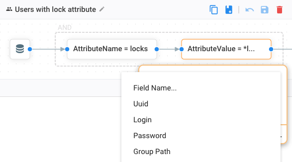
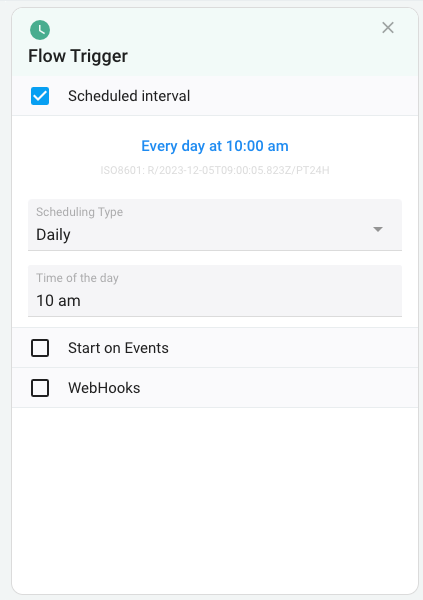

Cells Flows is a powerful drag-and-drop tool that allows you to easily automate tasks in Pydio Pydio Cells.

## Why should I use Cells Flows? 

Keeping things (servers?) under control in a company where file sharing and content collaboration usage intensifies is a big part of an administrator daily routine tasks. Whether it be monitoring storage usage, making sure any former employees files are not publicly shared, providing on-demand accesses to various collaborators, **all these tedious manual tasks can now be replaced by automatic jobs** that are either triggered in a timely manner or in response to various platform events.

### Drag-and-drop Interface on top of Cells Internal Scheduler

Cells Scheduler was added day one to Pydio Cells to provide tasks management for features such as Extract Thumbnails, Clean up Revoked Tokens, Handle Mailer Queue, etc. Cells Flows provides a **unique drag-and-drop interface** on top of this mature technology to build, customize and monitor automated jobs in your Cells instance.

### Process files and folders, but also other internal data

While Cells Flows primarily aims at processing files uploaded in Cells (move them around, extract PDF textual contents or thumbnails/exif data, many processors are available out-of-the-box), **it can also process other data types**: list all users with given attributes, apply some specific permissions to them, generate a CSV list and send it by email every day, etc.

### Replace CRON or watch events

Jobs can also be scheduled to **run on a timely manner**, replacing good old CRON for starting tasks every hour, every days, etc.

**Event-based approach** gives you the flexibility you need to react to many events. From new file uploaded or contents changed, to users signing in or public link creation, Cells Flows have you covered to trigger jobs whenever required.  

### Cells Integration with third-party tools

Many Actions provide tools to interact with external services, from **webhooks** to **command-line** and **HTTP** calls. This makes
it easy to seamlessly integrate Cells inside your existing infrastructure and set of services. Easily connect Cells to feed your in-house service developed for specific file processing, and use Cells REST API to automatically trigger Jobs within Cells Flows. 

## High-level concepts

A **Job** represent the definition of a sequence of **Actions**, basic building blocks that can be chained together to process data. Just add an action and connect it to others, adding **Filters** on the data flow, or loading data from Cells internal services using **Queries**. 

When **Trigger** conditions are met (based on events, schedule or when you run manually), a job will launch **Task** with your job-defined **Parameters**, and process all actions and log their results in the **Task Logs**.

Learn more about the [Anatomy of a Flow](./anatomy-flow) to get started quickly in the next section!