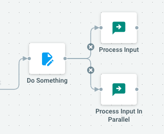

## The basic building blocks

Basic building blocks of Cells Flows jobs are **Actions**. They provide a wide range of tools to either process file contents, transform arbitrary data, communicate with external tools or even simply print something to the task log to monitor the good processing of a running task. 

See the [list of available actions](https://docs.pydio.com/cells-v4/cellsflows/actions/index/) and get inspired!

## Chaining Actions

Actions are chained together with simple connectors : every action can be chained to one or more actions, sending its _output_ as _input_ to the next sequence of actions for further processing.

Connecting one action to 2 or more actions will start running these in parallel (see [Parallelism & Concurrency](https://docs.pydio.com/en/docs/cells/v4/parallelism-and-concurrency)).

## Handling Data flow

### Input/Output messages

Every action receives a "Message" in its **input**, that contains information of various types: 

 - **Data loaded or generated** during the previous steps of the sequence, like one or more Nodes (file or folder), a given User, Role, Workspace, etc. or an arbitrary String/JSON message. See the [Data Types](https://docs.pydio.com/en/docs/cells-flows/data-types-queries-filters) section to learn more.
 - **Job-context information** like job and task identifiers, current context that triggered the job (username, http request metadata, etc), and job-level [parameters](https://docs.pydio.com/en/docs/cells-flows/parameters).

Each action handles input message differently depending on its purpose, and optionally passes on a copy or modified version of this input as **output** for the next chained actions (see below).

### Feeding messages data

Messages data can be generated or loaded: 
 
**Event-generated data**

When jobs are triggered by events, the data associated with that event will be implicitely appended to the first action Input.

**Loading data with Queries**   

You may need to explicitely load some data to feed a given sequence of actions. This is done using **Queries** that allows you to select rows (like you would in an SQL database) based on various criteria.  One can for example _list all files under a certain path_, or _list all Workspaces updated since a certain period_, etc.

**Filtering Data** 

Once some data is passed along from one action to another, you can perform dynamic filtering to e.g. reduce the amount of data to process, or continue the sequence only if received data meets certain conditions.

You will learn more about [Data Types](https://docs.pydio.com/en/docs/cells-flows/data-types-queries-filters) in the following section.

## Actions Parameters

Most action come with their own set of Parameters. Parameters are editable and can be scripted using Golang Templating to be dynamically computed at runtime based on previous message input, job-level parameters values and many other things. 
