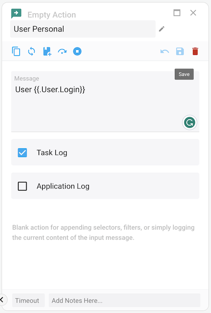
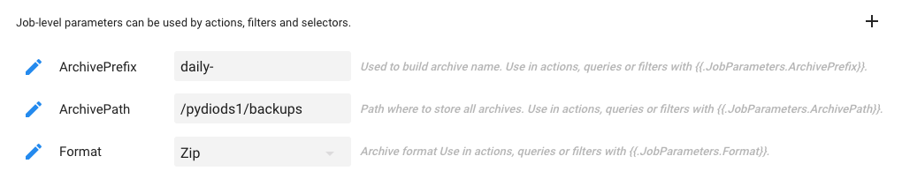
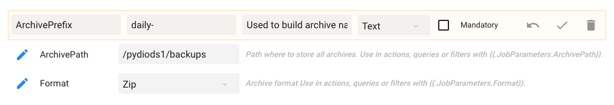
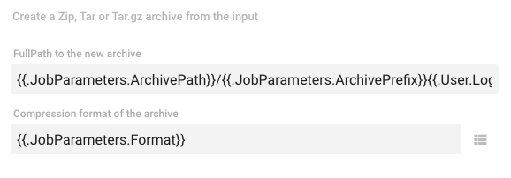
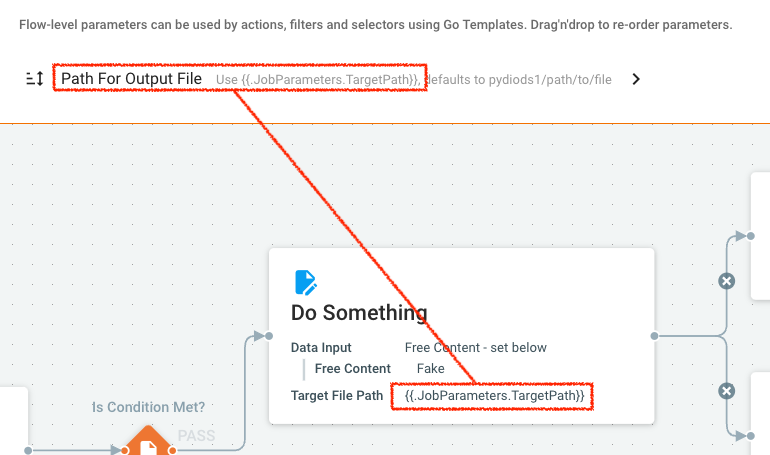

Parametrization is an essential feature of any workflow tool. Cells Flows flexible model allows you to set up parameters at various levels, and re-use them using advanced scripting capabilities.

## Action Parameters

Each action declares its own set of parameters that are typed (string, number, boolean, preset list of choices...) and can be edited directly in the interface.

In Edit mode, just click on an action to edit its parameters.

As you can see, you can also rename the action to make your diagram flow more readable.
## Flow-level Parameters

### Defining Flow-level parameters

You can define your own set of parameters at the Flow level. 

Defining parameters at the Flow-level provides many advantages : 

 - **Centralize parameters management** and reuse their values inside Actions, Filters and Queries.
 - **Parameters are typed** (string, number, boolean, preset list of choices...) to avoid human errors.
 - Manual and scheduled Flows run with the parameters preset values, but the "**Run With Custom Parameters**" option allows to apply some values for just one specific run. 

Creating or editing parameter is simply done by clicking on the "+" button of the Parameters panel, or the "pencil" icon next to an existing parameter.

### Using Flow-level parameters

As such, these parameters are not used anywhere: it is your mission to use them inside your Actions parameters (any parameter) or Queries/Filters field values (only applicable to text fields).  This is done by using the Golang Template syntax `{{.JobParameters.ParameterName}}`. Below is an example used in the default "Personal Files Archive" Flow. 

 - Using `ArchivePath`, `ArchivePrefix` and `Format` in the "Compress" action parameters:

   

 - Using `RootPath`, in the Query used for finding user personal folder:

   

### Runtime Values and Variables

Flow-level parameters can have their values overriden at runtime. Inside the Flows, you may also have the need to store and retrieve contextual values known as Variables. See this page to learn more about [Runtime Parameters and Variables](https://docs.pydio.com/en/docs/cells-flows/runtime-parameters-and-variables).