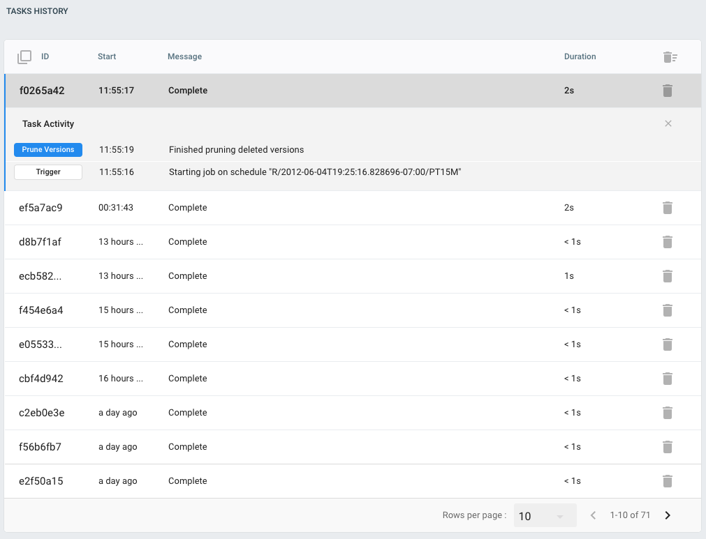

## Tasks History

Once a job is defined and ready to run, its actual running instances are named "Tasks". One job has one or many tasks that have a runtime Status : "Pending", "Running", "Complete" or "Error".

Each task will log its output to a specific logger. Most actions are pre-configured to send logs to the task logger, summarizing what exactly happened during their run. 

Tasks history and their logs can be found below the job workflow panel. You can manually clear tasks from this list using the various delete buttons (delete one raw, select multiple then delete, delete all tasks). 



**Note**: the task list is refreshed automatically, but as logs are sent internally in an asynchronous way, logs may take some time to appear just after a task has run.

## Printing Information to Logger

When creating your own custom job, it is very often useful to **print out some informative or debugging data** to check if you are correctly configuring your actions, queries or others. 

The [**Empty Action**](https://docs.pydio.com/en/docs/cells-flows/empty-action) is a good tool that you can insert here and there inside your flow, to print out the contents of the current messages passing along. Create a new action and select "Empty Action" in the action picker screen:


Then use the action parameter to type any message you want to print out. Notice that you can use Golang Templates here to print out a specific part of the action input!


You can also use the toggles to send this message to the Application Log. In that case, it will be appended to the standard syslog of Pydio Cells.

When using [Anko Scripting](/anko-pseudo-script), use the `Logger` object that is made available in the script scope with Info(), Warn() or Debug() functions.

```javascript
Logger.Info("My log message", anyObject, anyValue)
```

## Using Logs for Debugging Flows

Switching logs to DEBUG level is a nice way to monitor very closely all messages that are transferred from one action to another during a given Flow run. See the [Debugging Tools](https://docs.pydio.com/en/docs/cells-flows/debugging-tools) page to learn more about this.