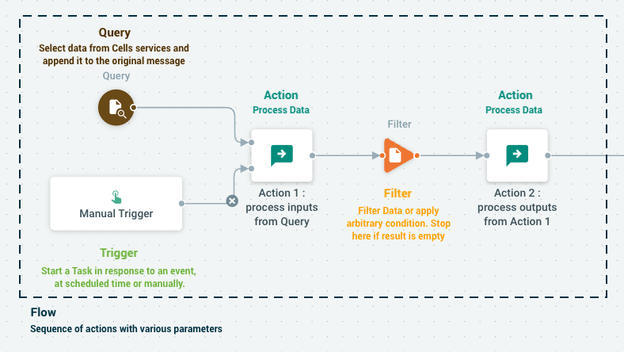

A **Flow** represent the definition of a sequence of **Actions** that are basic building blocks chained together to process data. The job **Trigger** starts in response to various event types. **Tasks** are actual instance of a job that are running. 

Data can be either explicitely loaded from internal Cells services using **Queries** or generated by the initial job trigger, and is carried by **Messages** from one action to another. 

Between each action, **Filters** can transform the message Data, or apply an arbitrary condition. 

Pages below provide more details about each of the Jobs components.

- [Actions and Messages](/cells-v4/cellsflows/cells-flows-manual/anatomy-of-a-flow/actions-and-messages/)
- [Data Types, Queries, Filters](/cells-v4/cellsflows/cells-flows-manual/anatomy-of-a-flow/data-types-queries-filters/)
- [Triggers](/cells-v4/cellsflows/cells-flows-manual/anatomy-of-a-flow/triggers/)
- [Parameters](/cells-v4/cellsflows/cells-flows-manual/anatomy-of-a-flow/parameters/)
- [Tasks Logs](/cells-v4/cellsflows/cells-flows-manual/anatomy-of-a-flow/tasks-logs/)
