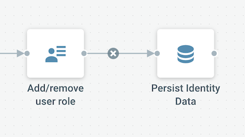
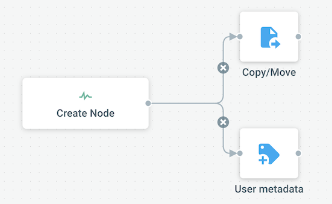

Understanding your business requirements and starting to translate it to an "automation-oriented" sequence of actions is the first if not the most difficult step. 

Translating a workflow requirement into actionable steps for a workflow management tool involves identifying the specific tasks and activities that need to be completed, and organizing them into a sequence or flow that represents the steps that need to be taken to complete the workflow. 

### Identifying the "what" and the "when"

The first step is to understand "**what**" you are about to manipulate. In most cases for a tool like Pydio, you will be handling "files" or "folders". In other cases, you may want to modify or create "users", "permissions", ...  

Then you have to understand **the scope** of what you will be manipulating : are you targeting a specific resource (e.g. one file) or do you have to gather a list of filtered objects ?  

Then finally you will need to figure out the **"when"**, i.e. which event will trigger the workflow: will it be a recurring task scheduled at a specific time? or will it be triggered by an event happening on the platform ? 

Examples :

| Requirement                                                | When              | What                                       | Scope      |
|------------------------------------------------------------|-------------------|--------------------------------------------|------------|
| I want to process all uploaded files with a custom script  | file uploaded     | the new file                               | file       |
| I want to alert admin when shared users will login         | user logged in    | the logged user                            | user       |
| I want to disable public links based on certain conditions | manual or regular | A selection of workspaces                  | workspaces |
| I want to purge files after 30 days                        | every night       | All files modified since more than 30 days | files      |

### Decomposing into Atomic Actions

Probably the first thing you have identified is the actual action you want to perform during your workflow! CellsFlows provides many [ready-to-use "atomic" actions](https://docs.pydio.com/cells-v4/cellsflows/cells-flows-manual/anatomy-of-a-flow/actions-and-messages/) that try to keep as simple as possible, to provide the most flexibility. As every action always take the same Input and Output formats, they can be composed as needed. Sometimes, you will only need to use one action, but sometimes the operations you want to do will have to be decomposed into a sequence of action. 

For example, updating a User attributes is done by an action, but this action does not actually persist the changes in the database. Another action "Persist Idm Changes" (as Identity Management) must be chained to the first one and configured to persist the "Users". 



On the other hand, the operation you need to do may not be available as a simple action, but you can create it by combining actions. For example, you want to "batch files that are uploaded at the same time" : this concept does not really exist, but you can emulate it by automatically moving files to new folders stamped with the current time and attaching a metadata to them at runtime. This would require at least two actions (copy/move, set user-meta) to be chained.



### Identifying "Conditions" and translating into automations

When it gets complex, a Flow generally is just a sequence of various actions that are triggered when **conditions** are met. Like in a programmation language, it's all about understanding logical causes and consequences that can boil down to :

```
If (condition fullfills...) then (do something) else (do something else)

// or

Retrieve objects fullfilling the following conditions [condition1, condition2, condition3, ...]
```

Cells Flows provides many ways to implement conditions:

- If you need to gather an ensemble of filtered object, Cells Flows provides "QUERIES" objects allowing you to retrieve objects from within Cells internal data, following specific conditions. 
- If your Flow is fed with an event-generated object (e.g. the "user" sent by the "user logged event"), FILTERS allow you to apply the same kind of criteria and decide whether the flow should continue on a specific path or switch to another sequence of action. 

Examples :

| Requirement                                     | Translates into                                 |
|-------------------------------------------------|-------------------------------------------------|
| All files modified since more than 30 days      | QUERY Files, Modification Time parameter ">30d" |
| Public links                                    | QUERY Workspace, Scope = LINK                   |
| All Reviewers                                   | QUERY Users, HasRole = "Reviewers"              |
| If logged user is admin, do not email           | FILTER Users, Profile not equals "admin"        |
| If DataSource is encrypted, do not extract data | FILTER Datasource, IsEncrypted = False          |

You will find the "ACTIONS", "FILTERS" and "QUERIES" in the toolbar when editing a Flow.


