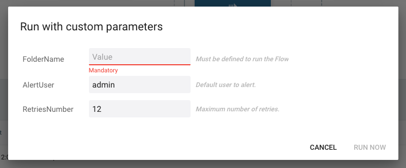
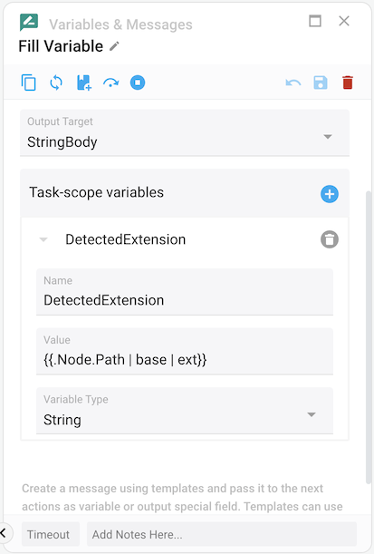

Using specific values to trigger filters or conditions is a common practice, and it is straightforward when it is a property attached to the object you are manipulating (e.g. do something "based on the file type"). 

But sometimes you keep repeating them (=> parameters), or sometimes you need to compute values at an early stage of the Flow  and re-use them later on (=> variable). 

### Parameters - Defaults vs Runtime

As soon as your Flow becomes complex, it is a very good practice to extract all the possible changing values from within the actions, filters and queries, and define flow-level parameters that will help you to reuse this Flow. 

Typically, if you use a Files Query that selects all files under `pydiods1/myspecial/folder`, instead of hard-coding this value inside the query condition, you should define a "LookupPath" parameter in the Flow parameters, and refer to it as {{.JobParameters.LookupPath}} in the query condition. That way, in six-months, when `myspecial/folder` will be renamed to `myspecial/directory` due to internal policies changes, updating that value will be super-simple and easy to find.

And maybe you already know that you will want to launch this job on a different folder once in a while: for that you can simply use the "Run|..." button to launch a job with a different value, without modifying the default value.

Similarly, when using WebHooks, you can create multiple hooks on the same job, and define a specific value for each of them. This can be useful to ease the use of the hooks with predefined values. Or this could be used for security reason: one hook could be configured to be run "as admin" and the other "as user"... 

### Variables

Going further with parameters, Variables give you the ability to create/compute arbitrary values and "store" them in the Flow's messages for later usage. 

This is done by using the "Build Message" action, where you can define variables and their types and values. These are set in the ActionMessage and passed to every subsequent actions. It can then be accessed using Golang templating {{.Vars.MyVariable}} or other scripting capabilities. 

Note that the underlying "variable store" is immutable: if you chain multiple "Build Message" actions and rewrite a same variable with a different value, a full copy of the store is made. So for example if a variable is sent to parallel branches, we make sure that modifying it in one branch will not modify its original value in the other branch.

The image below shows the value of a Build Message input:

And the value of its output after setting a variable:

