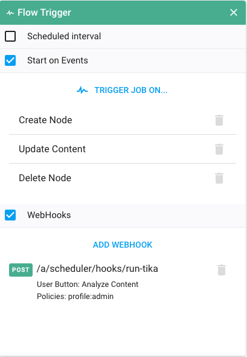
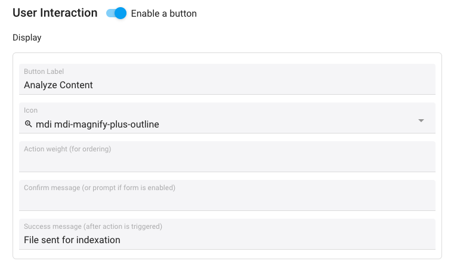
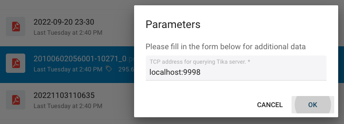

In the current Cells version, Flows creation and edition is an admin-only operation, as by definition a Flow can access to a wide range of resources in the server. But once a Flow is ready, you may wish to let end-users (with limited permissions) interact with it. 

A special trigger type called a "WebHook" can be registered as a custom API endpoint that can be called to trigger the Flow.

## WebHooks

Creating a WebHook trigger consists of picking a unique Slug that will expose a specific endpoint in the API, that is defined as follows:
```
POST /a/scheduler/hooks/{FlowUniqueSlug}

Request body: text/json
{
    // Optional runtime parameters overriding defaults values for job
    "JobParameters":{
        "key1": "value1", 
        "key2":"value2"
    },
    // Optional list of nodes path (path relative to userspace)
    "Paths":[
        "path/to/file1.ext,
        "path/to/file2.ext
    ]
    // Optional preset unique ID to follow the progress
    "TaskID":"unique-id"
}
```

To enable a WebHook, you must add a custom Trigger to the Flow main input: 



### Parameters

You can configure the webHook to allow the JobParameters default values to be overridden. In that case, as you can see in the Request body, you can pass your own values via the API.


Similarly, the Request body can be passed a list of files/folders Paths, that will be fed as {{.Input.Nodes}} to the Flow when it is started. The paths are expressed in userspace format (e.g. `workspace-slug/path/to/file.ext`) and will be checked for read/write permission and translated to internal format (`datasource-name/internal/path/to/file.ext`).

### Access Restriction

This endpoint access is restricted by security policies definitions: these are a set of rules allowing only specified set of users to access. For example, using `profile:admin` will only open the access to the administrators, or `role:reviewers` would open access to all users with role Reviewers.


Most common pattern is to allow access to `profile:admin` and `profile:standard` if you want all common users to have access to the Api.

## Buttons

WebHooks is a powerful feature to expose an admin-defined Flow, but calling a REST API requires technical skills that are not really user-friendly... Once a WebFlow is active, you can provide a **nice, integrated interaction to end-users by defining a Button** that will appear in the interface.



You can setup where the button appears in the UX, its label and icon, and many other properties.

### Context and Buttons Permissions

Buttons will follow the same Security Rules that you have defined as access restriction for the WebHook. That is, if then endpoint must only be accessed by `profile:admin`, similarly the Button will only show for users with `profile:admin`. 


Using Button Context, you can customize further the rules for the button to appear: will it appear by default user is inside a workspace or does it require a specific file to be selected (see below)? You can also define a code snippet that will evaluate with the current folder node metadata to determine whether it is active or not.  

### Selection / Sending Flow Input Node

Enabling a "Selection“ requirement will make the button appear only if specific files or folders are actively selected. You can finetune how the selection must be composed: does it allow folders? files? specific extensions? only one item, or only multiple items?... 


Generally speaking, if a selection is enabled, you probably want to "do something with this selection", namely send it to the Flow for processing. You can toggle this, or also choose to simply send the current parent folder as the input Path.

### Handling Parameters

As exposed in the previous section, a WebHook can allow the Flow Parameters default values to be overriden (you can enable that for each parameter). Some parameters may have a preset value for this hook, but you can also let the users edit this value at submission time. 


By using "Expose Parameters As a Form", clicking on the Button will show a form with a legend and selected editable parameters, so that the user can provide additional inputs for your Flow.

