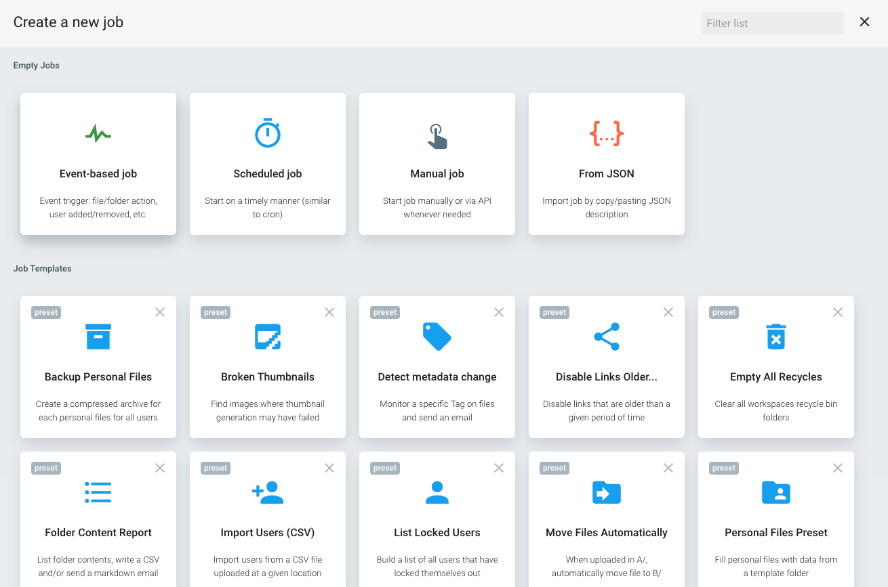
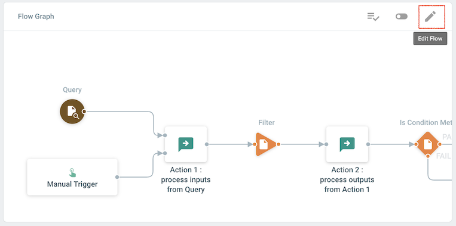
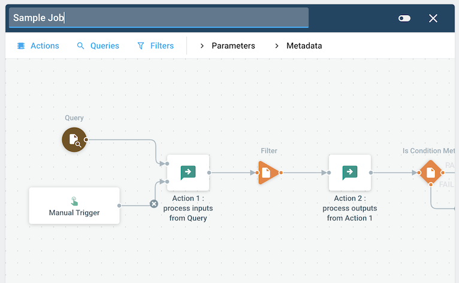

## Creating a Job

There are various methods to create a job, accessible via the "+JOB" button

### Using Preset Jobs

Pre-defined jobs are carefully crafted by Pydio Team to be easy to use, with predefined parameters and nice labelling of actions, queries and filters to make the diagram as simple as possible.

The most common approach to create your own job is to start from a Preset and modify it to suit your need.

You can see the whole list of [Preset Flows here](https://docs.pydio.com/cells-v4/cellsflows/preset-flows/index/).

### Creating an empty Job

If you want to create job from scratch, you will be guided through the steps required to build the most basically functional job:

 - Set up a label for the job
 - Choose a trigger type (manual, scheduled, event-based)
 - Choose a first-step action

### Creating Job from JSON

Using the JSON representation of a job can be a handy way to import a job from another instance, or for a job provided to you by our support team. Just paste the JSON and hit Save to continue to job edition.

## Renaming an existing Job

To rename a job, select it in the list and switch the workflow to Edit mode using the Pencil button.

Then edit the label and hit Save.

## Deleting a Job

Jobs can be simply deleted with the DELETE button.