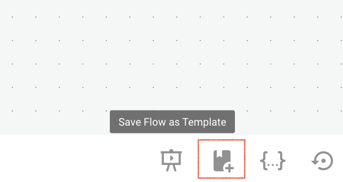
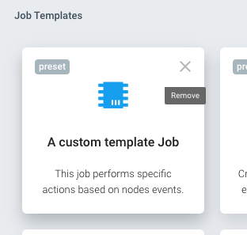
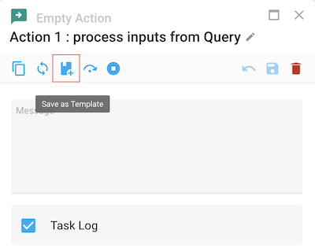

Jobs, actions, queries and filters can be saved as "Templates" for easily duplicating or re-using them.

## Job Templates

As explained in the Create section, one simple way to create a new job is to use a preset template that is shipped with Cells Flows. These jobs are carefully crafted by Pydio Team for ease of use and clarity of the flow chart. The full list is available in the [Preset Flows](https://docs.pydio.com/cells-v4/cellsflows/cells-flows-manual/managing-flows/templates-and-presets/) section.

You can feed this template list with your own jobs, by simply selecting the "Save Job as Template" option in the bottom-right buttons of the job editor (you must be in Edit mode). Pick a label, an icon and a description to save this template.

Templates, including preset ones, can be deleted simply in the "Create Job" picker.

## Actions, Queries, Filters templates

In a similar way, you can save your own templates for Actions, Queries and Filters. They are stored with all parameters set, making it super easy to reuse in other parts of a job or in another job.

