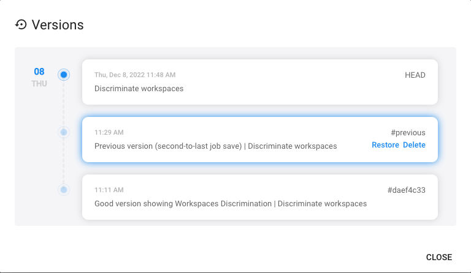
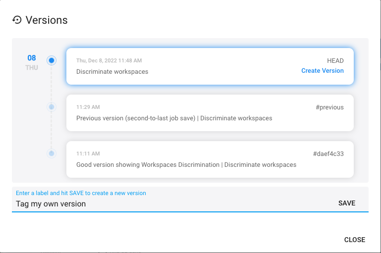

Flows modifications can be destructive and often you want to restore a previous version of a Flow. This section describes Flows versioning feature.

### Restoring an auto-saved version

Each time you save a Flow, the previous version is copied as a backup, in case you inadvertently broke something. You can list and restore available version by clicking on the bottom-right button. 

Select the version you wish to restore

### Tagging your own versions

Cells Flows only "auto-save" one version by default to avoid storing too much data and having to deploy complex versioning strategies. Once you have a satisfactory Flow, you can "Tag" it and create a version that will be kept. That way, you can make sure that you will be able to restore it anytime in the future.

The versions dialogs shows the list of all versions.

