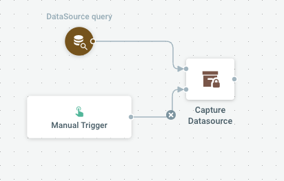

Capture snapshots from both s3 and index for debugging purpose.



This Flow triggers a snapshots capture for a structured datasource, mainly for debugging purposes. Structured datasources are continuously synchronizing a storage (an object storage or a local FS exposed as an S3-compatible storage), and an SQL index. Sometimes, synchronization issues cannot be easily fixed and it can be useful to load the initial representation of both endpoints.

### Parameters

|Name|Type|Default|Mandatory|Description|
|----|----|-------|---------|-----------|
|DataSourceName|text||true|Name of the datasource to capture.|
|TargetFolder|text||true|Folder where to store the snapshots (must be created).|
|Format|select, possible values: JSON (json), BoltDB (bolt)|json|true|Output format for the snapshots.|


### Trigger Type
Manual

### JSON Representation

```
{
  "Label": "Capture Snapshots",
  "Owner": "pydio.system.user",
  "Metadata": {
    "Description": "Capture snapshots from both s3 and index for debugging purpose",
    "Icon": "mdi mdi-reload",
    "TplCategory": "maintenance",
    "Usage": "This Flow triggers a snapshots capture for a structured datasource, mainly for debugging purposes. Structured datasources are continuously synchronizing a storage (an object storage or a local FS exposed as an S3-compatible storage), and an SQL index. Sometimes, synchronization issues cannot be easily fixed and it can be useful to load the initial representation of both endpoints."
  },
  "Actions": [
    {
      "ID": "actions.cmd.capture",
      "DataSourceSelector": {
        "Query": {
          "SubQueries": [
            {
              "type_url": "type.googleapis.com/object.DataSourceSingleQuery",
              "value": "CiF7ey5Kb2JQYXJhbWV0ZXJzLkRhdGFTb3VyY2VOYW1lfX0="
            }
          ]
        }
      },
      "Parameters": {
        "format": "{{.JobParameters.Format}}",
        "prefix": "snapshot-",
        "sides": "both",
        "target": "{{.JobParameters.TargetFolder}}"
      }
    }
  ],
  "Parameters": [
    {
      "Name": "DataSourceName",
      "Description": "Name of the datasource to capture.",
      "Mandatory": true,
      "Type": "text"
    },
    {
      "Name": "TargetFolder",
      "Description": "Folder where to store the snapshots (must be created).",
      "Mandatory": true,
      "Type": "text"
    },
    {
      "Name": "Format",
      "Description": "Output format for the snapshots.",
      "Value": "json",
      "Mandatory": true,
      "Type": "select",
      "JsonChoices": "{\"json\": \"JSON\", \"bolt\": \"BoltDB\"}"
    }
  ]
}
```
