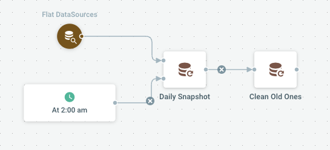

Daily dump of DB index for all flat datasources.



### Usecase Overview

As "flat" datasources store the documents using UUIDs instead of actual file names in the storage, one may be afraid of loosing the link between folder tree and actual files contents.  

This flow secures backup/recovery operations by daily snapshoting the index directly inside the storage. By default, it keeps snapshots for ten days (then deletes the oldest ones), but this can be changed using the job parameters. 

### How It Works

Both actions use a hook in the gRPC datasource service, using the Resync method with specific `write/snapshot-name` or `delete/snapshot-name` parameters. Flat datasources are configured to understand these parameters (whereas the Resync of a structured datasource triggers an actual resynchronization of the index).

This job makes use of various Go Templates features:

`{{$h := mul 24 .JobParameters.KeepDays | printf "-%dh"}}delete/snapshot-{{now | dateModify $h | date "2006-01-02"}}.db`
 * Assign a value to the `$h` variable
 * This value equals to (24 * NumberOfDays)h
 * Then used with the dateModify function
 

### Parameters

|Name|Type|Default|Mandatory|Description|
|----|----|-------|---------|-----------|
|KeepDays|integer|10|true|Number of snapshot to keep|


### Trigger Type
Scheduled

### JSON Representation

```
{
  "Label": "Daily Snapshots (Flat)",
  "Owner": "pydio.system.user",
  "Metadata": {
    "Description": "Daily dump of DB index for all flat datasources",
    "Icon": "mdi mdi-database",
    "TplCategory": "maintenance",
    "Usage": "### Usecase Overview\n\nAs \"flat\" datasources store the documents using UUIDs instead of actual file names in the storage, one may be afraid of loosing the link between folder tree and actual files contents.  \n\nThis flow secures backup/recovery operations by daily snapshoting the index directly inside the storage. By default, it keeps snapshots for ten days (then deletes the oldest ones), but this can be changed using the job parameters. \n\n### How It Works\n\nBoth actions use a hook in the gRPC datasource service, using the Resync method with specific `write/snapshot-name` or `delete/snapshot-name` parameters. Flat datasources are configured to understand these parameters (whereas the Resync of a structured datasource triggers an actual resynchronization of the index).\n\nThis job makes use of various Go Templates features:\n\n`{{$h := mul 24 .JobParameters.KeepDays | printf \"-%dh\"}}delete/snapshot-{{now | dateModify $h | date \"2006-01-02\"}}.db`\n * Assign a value to the `$h` variable\n * This value equals to (24 * NumberOfDays)h\n * Then used with the dateModify function\n "
  },
  "Custom": true,
  "Schedule": {
    "Iso8601Schedule": "R/2012-01-01T01:00:00.828Z/PT24H"
  },
  "Actions": [
    {
      "ID": "actions.cmd.resync",
      "Label": "Daily Snapshot",
      "DataSourceSelector": {
        "Label": "Flat DataSources",
        "Query": {
          "SubQueries": [
            {
              "type_url": "type.googleapis.com/service.Query",
              "value": "CkYKMHR5cGUuZ29vZ2xlYXBpcy5jb20vb2JqZWN0LkRhdGFTb3VyY2VTaW5nbGVRdWVyeRISag1jZWxsc0ludGVybmFsgAEBEAE="
            },
            {
              "type_url": "type.googleapis.com/service.Query",
              "value": "CjYKMHR5cGUuZ29vZ2xlYXBpcy5jb20vb2JqZWN0LkRhdGFTb3VyY2VTaW5nbGVRdWVyeRICKAEQAQ=="
            }
          ],
          "Operation": 1
        }
      },
      "Parameters": {
        "path": "write/snapshot-{{now | date \"2006-01-02\"}}.db",
        "service": "pydio.grpc.data.sync.{{.DataSource.Name}}"
      },
      "ChainedActions": [
        {
          "ID": "actions.cmd.resync",
          "Label": "Clean Old Ones",
          "Parameters": {
            "path": "{{$h := mul 24 .JobParameters.KeepDays | printf \"-%dh\"}}delete/snapshot-{{now | dateModify $h | date \"2006-01-02\"}}.db",
            "service": "pydio.grpc.data.sync.{{.DataSource.Name}}"
          }
        }
      ]
    }
  ],
  "Parameters": [
    {
      "Name": "KeepDays",
      "Description": "Number of snapshot to keep",
      "Value": "10",
      "Mandatory": true,
      "Type": "integer"
    }
  ]
}
```
