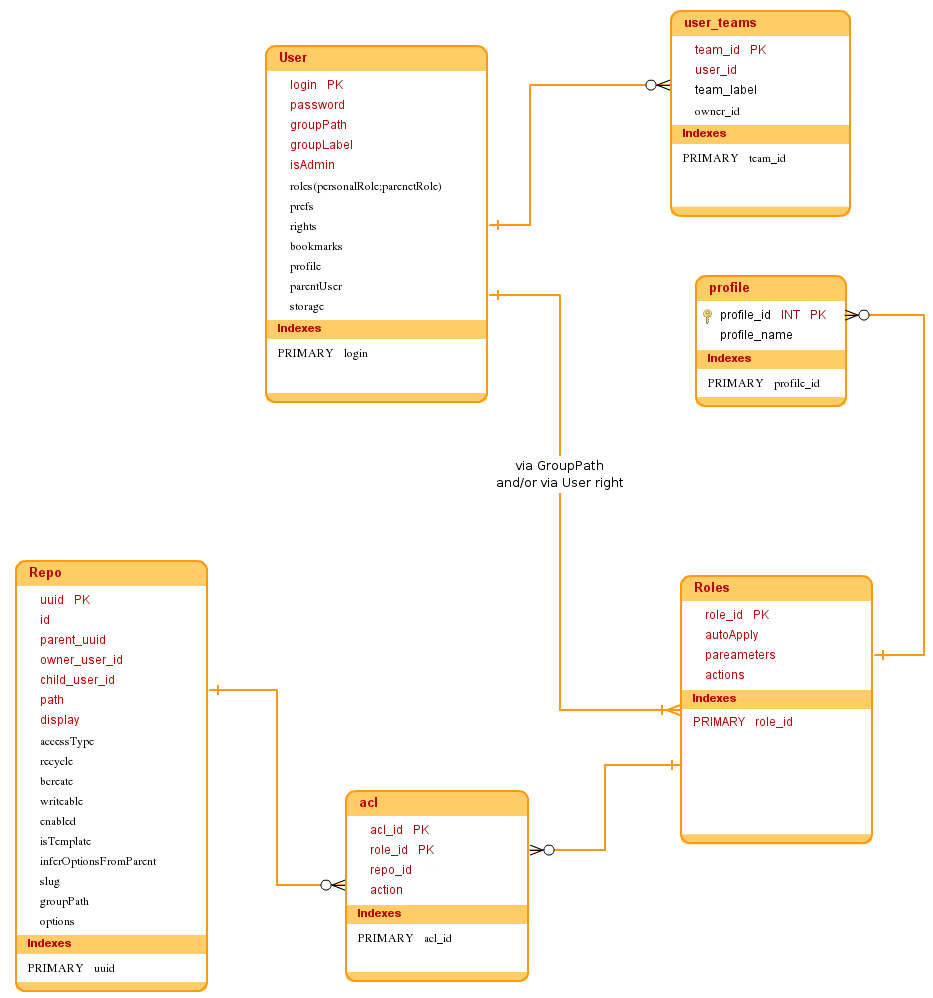

## Data Model
By Pydio internal data, we refer to all “configuration” data that are not the files and folders stored in the workspaces. These data cover workspaces definitions, users, roles, etc… The following schema describes the datamodel.

 
## Accessing this Data
As you might already have understood, most of these objects can be stored in various backends, depending on the chosen plugin. For the most commonly used (workspaces & users/roles data), there are two static classes that you must know: AuthService and ConfService. These classes will hide the actual plugin implemenation and provide simple to use APIs to CRUD the various objects.
