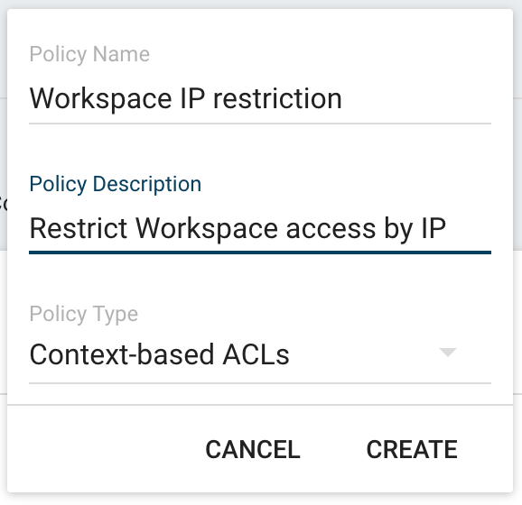
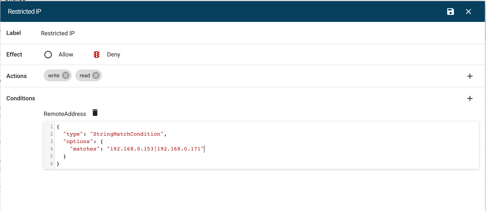
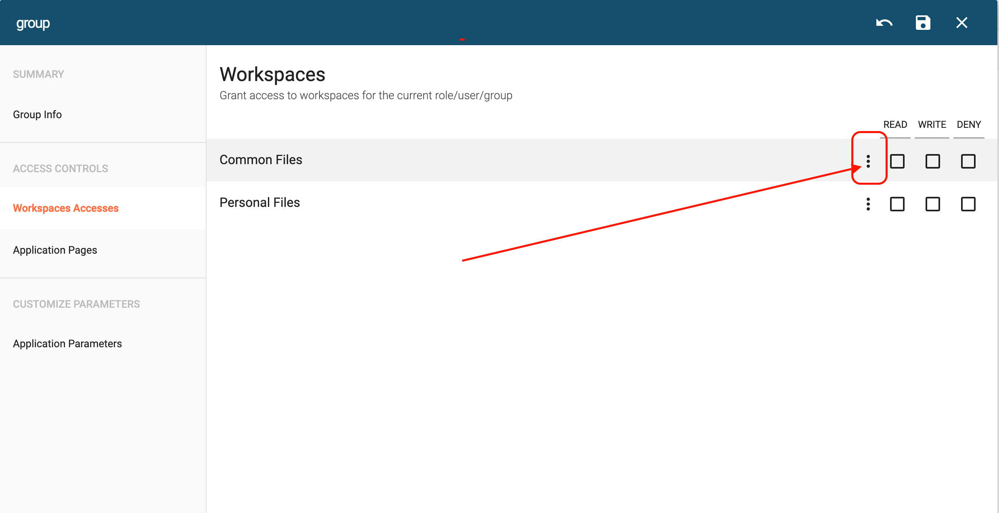

This chapter presents some real-life use cases of the ACL feature. At the bottom of the page, you can find a more complete glossary.

For a deeper understanding on how Security Policy work you might also refer [to the corresponding section of our administration guide](en/docs/cells/v4/secure-your-data).

## IP Restrictions

### Deny Access on a workspace to a list of IP

This is an example on how to deny access to a given **_workspace_** for a list of specific IPs.  
You can also apply this rule to Cells, Share links and so on.

- Create a New Policy (**Policy Type**: `Context-based ACLs`. Put the **Name** and **Description** of your choice)




- Then define default permissions: they are mandatory otherwise other users will not have access. So we give **read/write** to everyone before adding a restriction based on IPs for specific requests.


- Now, let's add a policy to define the _IP restriction rule_:


- Give it a **Label**, **Effect**: `Deny`, **Actions**: `Read/Write`, as seen in screenshot 5:


- Add a condition and choose `RemoteAddress`:


- Write the condition, using JSON: in our example we explicitly define some IPs.



- Save

- We can now apply the newly created rule. In our example, we apply it on a **group**. But you can also choose **user**, **group**, **role**, etc.



- Select the rule, using the label you have defined earlier


- Once the rule is selected, save the changes:


### Allow access for a specific IP range

You could also do the opposite and only give access to a list of IP by using `StringNotMatchCondition`.

_IMPORTANT: Security policies, as provided by Pydio Cells, are both "Deny By Default" and "First Deny Wins". It means that, when no policy is defined, the resources are not available. It also means that if we have 2 rules that are applied to the same resource for the same subject, if one gives access and the other forbids it, the **resource is not available**_.

Thus to allow access, you only have to define **one** rule that explicitely gives the access for the required IP range:

- Create a New Policy (Policy Type: `Context-based ACLs`)
- Create a rule that **allows access** to specific **IP addresses** or a **range**.

Corresponding JSON can then be something like:

```json
{
  "type": "StringMatchCondition",
  "options": {
    "matches": "192.168.2.*"
  }
}
```

Note that you can also add multiple _string conditions_ by separating them with a pipe `|` character. For instance:

`192.168.0.*|192.168.3.2|...`

<!-- TODO 

## Date/Time Restrictions

## REST method Restrictions

-->

## ACLs values

### Actions

| Action | Effect           | Example                                                                             |
| ------ | ---------------- | ----------------------------------------------------------------------------------- |
| Read   | read a resource  | e.g. with a workspace, it means that the workspace is displayed in the various lists and browsable |
| Write  | write a resource | e.g. with a workspace, you can upload new or modify existing resources |

### Query Context

| Query          | Effect                       | Description                                                                                 |
| -------------- | ---------------------------- | ------------------------------------------------------------------------------------------- |
| Remote Address | The client's remote address  | Remote IP presented by the request that accesses a resource |
| Request Method | REST Methods                 | The type of the current REST method (PUT, GET, DELETE, etc.) |
| Request URI    | A Pydio Cell's endpoint      | The `path` part of the URL, to restrict current rule to a subset of end-points |
| HTTP Protocol  |                              | Protocol used by current request: mainly HTTP or HTTPS |
| UserAgent      | Type of the client agent     | Such as browsers, mobile apps, etc. |

# Conditions

| Type                    | Options     | Example                                                    | Description                                                     |
| ----------------------- | ----------- | ---------------------------------------------------------- | --------------------------------------------------------------- |
| StringMatchCondition    | `"matches`  | `"matches": "192.168.0.1"`                                 | condition is true if there is a match                           |
| StringNotMatchCondition | `"matches`  | `"matches": "192.168.2.1"`                                 | condition is true if there is no match                          |
| DateAfterCondition      | `"matches"` | `"matches": "2018-02-28T23:59+0100"`                       | condition is true if date is after the one defined in the match |
| WithinPeriodCondition   | `"matches"` | `"matches": "2018-02-01T00:00+0100/2018-04-01T00:00+0100"` | condition is true if date is within the range of match          |
| OfficeHoursCondition    | `"matches"` | `"matches": "Monday-Friday/09:00/18:30"`                   | condition is true if date & time are within the match           |

_Note: under the hood, Cells uses we internally use [LADON](https://github.com/ory/ladon), you might find  it useful to refer to their documentation, typically on [conditions](https://github.com/ory/ladon#conditions) to gain a deeper understanding of what you can do and how_.
