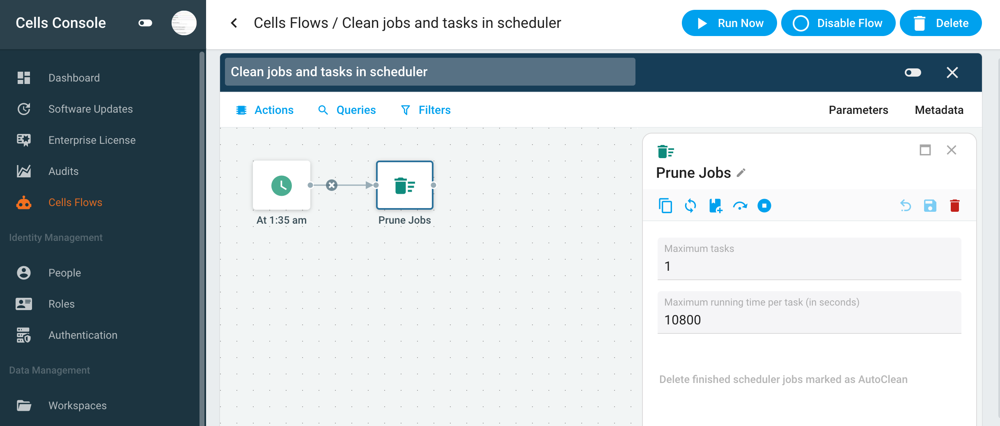

# Introduction

The Scheduler/CellsFlows service in Pydio Cells is responsible for managing all jobs. These jobs can be predefined (like maintenance tasks) or created by users (such as Copy or Move operations).

In Pydio Cells, a job is a definition of work to perform, while a task is a running instance of that job. Each task can generate logs that are stored in key-value (KV) storage. In some situations, heavy tasks may create large volumes of logs that can affect system stability.

# KV Storage problem

By default, a group of Pydio Cells microservices, such as audit, log, and tasklog, utilize an embedded key‑value (KV) database called BoltDB. 

BoltDB is lightweight and straightforward to implement, offering simplicity and ease of integration. However, it comes with notable drawbacks. BoltDB relies on mmap (memory‑mapped file) technology, which typically allocates as much RAM as possible to map the database file content.

Consequently, if the database file grows significantly, it can consume nearly all available RAM on the server, leading to system performance degradation. Users may observe that their server’s RAM usage remains persistently high - often approaching 100% - due to BoltDB’s extensive use of memory for caching data. Over time, as user activities and logs accumulate within these database files, the unregulated growth can severely impact overall system performance.

> Notice: To mitigate these issues, Pydio Cells includes housekeeping jobs that periodically clean up and compact the KV databases, thereby conserving disk space and enhancing performance.

# OOM Problem

Due to huge volume of task logs, the system may run out of memeory. In this case, Cells process may be a candidate for forced termination by the kernel (OOM killer). You may search for the track of OOM in system log in /var/log/message or /var/log/dmesg, or by using the command `dmesg -T | egrep -i 'killed process'`

# `Clean job and tasks in scheduler` job

`Clean jobs and tasks in scheduler` job periodically scan all jobs and remove their tasks including logs data.

If you are using CellsFlow, you can adjust this job’s parameters to better fit your workload:

- `Maximum tasks`: Limits how many tasks are kept per job. Older tasks beyond this limit are deleted. The default value is
- `Maximum running time per task`: If this job encounters tasks that are still running, it will remove any task that has been running longer than this limit. The default is 1 hour.

> **Notice**: If you often have long task, you may increase `Maximum running time per task` to keep this job from being terminated.

> **Notice**: If `Maximum tasks` is set to 0, you may have UI problem when you hoving the mouse on the notification icon. This issue is fixed in **cells v4.4.15**

# Solutions
## Quick fix

Because the tasks logs may not important information to keep, you can remove entirely such information by following steps:

* 1. Stop pydio cells service: `systemctl stop cells`
* 2. Delete `tasklogs.bleve` folder in `$CELLS_WORKING_DIR/services/pydio.grpc.jobs/tasklogs.bleve`

> $CELLS_WORKING_DIR=/var/cells or custom value in `/etc/systemd/system/cells.service`

## Taking control of your system

### Monitoring
Implement monitoring tools like Prometheus and Grafana to track the resource usage of your Cells instance. Monitoring helps you identify peaks in load and make better decisions about sizing your deployment.

### Alerts
Set up alerting to notify you of critical resource usage, so you can intervene before the kernel kills the process due to OOM conditions.

# Long term solution - Mongodb for KV storages

Starting with Cells version 3, we introduced support for MongoDB to offload the KV databases from
Pydio Cells to dedicated MongoDB servers. This transition alleviates the complexities associated with managing embedded KV databases within microservices, as MongoDB handles these tasks more efficiently on separate servers. Adopting MongoDB is strongly recommended to isolate Pydio Cells services from the overhead of KV databases.

Further reading: 

* https://docs.pydio.com/cells-v4/admin-guide/run-cells-in-production/configuring-mongo-storage/
* https://docs.pydio.com/cells-v4/admin-guide/run-cells-in-production/deploying-cells-in-a-distributed-environment/migrating-from-single-node/
