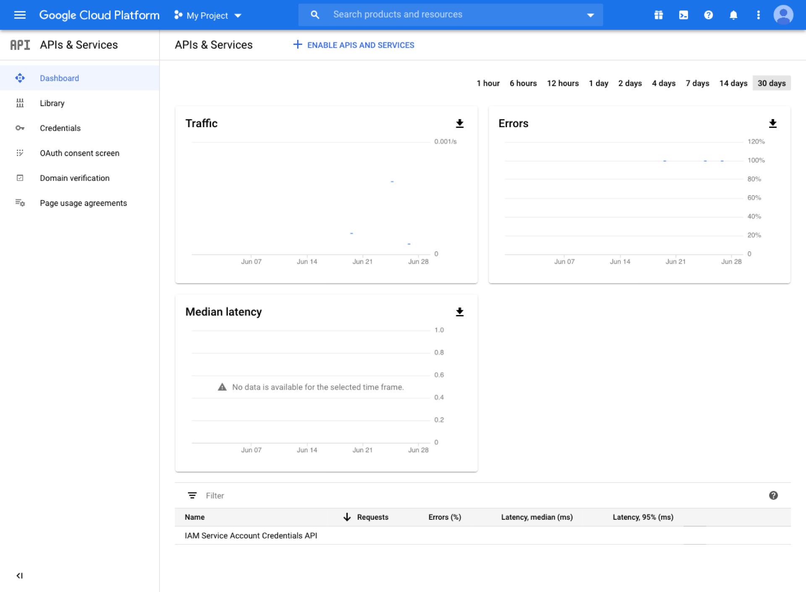
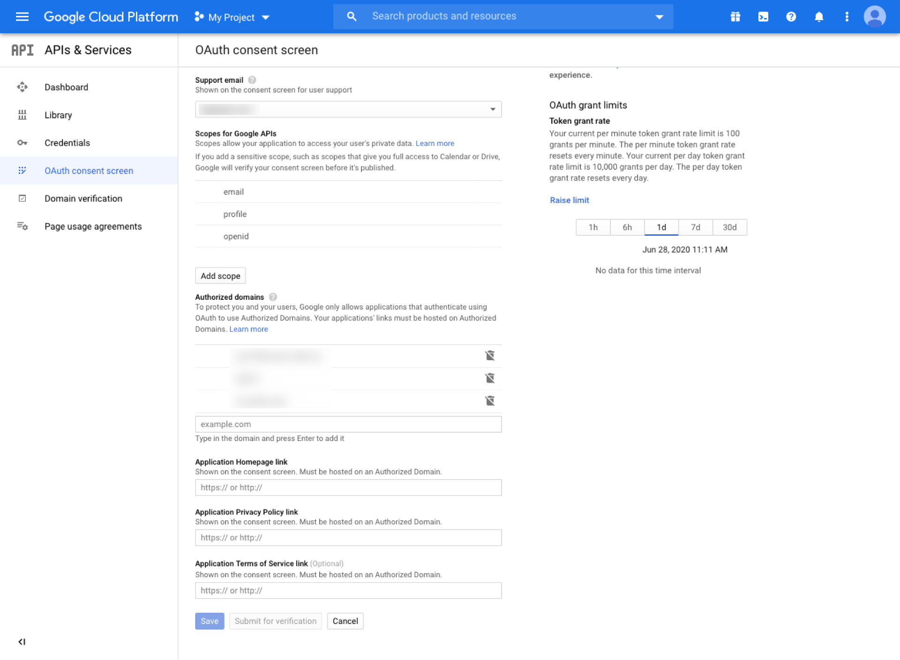
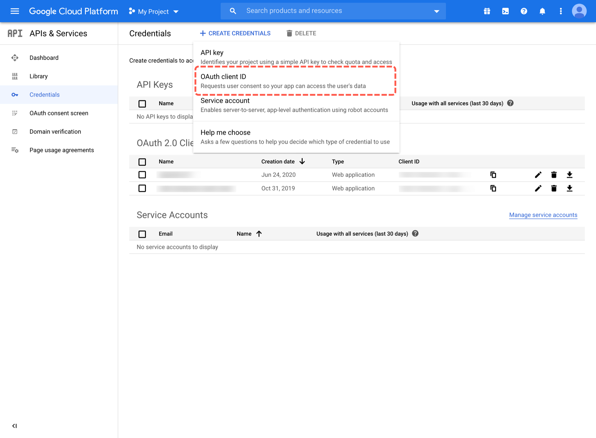
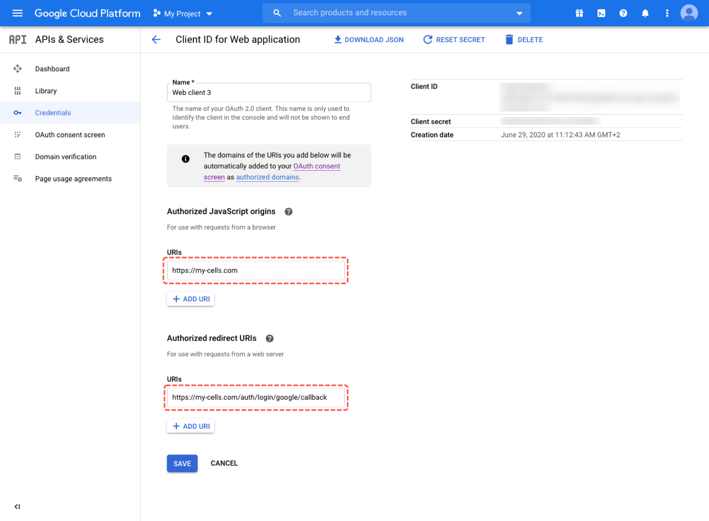
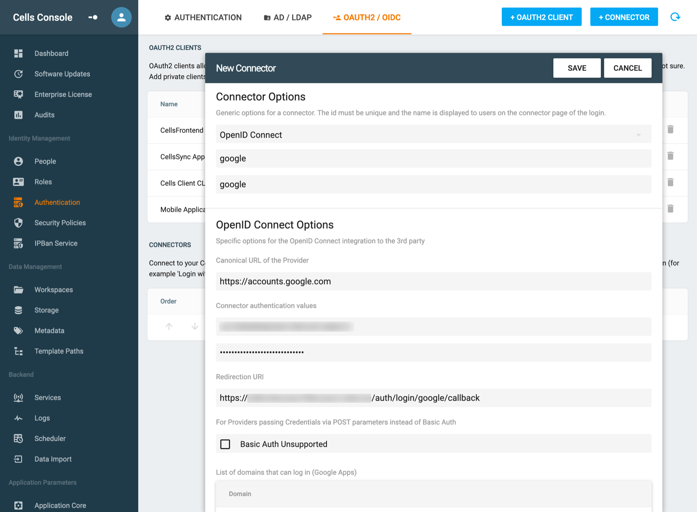

# Add a Google Connector

## Create a Google Application for OIDC

### References

- https://cloud.google.com/identity-platform/docs/how-to-enable-application-for-oidc

Default values

| name            | value                                               |
| --------------- | --------------------------------------------------- |
| Issuer/Provider | `https://accounts.google.com`                       |
| redirect_uri    | `https://your-cells.com/auth/login/google/callback` |

## Step 1

Visit [https://console.cloud.google.com/](https://console.cloud.google.com/), 

- Go to **APIs & Services**.

- Then browse to **OAuth consent screen**

And set the following fields:

- **Application name:** name your application
- **Authorized domains:** add your Pydio Cells instance domain
- Hit **Save**

## Step 2

- Then head to **Credentials**

- Click on **Create credentials**
- Select **OAuth client ID**

- Application Type : Select **Web Application**
- Press **Create**

Last step, name your app (make sure to remember your **ID** and **Secret**) :

- **Authorized JavaScript origins:** Add your Pydio Cells url.
- **Authorized redirect URIs**: add a redirect url such as `https://my-cells.com/auth/login/google/callback`, add at the end of your Pydio Cells URL **/auth/login/callback** (this is the endpoint).
  

## Create a Google Connector in Cells

In your Pydio Cells instance go to **Cells Console > Authentication > OAUTH2/OIDC > + Connector**.

- Select **OpenID Connect**
- give it a label (name)

Then set the following parameters:

- **Canonical URL of the Provider:** `https://accounts.google.com`
- **Client ID:** your previously fetched client ID
- **Client Secret:** your previously fetched client Secret
- **Redirection URI:** the same URI that you have set during the google app creation.

