---
slug: configure-keycloak-sso
title: Using Keycloak as an Identity Provider"
description: "This article shows how to configure Keycloak as an IdP for Pydio Cells, including client setup, attribute mapping, and common troubleshooting.
language: en
category: Identity Management
weight: 2

---

# Introduction

**Keycloak** is a robust, open-source Identity and Access Management (IAM) tool that implements popular SSO standards like **SAML** and **OpenID Connect (OIDC)**.  
It’s widely trusted for secure authentication in on-premise deployments, enabling organizations to centralize user identity and integrate easily with various services.

This step-by-step guide will help you:
- Register a new OIDC client in Keycloak.
- Set up an OIDC Connector in **Pydio Cells**.
- Map user attributes from Keycloak (using LDAP directory) to user roles in Pydio Cells.
- Understand how to fix session-related issues and debug your configuration.


## S1. Register a New OIDC Client in Keycloak

To enable SSO, first register a new client that represents Pydio Cells in your Keycloak instance.

> **Tip:** Steps 1 and 2 can be done in parallel — you’ll need the Connector’s `callback URL` for the client’s redirect URI.
>
> **Note:** This example uses the `master` realm.

**Keycloak Admin Console:**  
```
Clients → Create Client
```

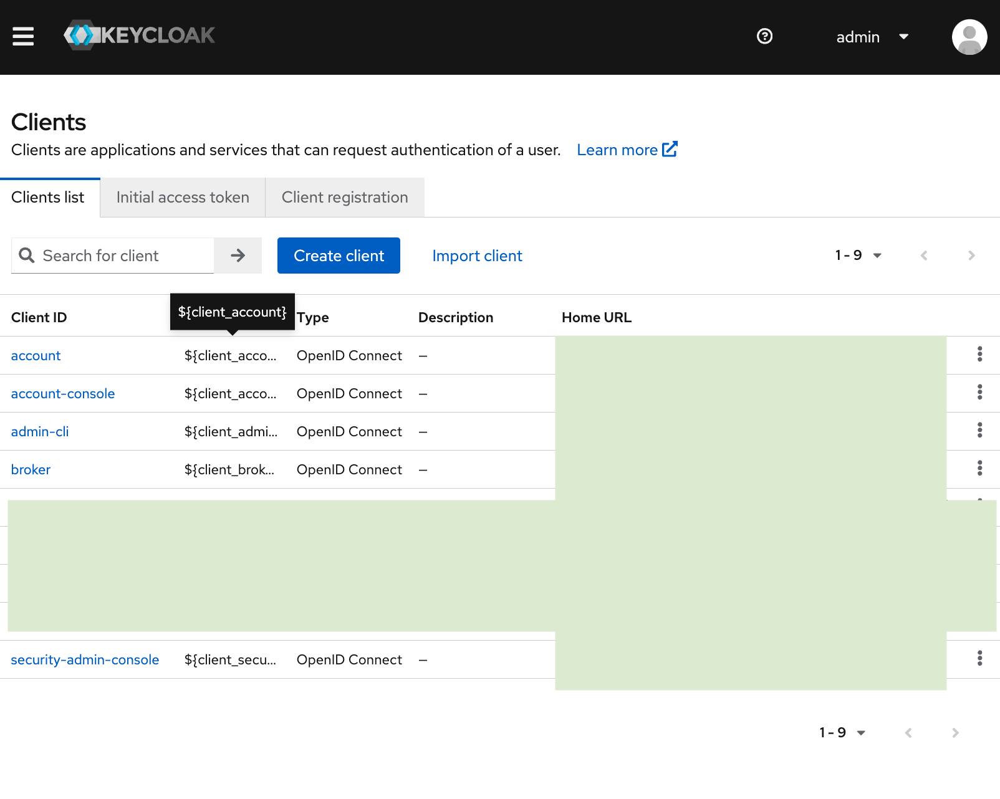

**Example values:**
- **Client ID:** `demo.cells.pydio`
- **Name:** `Cells Demo`

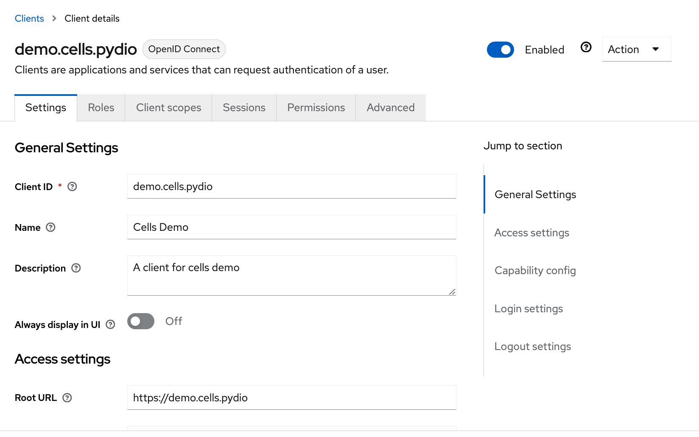


**Configure redirect and URLs:**
- **Root URL:** Pydio Cells URL
- **Home URL:** Same as above
- **Valid Redirect URIs:** Callback URL generated by the Connector in Step 2
- **Valid Post Logout Redirect URIs:** Leave empty
- **Web Origins:** Pydio Cells URL

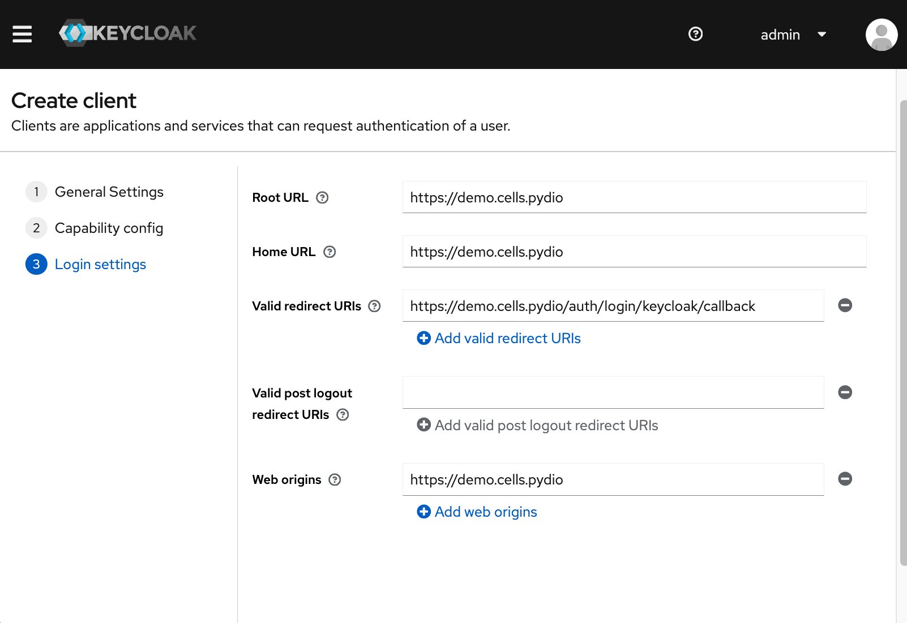


**New Client Capability:**
- **Cells Authentication:** Yes
- **Authorization:** Off
- **Authentication Flow:** Standard

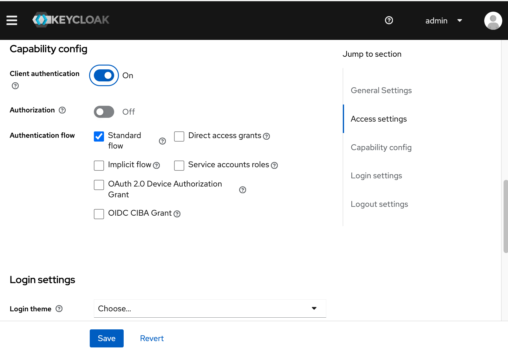

### Client Credentials

Enabling `Cells Authentication` generates a **Client Secret**. Pydio Cells uses this secret to securely authenticate with Keycloak’s OIDC endpoints.

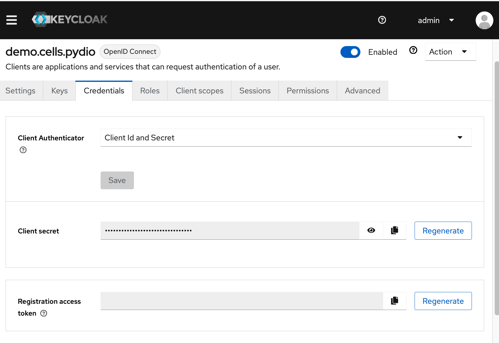


## S2. Create a New Connector in Pydio Cells

Inside Pydio Cells, create a new OIDC Connector to link your Cells instance to Keycloak.

**Cells Admin Console:**  
```
Settings → Authentication → OAUTH2/OIDC → Create New Connector
```

In the pop-up:
- **Connector type:** OpenID Connect
- **ID:** `keycloak` (won't be changed)
- **Name:** Example: `SSO with Keycloak` (can be customized later)

The **Issuer (Canonical URL)** updates automatically based on the ID. This URL acts as the callback where Keycloak sends tokens after authentication.

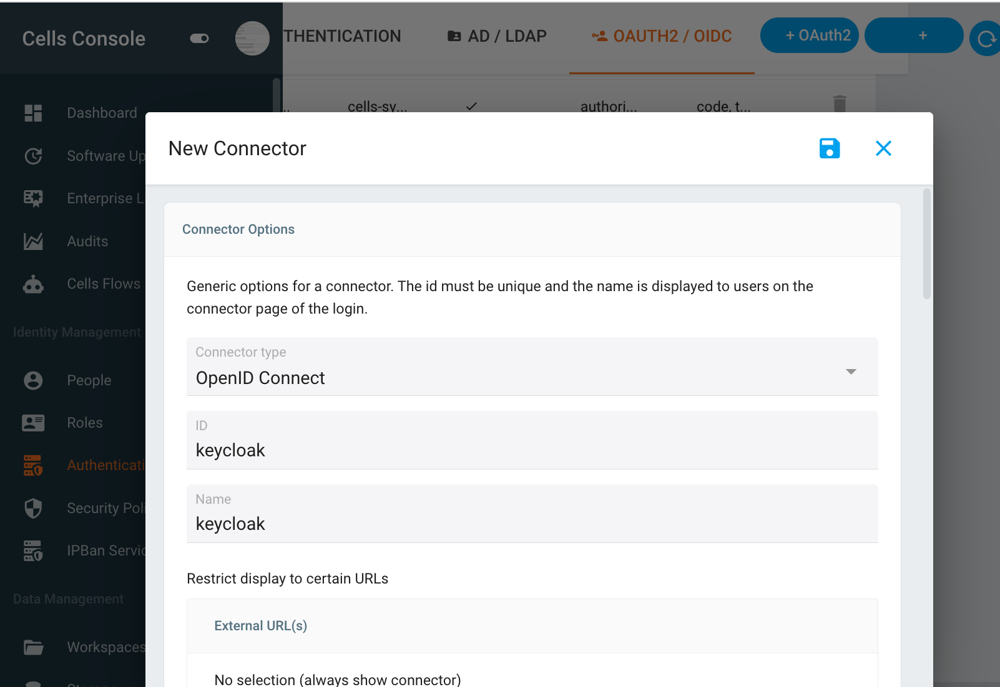

Pause here, return to **Step 1**, and add the generated callback URL to the client’s valid redirect URIs in Keycloak.


### Complete the Connector Configuration

Once you have your **Client ID** and **Client Secret**, continue filling out:

- **Issuer - Canonical URL:**  
  Format: `https://domain/realms/realm-name`  
  Example: `https://sso.keycloak.pydio/realms/master`

- **Client ID:** The client ID from Step 1 (`demo.cells.pydio`)
- **Client Secret:** Copied from Keycloak.

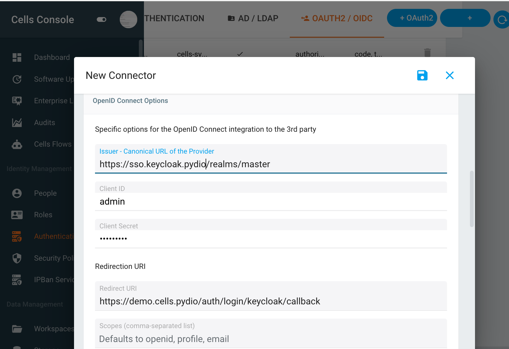

**Additional options:**
- **Insecure Skip Email Verified:** Set `On` if using a trusted directory.
- **Get User Info:** On

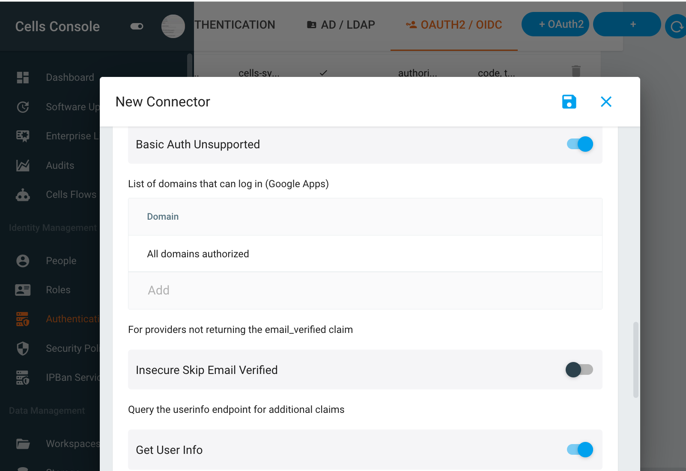

Once saved, your Pydio Cells login page will display an additional **“SSO with Keycloak”** option.

# Advanced Setup

A key feature of Pydio Cells is the ability to map external attributes to automatically manage user roles.  
This is powerful when you want to sync LDAP groups directly to Cells permissions.


## Mapping Roles

Suppose your Keycloak server uses an LDAP User Federation and you want to map the `memberOf` LDAP attribute to Pydio Cells roles.

### 1. Map LDAP User to UserModel in Keycloak

**Keycloak Admin Console:**  
```
User Federation → Select LDAP Provider → Mappers → Create Mapper
```

Example mapper:
- **Name:** `memberOf to group`
- **Mapper type:** `user-attribute-ldap-mapper`
- **User Model Attribute:** `cellsgroups`
- **LDAP Attribute:** `memberOf`
- **Read Only:** On
- **Always Read Value From LDAP:** On

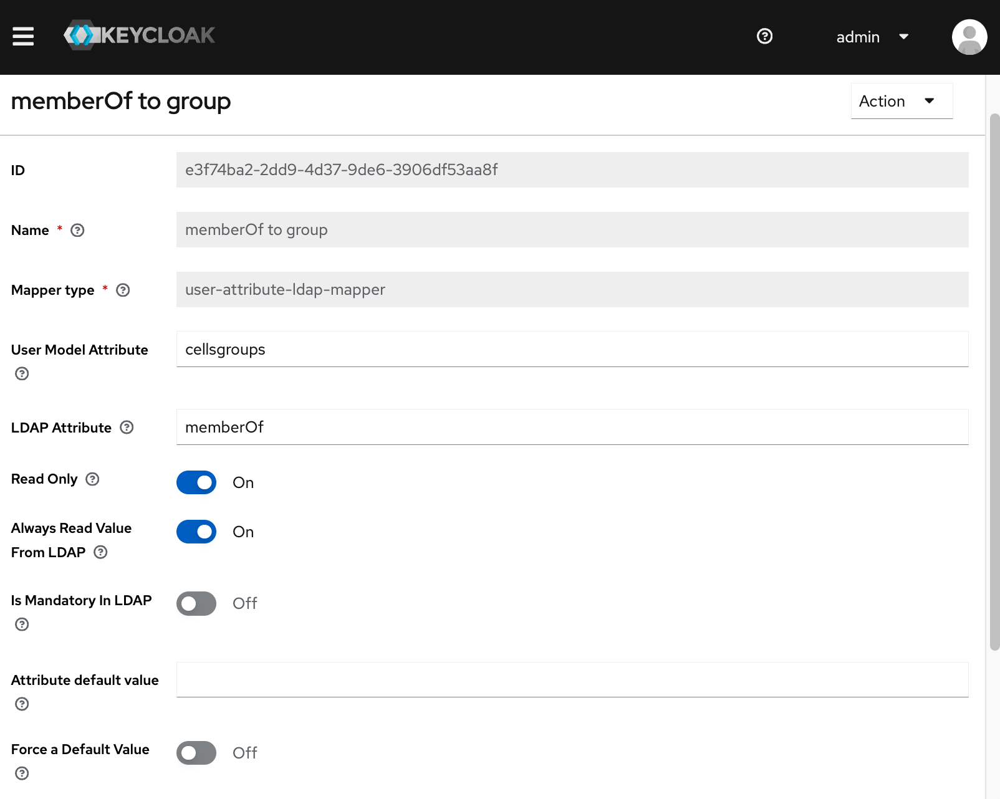


### 2. Create a Client Scope and Mapper

**Keycloak Admin Console:**  
```
Client Scopes → Create Client Scope
```

- **Name:** `cellsscope`
- **Description:** Defines `cellsgroups` claim

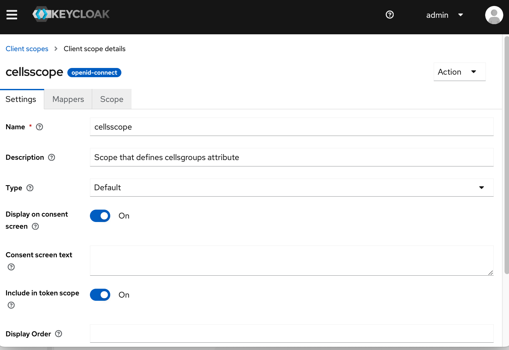

Add a new mapper in the scope:
- **Mapper Type:** User Attribute
- **Name:** User Group Mapper
- **User Attribute:** `cellsgroups`
- **Token Claim Name:** `cellsgroups`
- **Claim JSON Type:** string
- **Add to ID Token:** On
- **Add to Access Token:** On
- **Add to Userinfo:** On
- **MultiValued:** On
- **Aggregate attribute values:** On

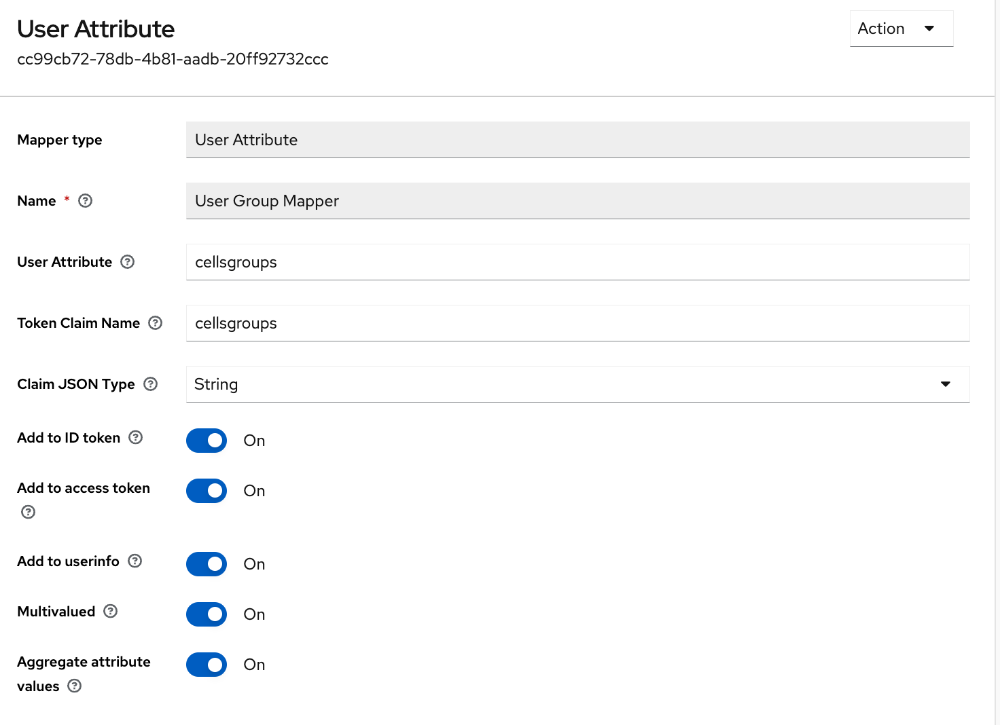

> **Note:** The *UserModel* is the user object in Keycloak.


### 3. Example ID Token

When the user logs in through Keycloak, the ID Token will look like this:

```json
{
  "Claims": {
    "cellsgroups": [
      "cn=Test_DEM_WebUsers,ou=test-pydio-cells,...",
      "cn=Test_Etrange_Gov,ou=test-pydio-cells,...",
      "cn=Test_GitlabDTC,pydio-cells,..."
    ],
    ...
  }
}
```


### 4. Map ID Token Claims to Cells Roles

In the Cells Connector configuration, click `+ ADD RULE`:

- **Left Attribute:** `cellsgroups`
- **Right Attribute:** `Roles`

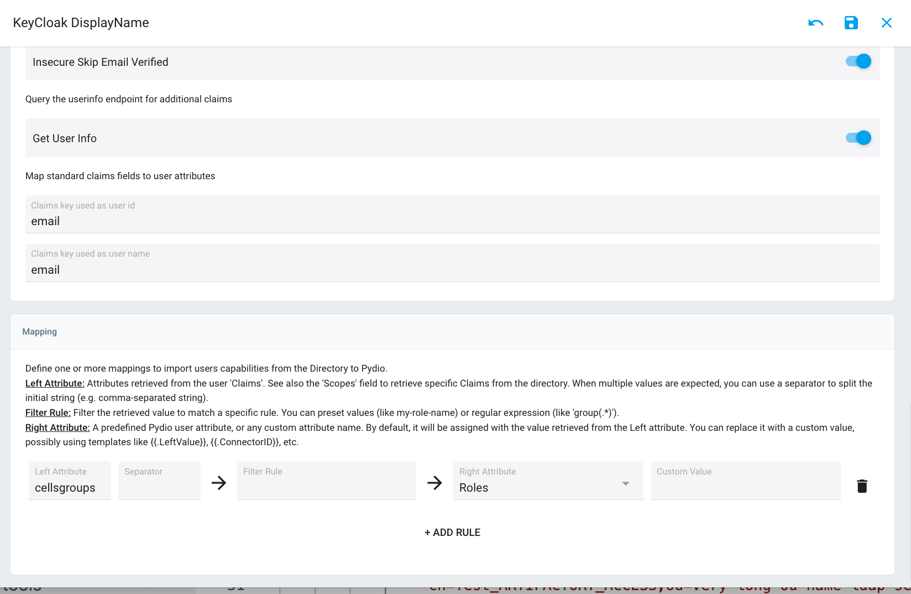

Now, users logging in with Keycloak SSO will automatically have these roles assigned in Pydio Cells.


# Additional Configuration

Sometimes you may experience unexpected session logouts for SSO users, while local auth sessions remain stable.  
This is often due to a missing **`audience` claim** in the token, which is required for token validation.

## The Root Cause

- After authentication, the client gets an **AccessToken** and **RefreshToken**.
- By default, the AccessToken expires in ~10 minutes. Near expiry, the client tries to refresh it.
- If the token is missing an `audience` claim, the refresh request fails, resulting in a forced logout.


## How to Test

1. Open Chrome Dev Tools.
2. Upload a large file to Cells.
3. Use throttling to simulate a slow network.
4. Wait until the AccessToken expires (~10 minutes).

Watch for `session` requests — if a refresh fails with a `401`, you’ll see the session close.


## Solutions

### 1. Add Audience in Config

Run the following command:

```bash
cells admin config set "pydio.web.oauth" "staticClients[0]/audience[0]" "https://demo.cells.pydio"
```

### 2. Or Edit `pydio.json` Directly

```json
"pydio.web.oauth": {
  "staticClients": [
    {
      "audience": [
        "https://demo.cells.pydio"
      ]
    }
  ]
}
```


# Troubleshooting

## Run Cells in Debug Mode

Because there are multiple moving parts between Keycloak and Pydio Cells, start Cells in **debug mode** to:

- See detailed error messages.
- Inspect full ID Tokens sent by Keycloak.
- Verify your claim mappings.

## Keep Server Clocks in Sync

Authentication can fail if server and client clocks are out of sync.  
Always configure **automatic time synchronization** on both the Keycloak and Cells servers, as well as user devices, to prevent unexpected token validation errors.
